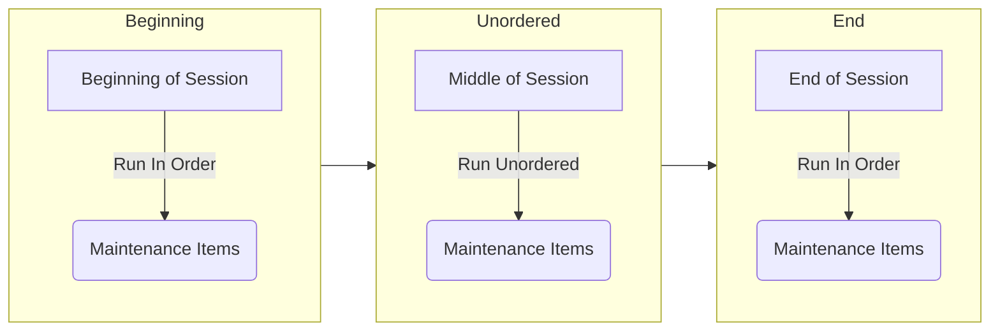
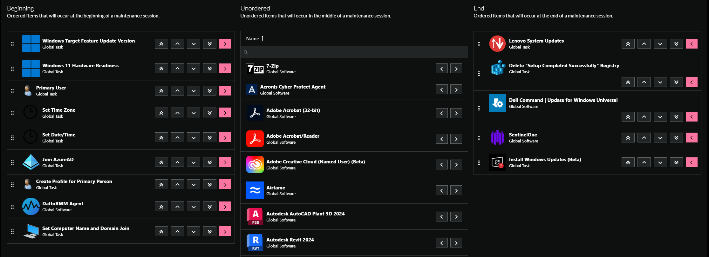

<!-- How To Template -->
# Deployment Ordering

## Overview
This document is intended to give you an overview of the deployment ordering in ImmyBot. In the context of ImmyBot, deployment ordering refers to the execution of maintenance items at specific intervals of a session.

## Prerequisites
An active ImmyBot subscription or [trial](https://www.immy.bot/pricing/)

A Deployment needs to be set up before you can set the order for the maintenance item you're working on.

## Flowchart

## Page Breakdown

::: warning Regarding Onboarding Tasks
All tasks that are limited to onboarding computers will be executed at the beginning of the session in the onboarding stage, following the sequence in which they are listed. Once the onboarding process is complete, we will proceed to execute all other actions, also in the order they are listed.
:::

On the page you will see three columns: **Beginning**, **Unordered**, and **End**.

- The Beginning column are the maintenance items that you want to run at the start of a maintenance session. We recommend you keep computer configuration maintenance items here, so you can control the order that these items are applied.
  - For example if you want to rename a computer and add it to an Azure Active Directory, both tasks would go here. You would set the rename task to run before the Azure AD task in this column.
- The Unordered column are the maintenance items that you don't particularly care about when it comes to the order in which they get applied to the computer. These would be your line of business applications, ancillary tasks, etc.
  - For example QuickBooks, Adobe Acrobat, etc can be put here.
- The End column are the maintenance items that you need to run at the end of a session. Typically these will be applications that rely on other software being installed first, your security software, or registry tasks.
  - For example ShareFile for Outlook needs to have some version of Microsoft Office installed and will fail if its not. You would want to place this in the End column, and have Microsoft 365 in either the Beginning or Unordered column.

You can move everything around using the provided arrow keys on each line for the maintenance items.

## Get to the page
1. Navigate to **Library** > **Deployment Ordering**

   
>[!NOTE] Document information
>Author: Mark Gomez
 
>Date Published: 08/30/2025
> 
>Date Revised: N/A
> 
>Version Number: 1.0
