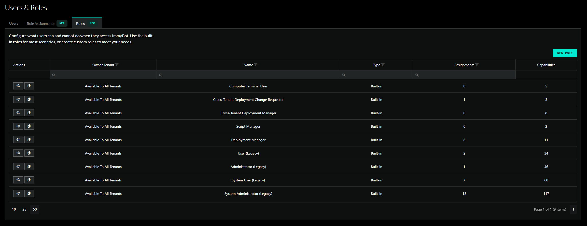
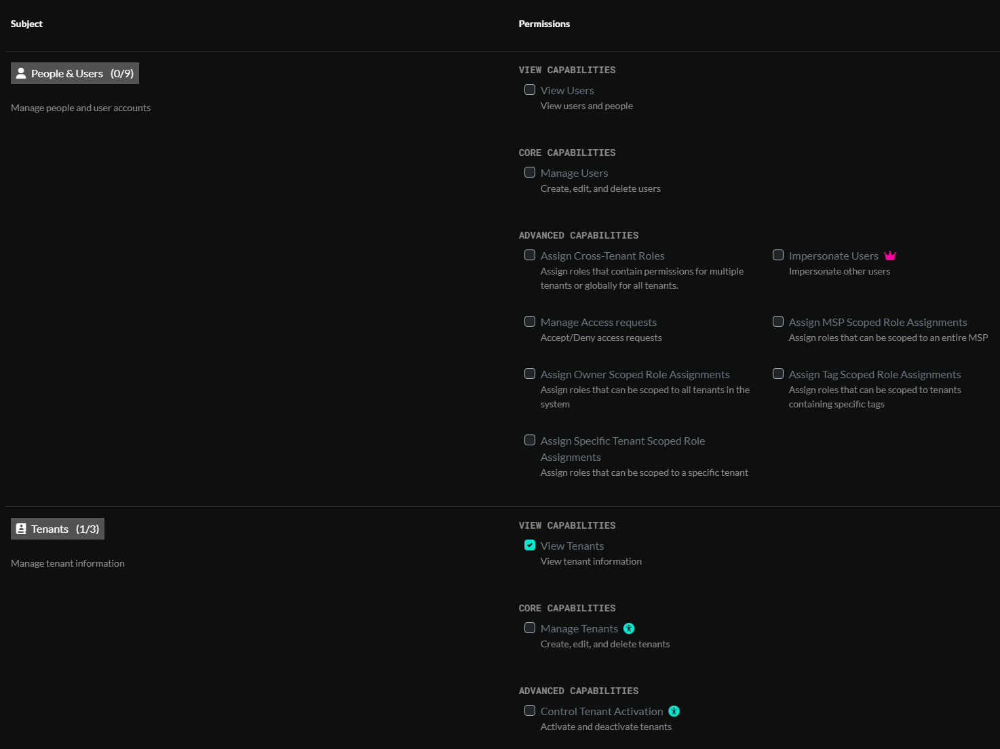
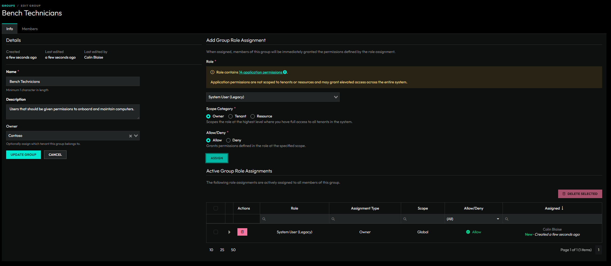
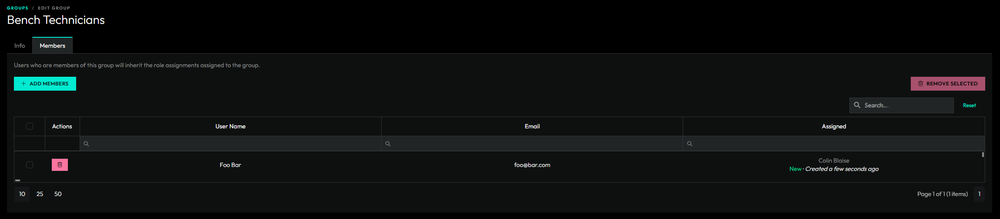
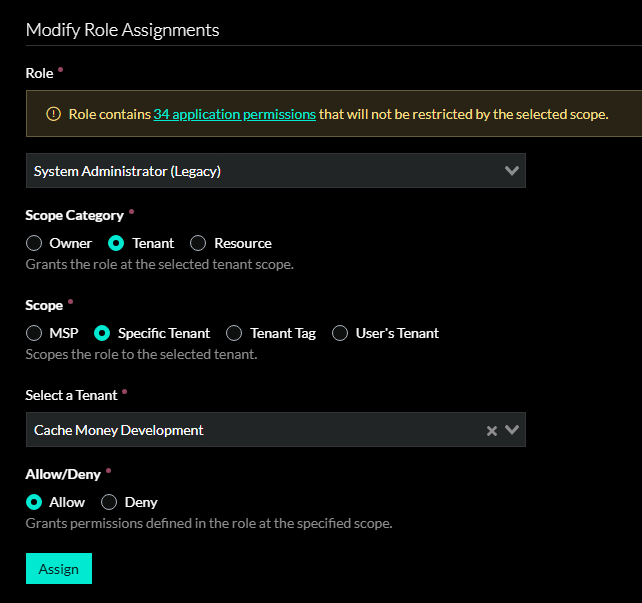
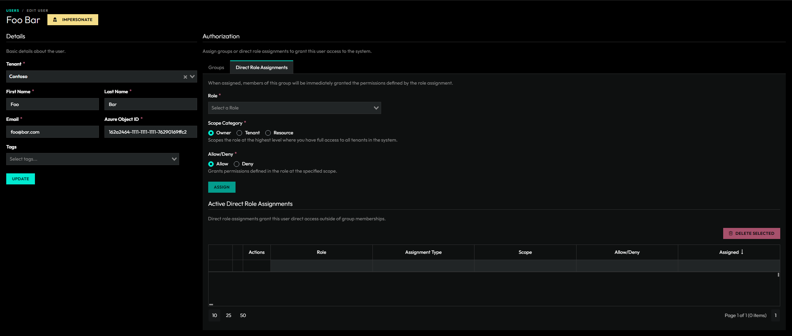
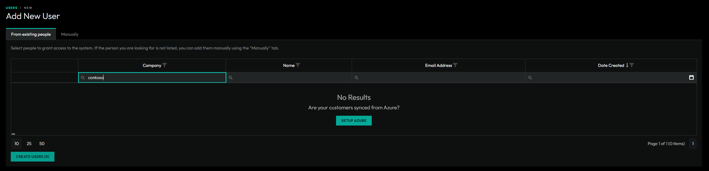
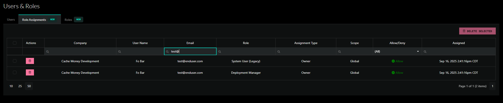

# Role-Based Access Control (RBAC)

*Updated 11/14/25*

*RBAC is still actively being developed. If you are beta testing this feature, please report any bugs or issues you find*

[Known Issues](#known-issues)

ImmyBot's RBAC system provides granular permission management, allowing you to control exactly what users can access and modify within your environment. This system has been designed with a phased approach to ensure seamless migration from legacy permissions while introducing powerful new capabilities.

RBAC can be broken down into four sections:

1) [Roles](#roles)
2) [Groups](#groups)
3) [Role Assignments](#role-assignments)
4) [Users](#users)

## Roles

A role grants one or more capabilities. There are 100+ capabilities to choose from. Some examples are 'Manage Software' and 'Manage Billing'.

### Built-In Roles

In an effort to provide a seamless transition for exisiting customers, four built-in legacy roles have been added that mirror existing permission structures:

| Role | Description | Legacy User Type
|------|-------------| ----------------|
| **System Administrator (Legacy)** | Grants every permission available | MSP Admin |
| **System User (Legacy)** | Same as system admin but with a few restrictions | MSP Non-Admin |
| **Administrator (Legacy)** | Broad access with no system permissions | Tenant Admin |
| **User (Legacy)** | Limited access | Tenant Non-Admin |

Additional built-in roles have been added to maintain compatibility with existing user settings and application preferences.

| Role | Description | Legacy preference
|------|-------------| ----------------|
| **Script Manager** | Permission to manage scripts | Used in favor of the 'Allow Non-Admins and Non-MSP Users to Use Terminal and Edit Scripts' application preference |
| **Computer Terminal User** | Grants access to run scripts against a computer in the terminal tab | Used in favor of the 'Allow Non-Admins and Non-MSP Users to Use Terminal and Edit Scripts' application preference
| **Deployment Manager** | Permission to manage deployments | Used in favor of the 'Allow Non-Admin Users to Manage Deployments' application preference |
| **Cross-Tenant Deployment Manager** | Permission to manage cross-tenant deployments | Used in favor of the user checkox 'Can Manage Cross Tenant Deployments'. |
| **Cross-Tenant Deployment Change Requester** | Permission to manage cross-tenant deployments through change requests | Used in favor of the the 'Require Change Requests for Non-Admin Cross-Tenant Deployments' application preference. |

Built-in roles are inherently available to all tenants. However, in order to assign a role that contains system permissions, a user must be granted the **Assign Cross-Tenant Roles** permission. Built-in roles are read-only and the permissions they grant cannot be modified.

### Custom Roles

You are encouraged to create your own custom roles to suite your needs.

If you have the `Manage Public Roles` permission, then you can create a role that any user in the system can see.

Otherwise, a role is owned by a specific tenant. A user can only see public roles or roles that are managed by a tenant they have permission to manage roles for.

### Role Capabilities

There are 100+ different permissions that can be granted for a given role.

#### System permissions

Many permissions can be scoped to a particular set of tenants or resources through role assignments. Other permissions,
such as 'Manage Billing' are denoted as system permissions and cannot be limited to certain tenants. System permissions are
traditionally reserved for MSP users and should be carefully considered when granted to non-MSP users.

## Groups

A group is a collection of users that share the same permission requirements. Since, managing permissions for individual users can be very tedious, we encourage the adoption of groups.

A group can be granted one or more role assignments.

Members of a group inherit all role assignments assigned to the group.

If a group is owned by a specific tenant, then only users that belong to that tenant can be added to the group.

## Role Assignments

Permissions are granted or denied to users through **Role Assignments**. Role assignments can be assigned to Groups or directly to users.

An assignment contains a selected role, a selected scope, and an "Allow" or "Deny" value. Users can have multiple role assignments where they are allowed the cumulative allowed permissions from allow role assignments. Denied role assignments
take precendence when determining if a user has access to a particular permission or resource.

### Role Assignment Scopes

| Scope | Description |
| ----- | ----------- |
| **Owner** | Scopes the role at the highest level where you have full access to all tenants in the system. |
| **MSP**   | Scopes the role to the MSP tenant and all tenants that belong to the MSP. |
| **Specific Tenant** | Scopes the role to the selected tenant. |
| **Tenant Tag** | Scopes the role to all tenants with the selected tag. |
| **User's Tenant** | Scopes the role only to the tenant of the selected user. Useful for giving your customers access to their own tenant.
| **Resource** | Grants the role at the selected resource scope. The only resource type supported for now is Computers.

## Users

A user is a person who has been granted access to ImmyBot.

### Creating a user

1. Access Requests - Users can request access and will show up on the main Users & Roles page.
2. From Existing People - Existing people can be promited to a user. If you can't find a specific person, you may need to link their azure customer to a tenant in ImmyBot.
3. Manually - You can always manually create a user if you know their Azure Object ID.

### View all direct role assignments

On the main Users & Roles page, we have a tab to view all direct role assignments. For existing customers, you will see that all of your users have been migrated over to direct role assignments.
Consider replacing these direct role assignments with groups to better organize your users.

### My User's Group and Role Assignments

You can now view your own user's group and role assignments on the profile page. The profile page can be accessed at /profile or
by clicking the profile link in your account dropdown located in the top-right of the page.

## Known Issues

1. The deployment and schedules details pages have some known issues for users who have been granted access to one or more tenants that are not their own tenant. This should be fixed in an upcoming release.
1. If a user attempts to create a deployment or schedule that resolves to computers that they are not authorized to manage, they should be forced to submit a change request. This is not currently working but will be fixed in an upcoming release.
3. Certain pages are not displaying properly when the current user is unauthorized to access them. All pages that have resource identifiers in the url are being cleaned up to handle 404 and 403 responses.