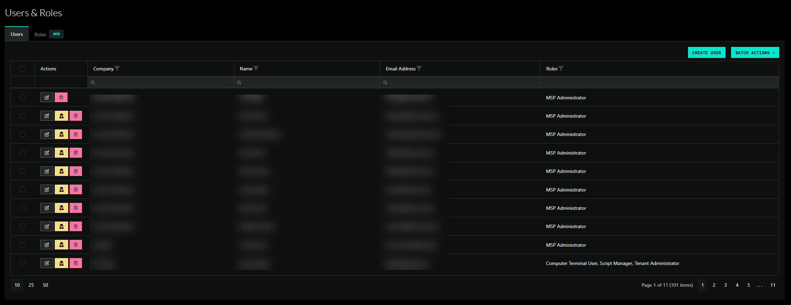
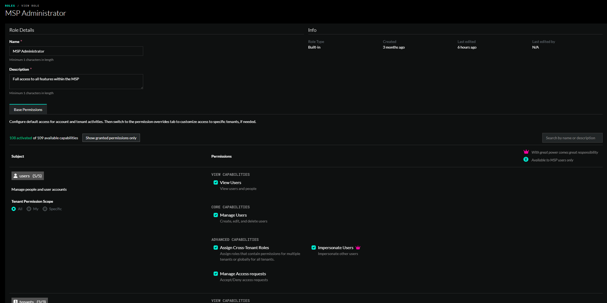

# RBAC (Role-Based Access Control)

We have been actively developing a system to granularly manage the permissions that users can be granted in ImmyBot.

The project has been broken down into 5 distinct MVP goals that all already have significant progress:

## &#9745; Goal 1: Build & Migrate to RBAC (under the hood)

In order to transition from what we have today to a full-fledged RBAC system, we needed to create
a migration path that didn't involve any breaking changes or new configuration from our users.

Therefore, our initial goal was to fully migrate to RBAC without requiring a single UI change.

This has been accomplished over the past minor 5 releases of ImmyBot.

## Goal 2: Expose RBAC

After we reached feature parity behind the scenes, we wanted to expose a UI that provided clarity
into what ImmyBot users can currently do today.

We wanted to maintain the following features in this UI:

<ol class="pl-3">
  <li>Create new users and remove existing users</li>
  <li>Assign one or more built-in roles to users</li>
  <li>Set the expiration date for user access</li>
  <li>View the details of the built-in roles and the permissions granted to them.</li>
</ol>

A view for seeing all users and their assigned roles.

A view for seeling all roles and how many users havae them.

<h3>Built-In Roles</h3>

  The built-in roles represent the main levels of access that users have today:

<ol class="pl-3">
  <li>MSP Administrator - Full access to the system</li>
  <li>MSP User - Restricted access, but mostly full access to the system</li>
  <li>Tenant Administrator - Full access to the resources managed under your own tenant.</li>
  <li>Tenant User - Restricted access to the resources managed under your own tenant.</li>
</ol>

The other built-in roles are there to maintain support for the existing user and application preferences that could be toggled on/off.

A view for seeing which permissions are included for a given role.

## Goal 3: Introduce Role Assignments

This goal introduces our first major new enhancement, the ability to assign roles to a specific scope of tenants.

 

  Role assignments allow you to define the specific tenant scope in which a role is applied.
  A user will be able to have multiple role assignments, each with different scopes.

One of the following scopes will be required when creating a role assignment:

#### Owner

This scope grants the role at the highest possible level. Every tenant in the instance is covered under this scope
<ul>
  <li>UI Remark - This option is only available to users with permission to manage cross-tenant role assignments</li>
</ul>

#### MSP

This scope grants the role for all tenants that belong to the selected MSP tenant. This includes the msp tenant itself.
<ul>
  <li>UI Remark - This option is only available to users with permission to manage cross-tenant role assignments</li>
  <li>UI Remark - Requires a tenant dropdown to select a specific MSP tenant.</li>
</ul>

#### Tag

This scope grants the role for all tenants that have the selected tag.
<ul>
  <li>UI Remark - This option is only available to users with permission to manage cross-tenant role assignments</li>
  <li>UI Remark - Requires a tag dropdown to select a specific tag</li>
</ul>

#### Specific Tenant

This scope grants the role for the specific tenant that is selected
<ul>
  <li>UI Remark - This option is only available to users with permission to manage cross-tenant role assignments</li>
</ul>

#### User's Tenant

This scope grants the role for the tenant that belongs to the logged in user
<ul>
  <li>UI Remark - This option is available to all users with permission to manage users.</li>
</ul>

## Goal 4: Introduce Resource Scopes

Resource scopes allow you to configure the specific resources that a role is applicable to. Each resource may bay different filters that can be applied.

The first resource scope we will introduce is for computers.

The following options will be available for the computer resource scope:

#### Individual

This scope grants access to the specific computer selected in the scope.

#### Tag

This scope grants access to all computers that have the specified tag.

#### Computer Type

This scope grants access to all computers of the specified type.

The supported types are:  All, Workstations and Portable Devices, Servers, Domain Controllers

## Goal 5: Introduce Custom Roles

Custom roles allow you to create roles with specific permissions tailored to your needs. You can define the permissions that a role grants, such as access to certain resources or actions within the system.

This feature is very close to the finish line and will likely go out in conjuction with other goals.