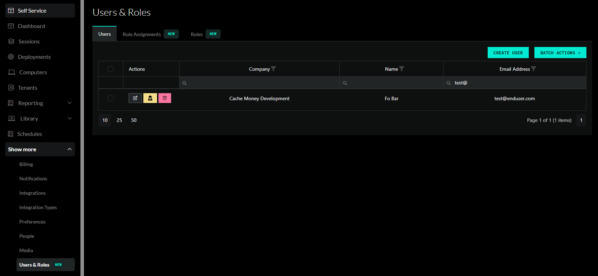
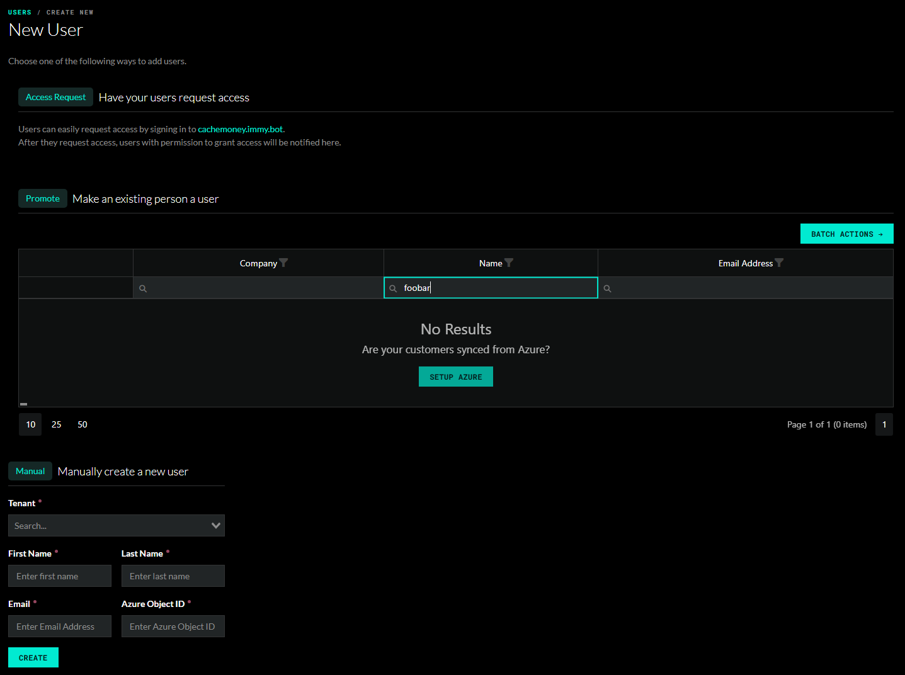
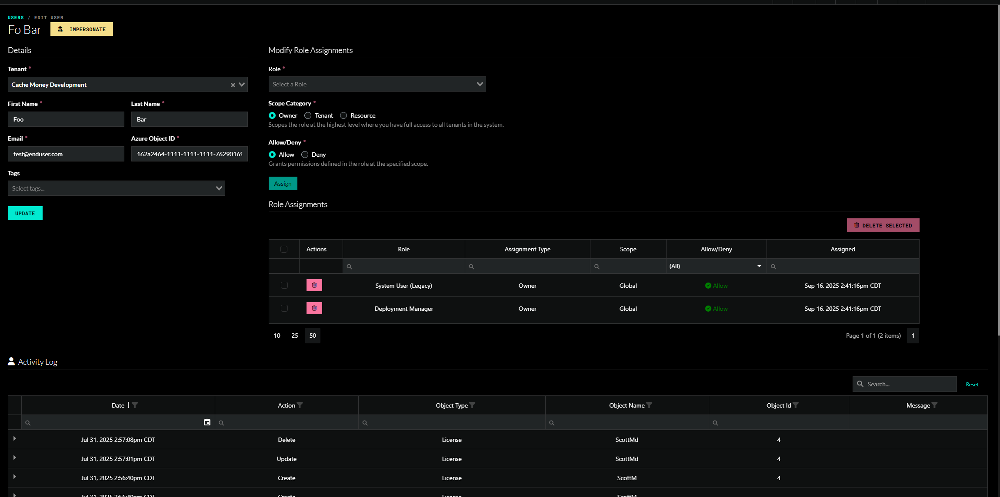

# Role-Based Access Control (RBAC) System (In Active Development)

Last Updated 10/07/25

ImmyBot's RBAC system provides granular permission management, allowing you to control exactly what users can access and modify within your environment. This system has been designed with a phased approach to ensure seamless migration from legacy permissions while introducing powerful new capabilities.

## Roles

### Built-In Roles

Four main legacy roles are built-in that mirror existing permission structures:

| Role | Description | Legacy User Type
|------|-------------| ----------------|
| **System Administrator (Legacy)** | Grants every permission available | MSP Admin |
| **System User (Legacy)** | Same as system admin but with a few restrictions | MSP Non-Admin |
| **Administrator (Legacy)** | Broad access with no system permissions | Tenant Admin |
| **User (Legacy)** | Limited access | Tenant Non-Admin |

Additional built-in roles have been added to maintain compatibility with existing user settings and application preferences.

| Role | Description | Legacy preference
|------|-------------| ----------------|
| **Script Manager** | Permission to manage scripts | Used in favor of the 'Allow Non-Admins and Non-MSP Users to Use Terminal and Edit Scripts' application preference |
| **Computer Terminal User** | Grants access to run scripts against a computer in the terminal tab | Used in favor of the 'Allow Non-Admins and Non-MSP Users to Use Terminal and Edit Scripts' application preference
| **Deployment Manager** | Permission to manage deployments | Used in favor of the 'Allow Non-Admin Users to Manage Deployments' application preference |
| **Cross-Tenant Deployment Manager** | Permission to manage cross-tenant deployments | Used in favor of the user checkox 'Can Manage Cross Tenant Deployments'. |
| **Cross-Tenant Deployment Change Requester** | Permission to manage cross-tenant deployments through change requests | Used in favor of the the 'Require Change Requests for Non-Admin Cross-Tenant Deployments' application preference. |

Built-in roles are inherently available to all tenants. However, in order to assign a role that contains system permissions, a user must be granted the **Assign Cross-Tenant Roles** permission. Built-in roles are read-only and the permissions they grant cannot be modified.

### Custom Roles

You are encouraged to create your own custom roles to suite your needs.

If you have the `Manage Public Roles` permission, then you can create a role that any user in the system can see.

Otherwise, a role is owned by a specific tenant. A user can only see public roles or roles that are managed by a tenant they have permission to manage roles for.

### Role Permissions

There are over a hundred different permissions that can be granted for a given role.

#### System permissions

Many permissions can be scoped to a particular set of tenants or resources through role assignments. Other permissions,
such as 'Manage Billing' are denoted as system permissions and cannot be limited to certain tenants. System permissions are
traditionally reserved for MSP users and should be carefully considered when granted to non-MSP users.

## Role Assignments

Permissions are granted or denied to users through **Role Assignments**.

An assignment contains a selected role, a selected scope, and an "Allow" or "Deny" value. Users can have multiple role assignments where they are allowed the cumulative allowed permissions from allow role assignments. Denied role assignments
take precendence when determining if a user has access to a particular permission or resource.

### Role Assignment Scopes

| Scope | Description |
| ----- | ----------- |
| **Owner** | Scopes the role at the highest level where you have full access to all tenants in the system. |
| **MSP**   | Scopes the role to the MSP tenant and all tenants that belong to the MSP. |
| **Specific Tenant** | Scopes the role to the selected tenant. |
| **Tenant Tag** | Scopes the role to all tenants with the selected tag. |
| **User's Tenant** | Scopes the role only to the tenant of the selected user. Useful for giving your customers access to their own tenant.
| **Resource** | Grants the role at the selected resource scope. The only resource type supported for now is Computers.

*Stay tuned for updates as we finalize these powerful new capabilities.*

# Users

The main Users & Roles page contains a list of all users you are allowed to see.

## Creating a user

1. Users can request access and will show up in the Access Request area.
2. Existing people can be promited to a user. If you can't find people, you may need to link their azure customer to a tenant in ImmyBot.
3. You can always manually create a user if you know their Azure Object ID

## View all role assignments

The Role Assignments tab shows all role assignments for users that you are allowed to see.

## View a single user

The user details page contains information about the user such as their name, email, and Azure Object ID.

If you have permission to manage the user you are viewing, then you will also see the Role Assignment sections
which allow you to add or remove the user's role assignments.

An activity log is shown underneath that indicates actions performed by this user.

