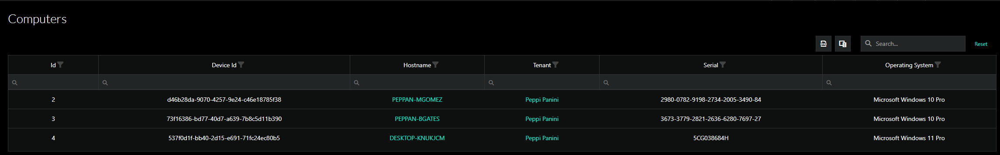
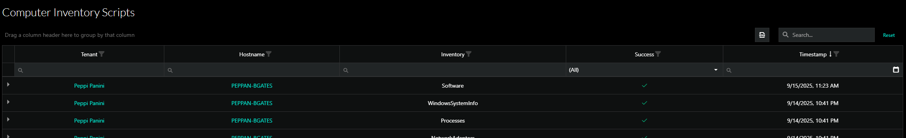
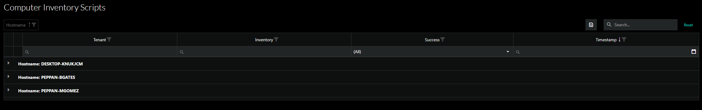
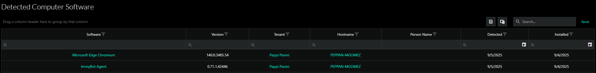
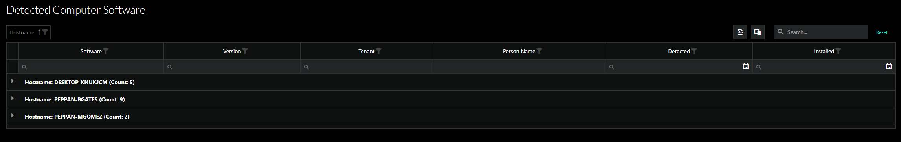
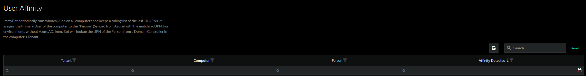

<!-- How To Template -->
# Reports

## Overview
This document will go over available reports within ImmyBot, and

## Prerequisites
An active ImmyBot subscription or trial

::: info
You must be an MSP Admin or Tenant Admin to export results from these pages
:::

## Navigation
You can get to the Reports by clicking on the Reporting tab on the left hand side of your ImmyBot instance and clicking on the appropriate Report.

All Reports have an export option, you must be an MSP Admin or a Tenant Admin to utilize this functionality. The export option is to the left of the search bar.

## Available Reports

### Computers
This report will give you all of the computers available in ImmyBot. You can select various columns by clicking on the column selection menu that is to the left of the search bar.

### Computer Inventory
This page shows the latest inventory results for all computers. In this report you can group the information by column. Simply drag the column to the top left of the table.

#### Ungrouped

#### Grouped

### Computer Software
This page shows all of the global software detected on your computers. You can select various columns by clicking on the column selection menu that is to the left of the search bar. In this report you can group the information by column. Simply drag the column to the top left of the table.

#### Ungrouped

#### Grouped

### User Affinity
ImmyBot periodically runs whoami /upn on all computers and keeps a rolling list of the last 10 UPNs. It assigns the Primary User of the computer to the "Person" (Synced from Azure) with the matching UPN. For environments without AzureAD, ImmyBot will lookup the UPN of the Person from a Domain Controller in the computer's Tenant.

### Dashboard
ImmyBot has a Dashboard that you can view session results from. This information is here, because the Dashboard is indirectly related to reporting, however it is it's own module.

   
>[!NOTE] Document information
>Author: Mark Gomez
 
>Date Published: 09/19/2025
> 
>Date Revised: N/A
> 
>Version Number: 1.0
