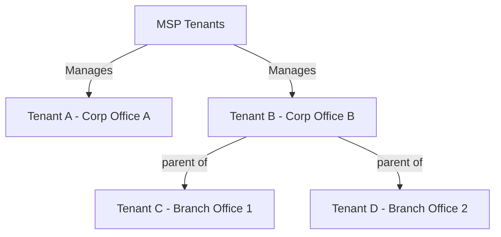

# Tenant Management

This guide explains how to effectively manage tenants (customers) in ImmyBot, including creation, organization, and configuration.

## Understanding Tenants

In ImmyBot, tenants represent the organizations you manage. Each tenant:

- Has its own set of computers and users
- Can have tenant-specific deployments
- May have different settings and configurations

Tenants can be organized hierarchically, with parent-child relationships that allow for inheritance of certain settings and deployments.

## Tenant Types

ImmyBot supports several tenant types:

### MSP Tenant

By default that first tenant in the ImmyBot instance is your MSP tenant. You can create additional MSP tenants, however, and Users (not People) can view and manage all Tenants within your instance.

### Client Tenants

Client tenants represent your customers. They can be created:
- Manually in ImmyBot
- Automatically through RMM integration
- Automatically through PSA integration
- Imported from Azure AD

### Child-Tenants

Child-tenants are sub tenants of tenants. They can represent:
- Branch offices
- Departments
- Divisions
- Geographic locations

## Creating Tenants

### Creating Tenants Manually

1. Navigate to **Tenants** in the left sidebar
2. Click **New** on the Tenants list page
3. Enter the tenant information:
   - Name
   - Description (optional)
   - Parent tenant (if applicable)
4. Click **Save**

### Importing Tenants from Integrations

If you have configured integrations, you can import tenants:

1. Navigate to **Show More** > **Integrations** in the left sidebar
2. Find and **Edit** your integration (RMM, PSA, or Azure)
3. Navigate to the **Clients** tab
4. Click **Sync agents for selected clients**
5. Review the imported tenants
6. Configure any additional settings
8. Click **Save**

## Tenant Hierarchy

ImmyBot allows you to create a hierarchical structure of tenants:

### Creating Parent-Child Relationships

1. Navigate to **Tenants**
2. Select the tenant you would like to make a child tenant
3. Go to the **Edit** tab
4. Select the parent tenant from the dropdown
5. Click **Update**

### Inheritance in Tenant Hierarchy

Child tenants inherit certain settings from their parents:

- Deployments (if configured for inheritance)
- Maintenance windows
- Integration mappings

You can override inherited settings at the child tenant level when needed.

## Tenant Configuration

Each tenant can have its own configuration options:

### Configuring Tenant Schedules

1. Navigate to **Tenants**
2. Select the tenant
3. Click the **Schedules** tab
4. Configure the Schedule:
   - Click **New** to create a new schedule
   - Set schedule name, frequency, and time window
   - Select targets (computers or groups)
   - Click **Create** to save the schedule

### Configuring Tenant Preferences

1. Navigate to **Tenants**
2. Select the tenant
3. Click the **Preferences** tab
4. Configure available preferences:
   - Default maintenance options
   - Agent settings
   - Deployment defaults
5. Click **Update** to save changes

### Tenant-Specific Deployments

You can create deployments that apply only to specific tenants:

1. Create a new deployment
2. Under **Targets**, select **Tenant**
3. Choose the specific tenant
4. Configure the deployment as needed
5. Save the deployment

For detailed instructions please see [Deployments](/Documentation/HowToGuides/creating-managing-deployments.md)

## Managing Tenant Users

Each tenant can have its own set of users:

### Adding Users to Tenants

1. Navigate to **Show More** > **People** in the left sidebar
2. Click **New** button
3. Enter user information:
   - Name
   - Email
   - Role
   - Tenant assignment
4. Click **Create** to add the user

### Importing Users from Azure AD

If you have configured Azure AD integration:

1. Navigate to **Show More** > **Azure** in the left sidebar
2. Select an Azure Client
3. Navigate to the **Users** tab
4. Click **Sync users From the parent tenant**
5. Review the imported users
6. Click **Save** to apply changes

## Tenant Migration

Sometimes you may need to move computers between tenants:

### Moving Computers Between Tenants

1. Navigate to **Computers**
2. Select the computer(s) to move
3. Click **Batch Actions**
4. Under **Change Tenant** Select the target tenant
5. Click **Change**
6. Confirm the action was successful

### Merging Tenants

To merge two tenants:

1. Identify the source and destination tenants
2. Move all computers from the source to the destination
3. Update any tenant-specific deployments
4. Once empty, you can delete the source tenant

## Best Practices

Follow these best practices for effective tenant management:

1. **Consistent Naming**: Use a consistent naming convention for tenants
2. **Hierarchical Organization**: Create a logical hierarchy that reflects your business relationships
3. **Regular Audits**: Periodically review tenant structure and settings
4. **Documentation**: Maintain documentation of tenant configurations
5. **Limit Direct Access**: Restrict direct access to the MSP tenants

## Next Steps

Now that you understand how to manage tenants in ImmyBot, you might want to explore:

- [User Roles and Security](/Documentation/Administration/user-roles.md) - Learn about user permissions and security
- [Integration Overview](/Documentation//integration-overview.md) - Connect ImmyBot to your existing tools
- [Maintenance and Updates](/Documentation/Administration/maintenance-updates.md) - Configure maintenance for your tenants

