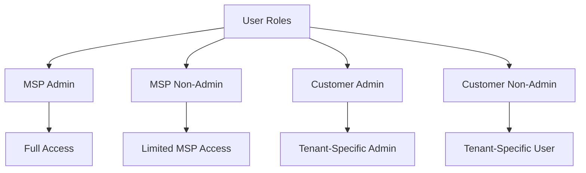

# User Roles and Security

This guide explains the different user roles available in ImmyBot, their permissions, and how to implement effective security practices.

## Understanding User Roles

ImmyBot uses a role-based access control (RBAC) system to manage permissions. Each user is assigned a specific role that determines what actions they can perform within the system. This approach simplifies permission management and helps maintain security.

## Role Permissions

### MSP Admin

The MSP Admin role has complete access to all ImmyBot features and functions:

* **Full access** to all features and settings
* Can manage all tenants and their resources
* Can create and manage users with any role
* Can create cross-tenant deployments
* Can access all computers and run any scripts
* Can configure system-wide settings
* No restrictions on any functionality

### MSP Non-Admin

The MSP Non-Admin role has broad access but with some administrative limitations:

* **Cannot create/edit/delete Schedules**
* **Cannot create/edit/delete Users**
* **Cannot create/edit/delete Cross-Tenant Deployments**
* **_Can_ create/edit/delete Single-Tenant and Individual Deployments**
  * NOTE: You can disable this in Settings > Preferences with the "Allow Non-Admin Users to Manage Deployments" setting
* **_Can_ access terminal on all machines and edit scripts**
  * NOTE: You can disable this in Settings > Preferences with the "Allow Non-Admins and Non-MSP Users to Use Terminal and Edit Scripts"
    * Disabling this prevents these users from being able to run arbitrary code on devices
* Can view all tenants and their resources
* Can run maintenance on any computer
* Can view system-wide reports and dashboards

### Customer (Tenant) Admin

The Customer Admin role has full control over their specific tenant:

* **Can view/edit Computers, Licenses, and Deployments for their Tenant**
* **Can create users in their tenant** (limited to Customer Non-Admin role)
* **Software they upload is owned by their tenant** and not visible to other tenants
* **Licenses they create are owned by their tenant** and not visible to other tenants
* **Cannot View/Create/Edit Schedules**
* Can run maintenance on computers in their tenant
* Can create and manage deployments for their tenant
* Can view reports and dashboards for their tenant
* Cannot access other tenants' resources

### Customer (Tenant) Non-Admin

The Customer Non-Admin role has limited access to their specific tenant:

* **Cannot View/Create/Edit Schedules**
* **Cannot create Cross-Tenant Deployments**
* **Cannot create Users**
* **Can create Deployments scoped to individual Computers and People**
* Can view computers in their tenant
* Can run maintenance on computers in their tenant (if permitted)
* Can view reports for their tenant
* Cannot modify tenant-wide settings

## Configuring Role Permissions

You can customize certain aspects of role permissions through system preferences:

### Deployment Management

To control who can manage deployments:

1. Navigate to **Show more** > **Preferences**
2. Find the "Allow Non-Admin Users to Manage Deployments" setting
3. Toggle it on or off based on your requirements
4. Click **Save**

### Script and Terminal Access

To control who can use terminal access and edit scripts:

1. Navigate to **Show more** > **Preferences**
2. Find the "Allow Non-Admins and Non-MSP Users to Use Terminal and Edit Scripts" setting
3. Toggle it on or off based on your requirements
4. Click **Save**

## Assigning Roles to Users

To assign a role to a user:

1. Navigate to **Show more** > **Users**
2. Click on the user you want to modify (or create a new user)
3. In the user details, select the appropriate role from the dropdown
4. (Optional) Configure tenant access for the user
5. Click **Save**

## Security Best Practices

Follow these best practices for effective role management:

1. **Principle of Least Privilege**: Assign users the minimum permissions needed for their job
2. **Regular Audits**: Periodically review user accounts and their assigned roles
3. **Role Separation**: Maintain clear separation between MSP and Customer roles
4. **Documentation**: Maintain documentation of who has what role and why
5. **Offboarding Process**: Promptly remove access when users leave the organization

## Multi-Tenant Considerations

When managing multiple tenants:

1. **Tenant Isolation**: Ensure customer admins can only access their own tenant
2. **Cross-Tenant Access**: Be cautious when granting cross-tenant permissions
3. **Tenant-Specific Roles**: Consider creating tenant-specific roles for specialized access
4. **Hierarchical Structure**: Use parent-child tenant relationships for complex organizations

## Next Steps

After understanding user roles, you might want to explore:

- [Adding Users](/Documentation/HowToGuides/add-users.md) - Learn how to add and manage users
- [Tenant Management](/Documentation/Administration/tenant-management.md) - Configure tenant access and settings
- [Security Best Practices](/Documentation/Troubleshooting/security-software-exclusions.md) - Enhance overall system security

