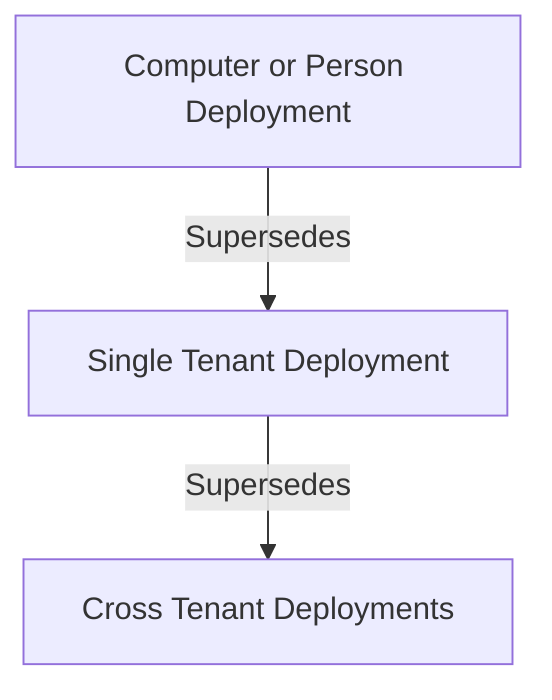

# Deployment Resolution

Deployment Resolution is the process by which ImmyBot determines which deployment "wins" when multiple deployments could apply to the same computer or user. This is essential for handling exceptions and special cases.

**Also known as:**
* Creating Exceptions
* "Winning" Deployments
* Dealing with Snowflakes

Like Group Policies have a "Winning Policy", ImmyBot must have a "Winning Deployment" for a given Maintenance Item on a computer. When multiple deployments target the same computer with conflicting settings, ImmyBot uses specific rules to determine which one takes precedence.

## Deployment Heirarchy

## Example Scenario
Lets say you want to ensure that a client has a softphone that needs to be deployed to everyone, except for the CEO, who's name is John Doe.
You would:
  
A. Deploy it to all computers in the tenant - Create a software deployment for this softphone, set the **Software Should Be** field to **Installed**,  set **Task Mode** to **Enforce**, set **Target Enforcement** to **Required**, set **Target Scope** to **Single Tenant**, set **Target Type** to **All Computers** and set **Target  Filter** to **Workstations and Portable Devices**
  
B. Ensure it's uninstalled from John Doe's computer - Create a software deployment for this softphone, set the **Software Should Be** field to **Uninstalled**, set **Task Mode** to **Enforce**, set **Target Enforcement** to **Required**, set **Target Scope** to **Single Individual  and Person**, set **Person** to **John Doe**

Here, the software will get installed on all computers, except John Doe's. ImmyBot will ensure that John Doe's computer has the software uninstalled.

## Example Scenario 2
Let's say you have a customer "Contoso" that uses Adobe Acrobat instead of Adobe Reader, and you would like that to be installed instead.

**Step 1:** Create a Deployment that sets the desired state of Adobe Reader to Uninstalled for Contoso

**Step 2:** Create a Deployment that Installs Adobe Acrobat for their computers

**Result:** When maintenance runs on Contoso computers, Adobe Reader will be uninstalled and Adobe Acrobat will be installed, even if you have a global deployment that normally installs Adobe Reader on all computers.