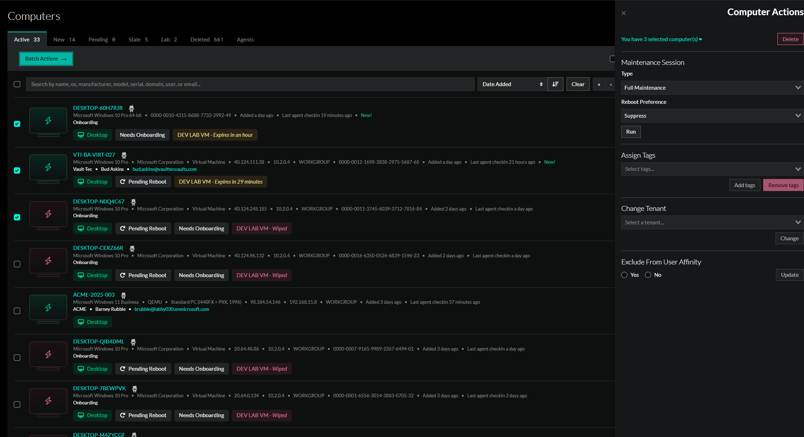
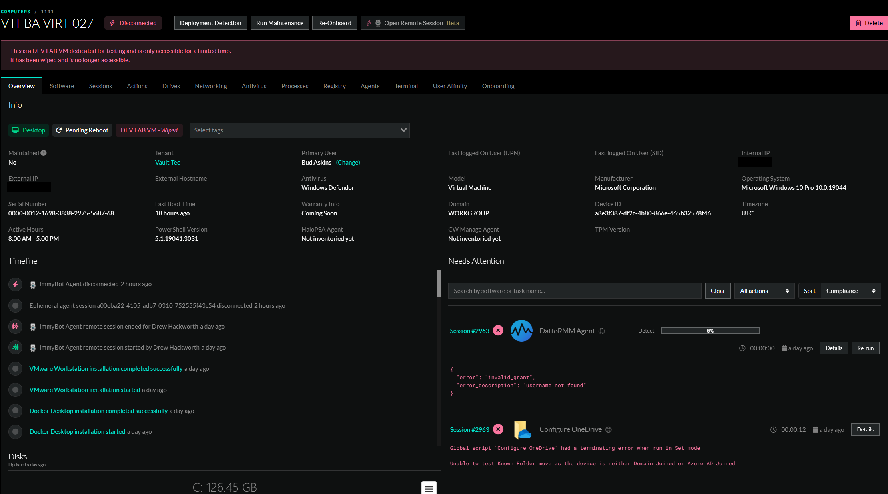

# Computers

> [!WARNING] *For starter subscriptions, computers cannot be managed after 7 days*
> Please see the [FAQ section for more details](https://docs.immy.bot/FAQ.html#licensing-and-plans).

Computers are a reference to the PC and Servers that exists within your ImmyBot instance.

## Overview
Computers can be managed through the computer tab on in the navigation column on the left, or through the computers tab after clicking into a tenant. In either case, bulk management is supported.

## Navigation
When you click on a computer, you'll be taken to the Overview tab by default. This tab provides key information about the computer, lets you manage tags specific to it, and displays the primary user assigned to the device. From the Overview page, you can use the navigation tabs to access and manage other aspects of the computer.

- **Software** will give you a list of software on the computer and allow you to deploy software from the same interface
- **Sessions** lists all of the sessions run for that computer
- **Actions** lists any actions taken against the computer during a maintenance session
- **Drives** is informational only and will list the physical and logical disks on that computer
- **Networking** is informational only and will list the network interfaces on that computer
- **Antivirus** is informational only and will list the antivirus platforms that are installed on that computer
- **Processes** is informational only and will list the sytem processes
- **Registry** allows you to view the registry and deploy changes from the same interface
- **Agents** allows you to view any agent associated with this PC.
- **Terminal** allows you to run scripts directly on the machine without pushing a deployment

