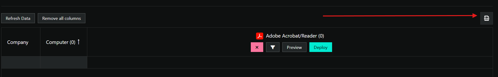
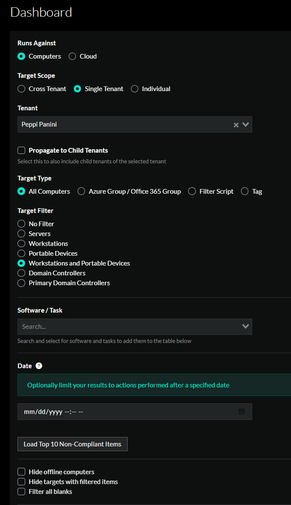
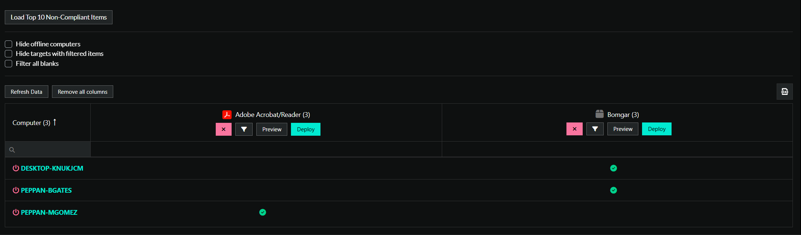

# Dashboard

## Overview
This document is intended to give you an overview of the Dashboard and it's functionalities. The intention of the Dashboard is to give you a centralized location to review session results.

## Prerequisites
An active ImmyBot subscription or [trial](https://www.immy.bot/pricing/)

## Navigation
The Dashboard is at the top of the navigation column on the left hand side of your ImmyBot instance.

You can export the results if you're an MSP Admin or Tenant Admin of your instance. That button is at the top right of the results page

## Using the Dashboard

1. Select what you're going to run this task against, cloud or computers.
   - Cloud allows you to run Cloud Tasks, where computers let you run Software and Computer Tasks.
2. Select the Target Scope and filter
3. Select the Software/Task item you need to review
4. Set a date if you need to.
5. When you scroll down, you will be presented with a list of available computer endpoints that match your criteria

If there was a session that ran with the Software or Task you specified, you will be given the results of that run. You can also deploy this maintenance item from here.

You're not limited to one maintenance item, you have have more then one showing, just add the item again from step 3 above.

   
>[!NOTE] Document information
>Author: Mark Gomez
 
>Date Published: 09/19/2025
> 
>Date Revised: N/A
> 
>Version Number: 1.0
