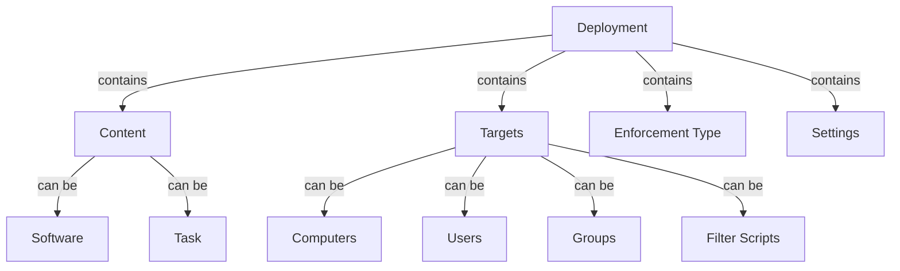

# Deployments

Deployments are the central concept in ImmyBot. They define how computers "should be" configured and allow you to automate software installation, configuration, and maintenance across your environment.

## What are Deployments?

A deployment is a rule that specifies:

1. **What** should be deployed (software or task)
2. **Where** it should be deployed (target computers)
3. **How** it should be enforced (required, optional, etc.)
4. **When** it should be applied (immediately, during onboarding, etc.)

Think of deployments as similar to Group Policy Objects in Windows environments, but more powerful and flexible.

## Deployment Types

ImmyBot supports two types of deployments:

### Software Deployments

Software deployments install, update, or remove software applications. They can:

- Install a specific version of an application
- Always keep an application updated to the latest version
- Uninstall an application if it's found
- Configure application settings after installation

### Task Deployments

Task deployments run scripts or commands to configure settings or perform actions. They can:

- Configure Windows settings
- Join computers to a domain
- Create local user accounts
- Set up network configurations
- Perform custom maintenance actions

## Enforcement Types

The enforcement type determines how and when a deployment is applied:

### Required

Required deployments are automatically applied during maintenance sessions. They ensure that:

- Software is installed if missing
- Software is updated if outdated
- Tasks are run if they haven't been run successfully before
- Configurations are applied and maintained

Use Required for software and settings that should always be present on target computers.

### Optional

Optional deployments are available for manual installation but aren't automatically applied. They:

- Appear in the Self-Service Portal for users to install
- Can be manually applied by technicians
- Don't run during automated maintenance

Use Optional for software that some users might need but isn't required for everyone.

### Onboarding

Onboarding deployments only run during the initial computer setup process. They:

- Run once when a computer is first added to ImmyBot
- Don't run during regular maintenance
- Are ideal for initial configuration tasks

Use Onboarding for one-time setup tasks like computer naming, domain joining, and initial software installation.

### Ad Hoc

Ad Hoc deployments only run when explicitly triggered. They:

- Don't run automatically during maintenance
- Must be manually triggered by a technician
- Are useful for occasional or on-demand tasks

Use Ad Hoc for tasks that should only run when specifically needed, like cleanup scripts or diagnostic tools.

## Targeting

Deployments can target computers based on various criteria:

### Direct Targeting

- **All Computers**: Apply to every computer in your ImmyBot instance
- **Specific Computer**: Apply to a single computer
- **Computer Group**: Apply to a predefined group of computers
- **Tenant**: Apply to all computers in a specific tenant

### Dynamic Targeting

- **Filter Scripts**: Use PowerShell scripts to dynamically determine eligibility
- **User-Based**: Target computers based on their primary user
- **Tag-Based**: Target computers with specific tags

### Exclusions

You can also define exclusions to prevent a deployment from applying to certain computers, even if they match the target criteria.

## Deployment Resolution

When multiple deployments apply to the same computer, ImmyBot uses a resolution process to determine the final configuration. This process considers:

- Enforcement type priority
- Deployment specificity
- Tenant hierarchy
- Supersedence relationships

For detailed information on how deployments are resolved, see [Deployment Resolution](/Documentation/Reference/terminology.md#deployment-resolution).

## Creating Deployments

To create a new deployment:

1. Navigate to **Deployments** in the left sidebar
2. Click **New** to create a new deployment
3. Configure the deployment settings:
   - Name and description
   - Content type (Software or Task)
   - Enforcement type
   - Targets
   - Additional settings
4. Click **Create** to save the deployment

For step-by-step instructions, see [Creating and Managing Deployments](/Documentation/HowToGuides/creating-managing-deployments.md).

## Recommended Deployments

ImmyBot includes several recommended deployments that provide a solid foundation for managing your endpoints:

- **Create Profile for Primary User**: Allows ImmyBot to set default browser and PDF editors
- **Microsoft 365 Apps**: Installs the apps the selected user is licensed for
- **Manufacturer Updates**: Installs the latest updates from Dell, HP, and Lenovo
- **Adobe Reader**: Installs and configures the latest version of Adobe Reader

For more information, see [Recommended Deployments](/Documentation/HowToGuides/recommended-deployments.md).

## Best Practices

### Targeting Strategy

- Start with smaller, specific targets before expanding to larger groups
- Use filter scripts for complex targeting scenarios
- Test deployments on a small group before applying to all computers

### Deployment Organization

- Group related deployments together
- Use tags to categorize deployments
- Document the purpose and scope of each deployment

### Testing and Validation

- Test deployments in a Windows Sandbox where available
- Monitor maintenance logs for deployment issues
- Regularly review and update deployments as needed
