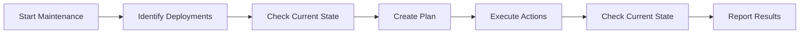
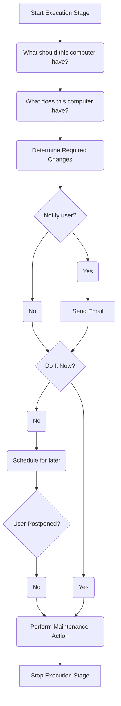
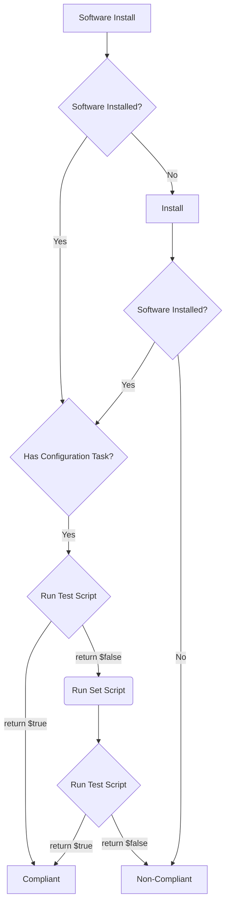

# Maintenance Sessions

This guide explains maintenance sessions and updates in ImmyBot, ensuring your managed computers stay up-to-date and properly configured.

## Understanding Maintenance Sessions

A Maintenance Session is conceptually similar to running gpupdate /force, but more powerful and predictable.

In traditional systems, different types of maintenance tasks run on separate, often unpredictable schedules. For example, Windows Updates might run Tuesday night, third-party updates on Wednesday, and auto-remediation tasks whenever an alert triggers—each based on its own polling interval.

By consolidating all automation into a structured sequence called a Maintenance Session, we gain control and consistency, not just over what changes are applied, but when they happen.

This approach also streamlines onboarding new machines. Conventional RMMs typically rely on Monitors that detect missing software and trigger install scripts. However, this method doesn’t scale well due to complex dependency and exclusion handling.

Now, imagine if Group Policy could:

- Reliably deploy any type of software,
- Run consistently even when the device is off-network,
- Provide real-time feedback about what's being applied,
- And optionally notify the end user with branded emails—before and after—with the option to cancel.

That’s the kind of reliability and transparency Maintenance Sessions bring.

## The Anatomy of a Maintenance Session

When a maintenance session runs, ImmyBot:

1. Identifies all deployments that apply to the computer
2. Determines the current state of the computer
3. Creates a plan to bring the computer into compliance
4. Executes that plan as a series of maintenance actions
5. Determines the current state of the computer to see if the deployments were successful
6. Reports on the results of the maintance session

## Maintenance Session Stages

### Detection Stage

During the Detection Stage, ImmyBot "Detects" which Maintenance Actions are necessary to bring the computer into compliance. These Actions are added to the Maintenance Session.

This is a read-only process, and typically done while the user is active. This is so ImmyBot can notify the user of changes that will occur later during the Execution Stage. By doing this during the day, and scheduling Execution for later, we are giving the end user the best possible chance to be aware of the upcoming maintenance, Postponing if you allow. The Postpone feature is very popular among engineers that do may need to leave renderings and analysis tasks running overnight.

### Execution Stage

## Maintenance Action

This is an example of the flow for a software install

A *Maintenance Session* has one or more *Maintenance Actions*. A Maintenance Action could be to install software, apply a Windows Update, or run a [Task](#task).

The image below depicts a typical Maintenance Session with many [Maintenance Actions](#maintenance-action)

## Finding your Maintenance Sessions
You can view Maintenance Sessions for all computers under the **Sessions** tab on the left hand navigation.

Or, you can view Maintenance Sessions for a specific Computer under the Sessions tab for that Computer

## Scheduled Maintenance Sessions

::: info ImmyBot Standard and ImmyBot Forever Clients only
If you're an ImmyBot starter client, you do not have access to Schedules in ImmyBot
:::

ImmyBot can automatically run maintenance sessions based on your configured Schedules.

Please see [Schedules](/Documentation/HowToGuides/schedules) on how to accomplish this

You can control how often maintenance runs in the Schedule, please also see our [best practices](/Documentation/GettingStarted/instance-best-practices.html#scheduled-maintenance) for more information

## Next Steps

Now that you understand how to manage maintenance and updates in ImmyBot, you might want to explore:

- [Common Issues](/Documentation/Troubleshooting/common-issues.md) - Troubleshoot common maintenance problems
- [Creating Deployments](/Documentation/HowToGuides/creating-managing-deployments.md) - Create effective deployments for your environment
- [Working with Tasks](/Documentation/HowToGuides/working-with-tasks.md) - Use tasks to enhance your maintenance capabilities
