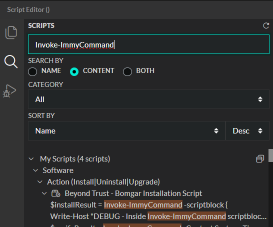
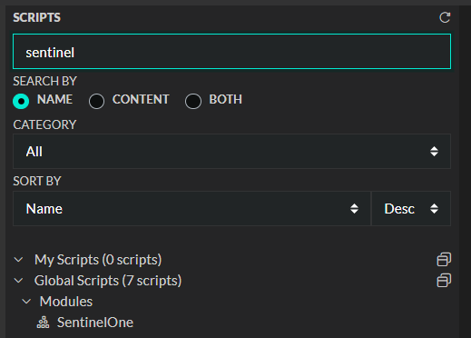
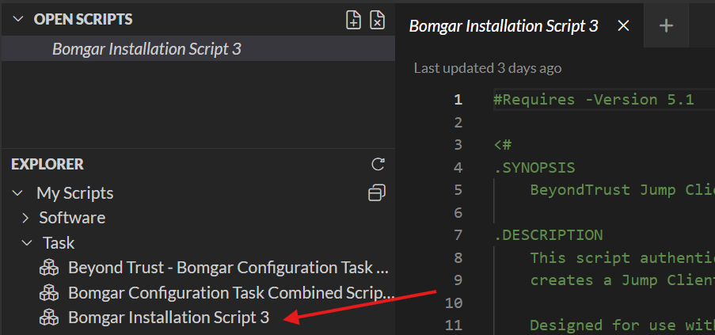
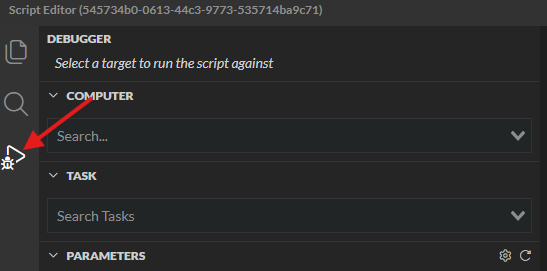
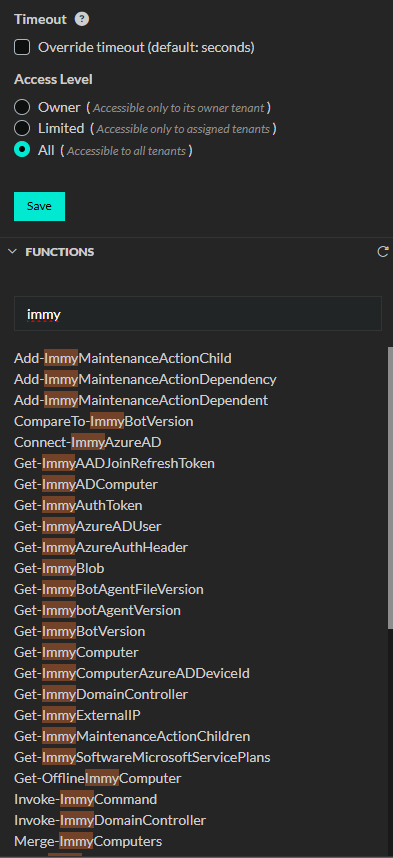
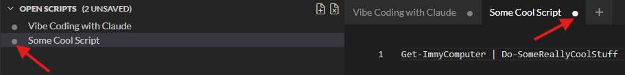

# Script Editor

## Overview
The script editor is a built in tool that allows you to build, and edit local instance scripts in ImmyBot. When viewing any scripts, local or global, they will open in the script editor. You can view ImmyFunctions through his

## Navigation

To get to the script editor, click on **Library** > **Script Editor**

1. Module and script explorer
2. Script properties blade
3. Functions explorer
4. Script editor
5. Output and syntax errors
6. Open Scripts
7. Search
8. Debugger

## Searching

On the left hand navigation, click on the magnifying glass.

This will bring up a search context. From there you can type in key words to find the assets you need. You can change the search by as well, by default is is set to content

## Creating and editing scripts

### Creating a script
::: info
When you create Tasks and Software, scripts are automatically managed for you as you go through those processes. You don't need to follow this process to get your scripts into Software and Tasks.
:::

Click on the icon with the '+' on the top right corner of the navigation pane.

Once you're done editing, click Save on the right hand side under the Access Level.

### Opening a script
Simply click on a script from the explorer or from the search window.

## Debugging scripts
Click on the triangle with a bug icon on the left hand navigation pane.

From here, you can select a computer, and a task and run it against that computer. If you're working with a cloud script, you can select the Tenant instead of the computer.

## Finding available functions
One the right hand side, you can find a module that is labeled functions. It will match on partial matches when you search.

### How to exit the script editor
You can close individual scripts by clicking on the circle or 'x' on the tab it's open on.

You can close the entire script editor by clicking on the 'x' on the top right hand corner like a normal Microsoft Windows OS program.

