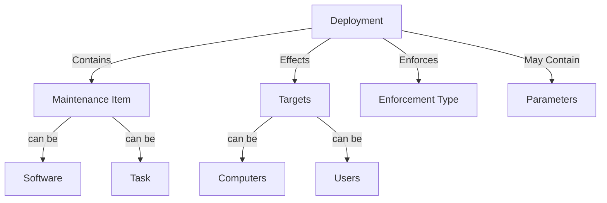
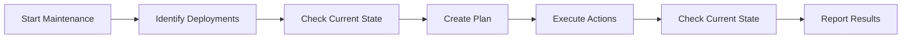
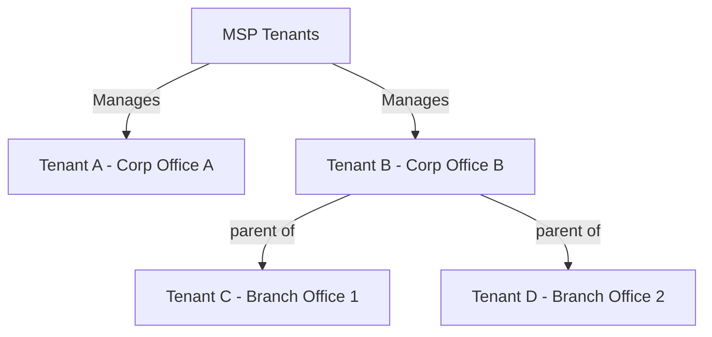

# Core Concepts

This guide explains the fundamental concepts of ImmyBot that you'll need to understand to use the platform effectively. Each concept builds on the previous ones to create a comprehensive automation system.

## Deployments

A deployment is a rule that specifies:

1. **What** should be deployed (software or task)
2. **Where** it should be deployed (target computer, user)
3. **How** it should be enforced (required, adhoc, or onboarding.)

Think of deployments as similar to Group Policy Objects in Windows environments, but more powerful and flexible.

> **Example**: A deployment might specify that "All accounting computers should have QuickBooks 2023 installed."

## Maintenance Sessions

Maintenance Sessions are the mechanism through which ImmyBot applies deployments to computers. When a maintenance session runs, ImmyBot:

When a maintenance session runs, ImmyBot:

1. Identifies all deployments that apply to the computer
2. Determines the current state of the computer
3. Creates a plan to bring the computer into compliance
4. Executes that plan as a series of maintenance actions
5. Determines the current state of the computer to see if the deployments were successful
6. Reports on the results of the maintance session

Maintenance sessions can be triggered:
- Manually by a technician
- Automatically on a schedule
- Via API or integration

## Agents

The ImmyBot Agent is a lightweight service that runs on managed computers and communicates with the ImmyBot instance. The agent:

- Executes commands sent from the ImmyBot instance
- Reports computer information and status
- Manages software installations and configurations
- Runs scripts in various contexts (System, User, etc.)

There are two types of agents:
- **Full Agent**: Installed on managed computers, the full agent creates Ephemeral agents that do the actual work. Recommended for all endpoints. See [Installation](/Documentation/GettingStarted/quick-start-guide.md) for more information.
- **Ephemeral Agent**: A temporary agent created dynamically for communicating to your ImmyBot instance. Does not require the Full Agent; integrations will be used to initiate these agents where possible if the full agent is not installed or not runnning.

## Tenants

In ImmyBot, tenants represent the organizations you manage. Each tenant:

- Has its own set of computers and users
- Can have tenant-specific deployments
- May have different settings and configurations

Tenants can be organized hierarchically, with parent-child relationships that allow for inheritance of certain settings and deployments.

## Software

In ImmyBot, software is more than just an application. A software definition includes:
- **Versions**: Different versions of the software that can be deployed
- **Detection Methods**: Scripts that determine if the software is already installed
- **Installation Scripts**: Scripts that handle the installation process
- **Configuration Scripts**: Scripts that configure the software after installation

Software can be deployed in different ways:
- **Enforced**: Always installed and kept at a specific version
- **Removed**: Actively uninstalled if found

## Tasks

Tasks are scripts or commands that perform specific actions on computers. Unlike software deployments, tasks:
- Don't necessarily install anything
- Can be used for configuration, maintenance, or information gathering
- Can run in different contexts (System, User, Metascript, Cloud)

Tasks can be:
- **One-time**: Run once and complete
- **Recurring**: Run on a schedule

## Execution Contexts

Scripts in ImmyBot can run in different contexts, each with its own capabilities and limitations:

- **System Context**: Runs with SYSTEM privileges on the computer
- **User Context**: Runs in the context of a specific user **User MUST be logged in**
- **Metascript Context**: Runs on the ImmyBot server and can orchestrate actions across multiple computers
- **Cloud Context**: Runs in a cloud environment with access to cloud-specific APIs

Understanding these contexts is crucial for writing effective scripts and troubleshooting issues.

## Targets

Targets define which computers or users should receive a deployment. Targets can be based on:

- **Computer Groups**: Static or dynamic groups of computers
- **User Groups**: Groups of users, often synchronized from Azure AD
- **Filter Scripts**: PowerShell scripts that dynamically determine eligibility
- **Tenant**: All computers in a specific tenant

Targets allow for precise control over which computers receive which deployments, enabling you to create sophisticated deployment strategies.

## Next Steps

Now that you understand the core concepts of ImmyBot, you're ready to explore:

- [Common Workflows](/Documentation/GettingStarted/common-workflows.md) - Step-by-step guides for everyday tasks
- [Creating Deployments](/Documentation/HowToGuides/creating-managing-deployments.md) - Learn how to create effective deployments
- [Scripting Guide](/Documentation/AdvancedTopics/scripts.md) - Master the art of scripting in ImmyBot

