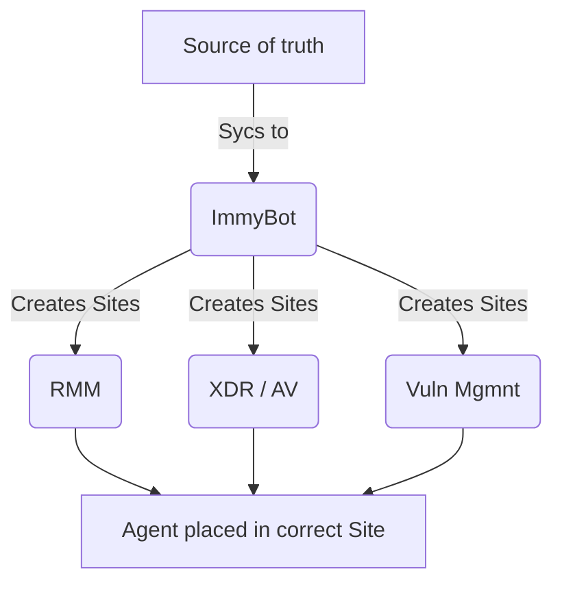

<!-- How To Template -->
# ImmyBot Onboarding

## Objective
This document is intended to be a detailed self guided process that will help you understand and set up your ImmyBot instance. This document's intended audience is the ImmyBot maintainer for your organization. If you would like to jump right into using ImmyBot, please see the [Quick Start Guide](/Documentation/GettingStarted/quick-start-guide)

## Prerequisites
An active ImmyBot subscription or trial with MSP Admin access.

Global Administrator in your Azure instance

The ability to make API objects in your platforms

## Generalizations

We recommend creating processes around a single source of truth when implementing ImmyBot. This source will be the place that you create clients from in ImmyBot and other platforms so that everything can be automated properly and match names across any platform that you use.

## Process

### Configure Security Platforms
You will need to make some changes to your security platform in order for ImmyBot to work correctly without your antivirus, XDR, Zero Trust platforms etc, killing the processes we start.

Please see our [security requirements](/Documentation/Troubleshooting/security-software) for detailed information on the changes you need to make.

## PSA Integration Setup
Setting up your PSA integration allows ImmyBot to sync and utilize
  - Client Names, Types, and Statuses
  - Agreements and additions

The ConnectWise Manage integration allows you to use agreement additions as a filter in Deployments. This allows ImmyBot to ensure that customers with specific agreement additions, such as SentinelOne, get that software installed when the agreement addition is active.

Supported PSA Integrations
- ConnectWise Manage: [Setup](/Documentation/Integrations/connectwise-manage-integration-setup)
- Halo PSA: [Setup](/Documentation/Integrations/halo-integration-setup)

## RMM Integration Setup
Setting up your RMM Integration allows you to run scripts through your RMM instead of utilizing the ImmyBot Permanent Agent, as well as sync your clients from your RMM.

Supported RMM Integrations

[ConnectWise Automate](/Documentation/Integrations/connectwise-automate-integration-setup)

[ConnectWise Control](/Documentation/Integrations/connectwise-control-integration-setup)

[N-Central](/Documentation/Integrations/ncentral-integration-setup)

[NinjaRMM](/Documentation/Integrations/ninjarmm-integration-setup)

::: info What about Datto RMM?
We don't currently have an integration with DattoRMM, however, the global deployment will suffice for installing the agent across your ImmyBot instance via a Cross Tenant Deployment.
:::

## Configure Azure Integration
For a basic instance set up:
Navigate to **Tenants** > **Your tenant** > **Azure** > **Default** > **Save** > **Consent**

We recommend setting up the Custom permission level after this to ensure help ensure that Intune and AzureAD tasks function well.
Navigate to **Tenants** > **Your tenant** > **Azure** > **Custom** > **Save** > **Consent**

From here, you need to provide concent to your managed Microsoft 365 organizations
**Show More** > **Azure** > **Tenant** > **Red Consent Link**

## Create Your Tenants
At this point you will want to create your tenants with one of your integrations acting as a source of truth.

From any of your PSA or RMM integrations
Show More > Integrations > Edit the integration > Clients > Click on Link Tenant > Click Create a new tenant

From your Azure Integration
Show more > Azure > Select your parent (CSP) tenant > In the generated list below, click on Link > Either select a tenant or create a new tenant.

Alteratively, you can import all customers using the **Import all customers** button

## Regarding Deployments

You are going to want to go over the [Deployment Concept](/Documentation/CoreFeatures/deployments) as well as [Managing Deployments](/Documentation/HowToGuides/creating-managing-deployments) pages before continuing. They outline how Deployments work, as well as their intentions and use in your ImmyBot instance.

## Azure / Active Directory Setup

### Azure AD Join Setup
In each Azure tenant you manage (read: every Microsoft 365 account you intent on using Join AzureAD and / or Join Intune tasks for) you will need to create a DEM account. This account does not need to be and should not be a Global Administrator. Document the password in your password manage for each client.

Once the user is created, add the Cloud Device Manager Role and assign an Intune P1 license if you intend on utilizing Intune for your clients.

This user will need to be excluded from enforced MFA for device joining.

#### Creating the Deployment
1. Deployments > New
   1. Software / Task: Join AzureAD
   2. Task Mode: Enforce
   3. Parameters:
      - OAuth2 (Do not use UsernamePassword tab)
        - Click Provide Consent, and sign in with the DEM user you created for this tenant.
      - Other parameters as you see fit
   4. Target Enforcement: Onboarding
   5. Target Scope: Cross Tenant
   6. Target Type: All Computers
   7. Target Filter: Workstations and Portable Devices
   8. Click Create

Supplemental Links:
- [Microsoft](https://learn.microsoft.com/en-us/intune/intune-service/enrollment/device-enrollment-manager-enroll)
- [ImmyBot Community](https://community.immy.bot/t/everything-you-need-to-know-about-azuread-and-immy/2669)

### Active Directory Join Setup

For each Tenant you intend on running the Rename and Join Active Directory task, you will need to install the ImmyBot agent on a domain controller that is in that tenant. You need at least one, but we recommend having at least two. Once the ImmyBot agent is installed, it will attempt to run inventory on that domain controller and assign the Domain Controller tag to the computer. If it does not show up, you can run inventory manually (Computers > Find your DC > Check the box to the left of the DC > Batch Actions > Maintenance Session > Click the Type drop down, and select Inventory Scripts > click Run)

#### Creating the Deployment
1. Deployments > New
   1. Software / Task: Set Computer Name and Domain Join
   2. Task Mode: Enforce
   3. Parameters: Edit them as you see fit
      - We do not recommend using the "PreferredDomainControllerName"
   4. Target Scope: Cross Tenant
   5. Target Type: All Computers
   6. Target Filter: Workstations and Portable Devices
   7. Click Create

## Configure SMTP (optional)

If you would like to send emails about the work being done to your tenant computers, be sure to set up SMTP for your default MSP tenant. This will allow ImmyBot to send authenticated emails to your end users.

[SMTP Setup Guide](/Documentation/HowToGuides/smtp)

## Configure Time Zone

Be sure to configure the timezone for your instance.

Show More > Preferences > Search for "Default Time Zone" > Set preference

## Configure Automatic ImmyBot Version Upgrades

By default ImmyBot doesn't update it self. You can enable this if you would like, and we do recommend this is enabled. ImmyBot releases new versions that include bug fixes and quality of life improvements every 2 to 4 weeks.

Show More > Preferences > Search for "Automatic immy.bot Version Upgrades" > Toggle the switch on and set your preferences.

## Exclude Chocolatey from Software Search

We have observed Chocolatey causing issues for deployments in the past, we recommend turning this off unless you utilize that service.

Show More > Preferences > Search for "Exclude Chocolatey from Software Search" > toggle the switch on

## Set up Recommended Deployments

We recommend setting up Cross Tenant deployments for the following Tasks and Software

### Software
- Acrobat
  - Set this to update if found, unless you want to have it installed on all of your endpoints
- 7-Zip
  - Set this deployment to Update if Found. You may not want 7-Zip on everything, but you do want to keep it updated where possible.
- HP Wolf Security
  - You don't need to deploy this, however we have found it to be bloatware on our client PCs. Please also see that this is an Uninstall only software deployment.
- Microsoft Visio
  - ImmyBot has a functionality called a metascript that will run in the context of your ImmyBot instance to act as a central point to check licensing etc in your platforms.
  - This Deployment specifically will only deploy if the assigned primary user has a Visio license and the tenant it is applying to has an Azure connection.

### Tasks
- Create Profile for Primary Person
  - Creates a profile for the set Primary Person on the computer. Makes for smoother first login
- BitLocker
  - Ensures your computers are encrypted, if they're capable, and stores the keys in AzureAD or Active Directory
  - See [BitLocker](/Documentation/GettingStarted/recommended-deployments.html#bitlocker) for best practices
- Lenovo / Dell / HP Updates
  - You can use tasks to deploy manufacture updates.
  - You can also utilize filter scripts to only apply to specific manufacturers
    - 

### Set up a Schedule
If you're an ImmyBot Forever or ImmyBot Standard client, you have access to Schedules. You can create a schedule to run maintenance across any subset of your computers.

See [Schedules](/Documentation/HowToGuides/schedules) for more information.

## Final Thoughts

You're set up to start [onboarding](/Documentation/HowToGuides/onboarding) your computers into Immy! You should spend some time in your Preferences (Show More > Preferences) to familiarize yourself with what you have available to you.

   

>[!NOTE] Document information
>Author:
 
>Date Published:
> 
>Date Revised:
> 
>Version Number:
