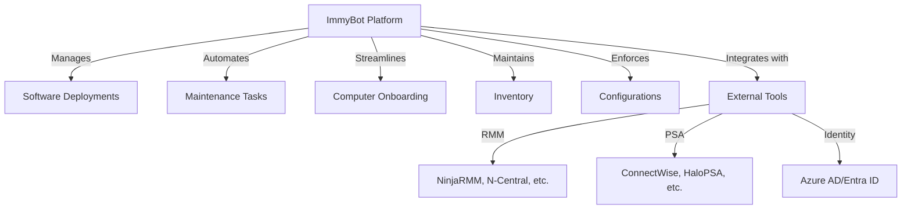
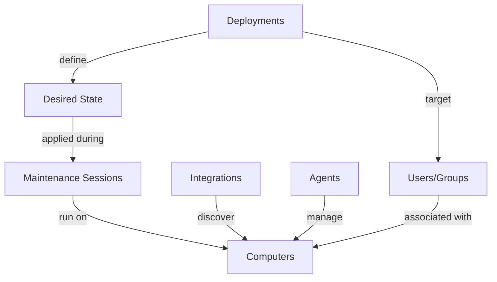

# Introduction to ImmyBot

ImmyBot is a powerful IT automation platform designed to streamline the management of computers and software deployments across organizations. This guide provides an overview of ImmyBot's capabilities and how it can transform your IT operations.

## What is ImmyBot?

ImmyBot is a comprehensive IT automation platform that helps IT professionals:

- **Deploy and manage software** across multiple computers and tenants
- **Automate routine maintenance tasks** to ensure systems are secure and up-to-date
- **Streamline computer onboarding** for new devices
- **Integrate with existing tools** like RMM and PSA platforms
- **Maintain detailed inventories** of hardware and software
- **Enforce consistent configurations** across your environment

## The ImmyBot Approach

ImmyBot uses a **declarative approach** focused on desired state configuration. Instead of thinking about the steps to make something happen, you define how things "should be" and ImmyBot handles the rest.

For example, instead of creating a script that checks if Chrome is installed and then installs it if it's not, you simply declare:

> "Chrome should be installed on all accounting computers"

ImmyBot then:
1. Identifies all accounting computers
2. Checks if Chrome is already installed on each one
3. Installs Chrome where it's missing
4. Verifies the installation was successful

This paradigm shift allows you to focus on the end result rather than the process.

## Key Benefits

### For MSPs (Managed Service Providers)

- **Multi-tenant Management**: Manage multiple clients from a single console
- **Standardization**: Apply consistent configurations across all clients
- **Efficiency**: Automate routine tasks to reduce technician workload
- **Integration**: Connect with your existing RMM and PSA tools
- **Scalability**: Easily onboard new clients and computers

### For Internal IT Departments

- **Consistency**: Ensure all computers meet your organization's standards
- **Automation**: Reduce manual intervention for routine tasks
- **Visibility**: Maintain a comprehensive inventory of all assets
- **Compliance**: Enforce security policies and software requirements
- **User Experience**: Improve end-user experience with reliable systems

## Core Components

ImmyBot consists of several key components that work together to provide a comprehensive automation solution:

### ImmyBot Instance

The central management platform that:
- Orchestrates all automation activities
- Stores configuration data and inventory information
- Provides the web-based management interface
- Communicates with agents on managed computers

### ImmyBot Agent

A lightweight service installed on managed computers that:
- Executes commands from the server
- Reports computer information and status
- Manages software installations and configurations
- Runs scripts in various contexts (System, User, etc.)

### Deployments

Rules that define how computers should be configured, including:
- What software should be installed
- What tasks should be run
- Which computers should receive these configurations

### Maintenance Sessions

Scheduled or on-demand processes that:
- Apply deployments to computers
- Update software and configurations
- Run maintenance tasks
- Report results back to the server

## Getting Started

Ready to start using ImmyBot? Here's how to get up and running quickly:

1. [Quick Start Guide](./quick-start-guide): Set up your first computer and deployment
2. [First Computer Setup](./first-computer-setup): Detailed instructions for onboarding computers
3. [Core Concepts](./core-concepts): Learn the fundamental concepts of ImmyBot
4. [Common Workflows](./common-workflows): Step-by-step guides for everyday tasks

## System Requirements

ImmyBot is designed to work with:

- **Managed Computers**: Windows 10/11 (all editions), Windows Server 2016+
- **Agent Requirements**: .NET Framework 4.7.2 or higher
- **Browser Requirements**: Chrome, Edge, Firefox, Safari (latest versions)

For detailed system requirements, see the [System Requirements](./system-requirements) page.
