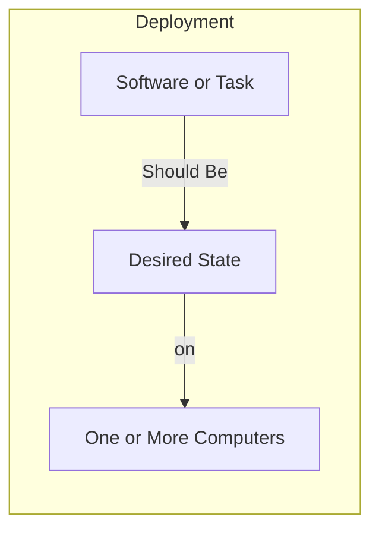
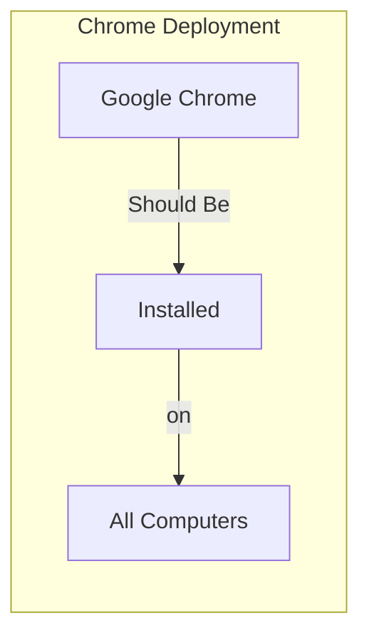

# Quick Start Guide

This guide will help you get up and running with ImmyBot in under 30 minutes. Follow these steps to set up your account, connect your first computer, and create your first deployment.

<WistiaEmbed media-id="j4jjmljlxw" />

## Understanding the ImmyBot Approach

**The goal of ImmyBot is to set up a computer knowing only the customer and the end user.**

ImmyBot uses a declarative approach focused on desired state configuration. Instead of thinking about the steps to make something happen, you define how things "should be" and ImmyBot handles the rest. This allows you to focus on the end result rather than the process.

## Prerequisites

Before you begin, make sure you have:
- An active ImmyBot account (sign up at [immy.bot](https://www.immy.bot/pricing/) if you don't have one)
- Administrator access to a test computer (physical or virtual)
- A USB drive (for physical computers)

## Step 1: Log in to ImmyBot

1. Navigate to your ImmyBot instance URL (typically `https://yourdomain.immy.bot`)
2. Click the login to AzureAD button and follow the onscreen instructions

You'll be greeted with the ImmyBot dashboard, which provides an overview of your environment.

<!--    -->
## Step 2: Create an ImmyBot USB Drive for Physical Machines or ISO for Virtual Machines

When you first log in to ImmyBot, the Getting Started Wizard will prompt you to create an ImmyBot flash drive.

::: info
 **Important:** You only need to create this USB drive ONCE. The same drive can be used for all clients and computers. You'll select the specific client after the computer connects to ImmyBot.
:::

::: warning Information on the flash drive you're using
The flash drive doesn’t need to be anything special, or have an active partition.  
The flash drive needs to be one of the following formats: NTFS,fat32,exfat  
It cannot have more then 1 provisioning package on the root  
Windows needs to recognize it as removable media which can be problematic with USB Hard Drives, smaller flash drives are usually better for this
:::

1. Insert a USB drive into your computer
2. From the ImmyBot dashboard, click on **Download ImmyAgent** in the left navigation
3. Select the **Onboarding** tenant
4. Choose **New Computer Flash Drive**
5. Click **Download PPKG to Flash Drive**
   1. Note: If you're testing with a virtual machine, please select **Downlaod ISO to Flash Drive** and proceed to Step 2.
6. Place file on the root of your flashdrive

::: danger Initial Admininstrator Credentials Recommendation
We recommend leaving this default, then in one of your first deployments, deleting it and creating a new administrator. Unless your provisioning package is encrypted, it is trivial to retrieve this password.
:::

## Step 3: Connect the Computer

### For Physical Computers (Recommended)

We recommend using a physical computer (Dell, HP, or Lenovo) for your first setup to experience the full capabilities of ImmyBot, including BIOS and driver updates.

1. Unbox the new computer and power it on
2. When you reach the Windows setup screen (region selection), insert your ImmyBot USB drive
3. The computer will automatically detect the ImmyBot provisioning package (PPKG)
4. Follow any on-screen prompts to apply the package, otherwise do not select anything.

### For Virtual Machines

If you're testing with a virtual machine:

1. Mount the ISO from Step 1 to your virtual machine
2. At the Windows region selection screen, press the Windows key 5 times

## Step 4: Identify the Computer in ImmyBot

Once the provisioning package is applied, the computer will connect to ImmyBot and appear in the **New Computers** section.

1. Go to **New Computers** in the ImmyBot dashboard
2. Locate your newly connected computer in the list
3. Click on the computer to begin the onboarding process

## Step 5: Assign Customer and User

For ImmyBot to properly configure the computer, you need to specify:

1. **Customer (Required)**: The organization that owns the computer
2. **Primary User (Recommended)**: The person who will primarily use this computer

> **Tip:** If this is your first time using ImmyBot, you'll only have your MSP as a customer and yourself as a user. That's fine for testing - just select these options.

> **Tip:** Customers can be imported from your RMM, PSA, or Azure integration. Users can be imported from your customers' Azure AD.
<!--    -->

## Step 6: Create Your First Deployment

Now let's create a simple deployment to install a software package:

1. Navigate to **Deployments** in the left sidebar
2. Click **Create Deployment**
3. Select **Software** as the deployment type
4. Search for and select "Google Chrome" from the software list
5. Under **Targets**, click **Add Target**
6. Select a target type (e.g., "All Computers")
7. Click **Save**

Your deployment is now created and will be applied to all computers in the selected target during the next maintenance session. Maintenance sessions are initiated through schedules, ad hoc or computer onboarding.

### Understanding Deployments

Deployments are the core building blocks of ImmyBot. They define what should be installed or configured on which computers:

For example, your Chrome deployment specifies that Chrome should be installed on all computers:

#### Conditional Deployments

You can also create deployments that only apply under certain conditions. For example:
- Install Microsoft Visio only for users who have a license
- Deploy SentinelOne only for customers who pay for it (Requires PSA integration to be enabled and healthy)

These conditions are defined using filter scripts, or metascripts that can check external systems.

## Step 7: Run a Maintenance Session

To apply your new deployment immediately:

1. Navigate to **Computers** in the left sidebar
2. Find and select your test computer
3. Click **Run Maintenance** in the top action bar
4. Select your reboot preference
5. Click **Start**

You can monitor the progress of the maintenance session in real-time.

### Verification and Testing

ImmyBot tests everything it does before and after it does it, ensuring that changes are applied correctly and consistently:

- **Before Maintenance**: ImmyBot checks if the computer is in compliance with the maintanance item
- **During Maintenance**: The system monitors the maintenance sesion for errors
- **After Maintenance**: ImmyBot verifies that the computer is in compliance with the maintenance item

For example, when installing Adobe Reader, ImmyBot will:
1. Find the latest available version using a dynamic version script
2. Determine the installed version (if any) by checking Add/Remove Programs
3. Queue an Install or Upgrade task based on the current state
4. Set Adobe Reader to be the default PDF handler by running a configuration task

## Next Steps

Congratulations! You've successfully set up ImmyBot, connected your first computer, and created your first deployment. Here are some next steps to explore:

- [First Computer Setup](/Documentation/HowToGuides/onboarding.md) - Learn more about the onboarding process
- [Core Concepts](/Documentation/GettingStarted/core-concepts.md) - Understand the fundamental concepts of ImmyBot
- [Creating Deployments](/Documentation/HowToGuides/creating-managing-deployments.md) - Explore advanced deployment options
- [Integration Overview](/Documentation/Integrations//integration-overview.md) - Connect ImmyBot to your existing tools
