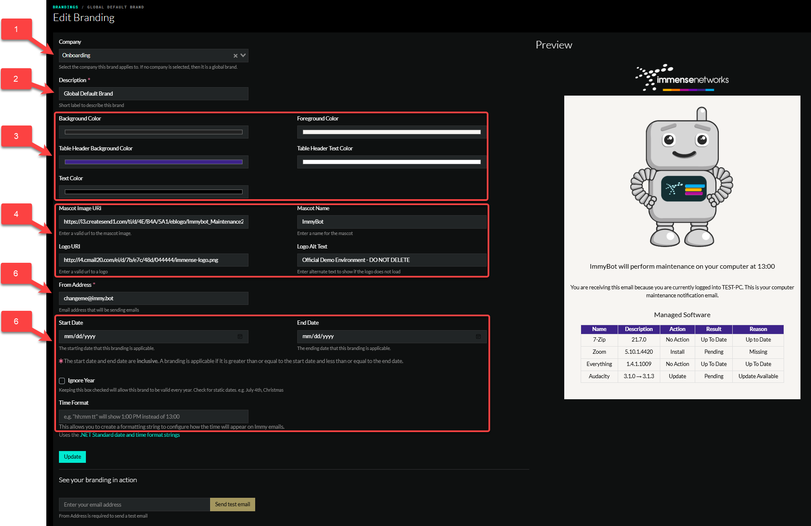

# Overview
The Branding page allows you to set the color palet, company logo, etc on a per tenant level. This allows you to brand the individual tenants with either your company information or an IT departments information.

# Best Practices
- To ensure that your company branding is the same accross your tenants, the default global branding should be your company's branding, and one off's for specific tenants should have their own branding.

# Settings
1. Company - Who is this branding going to apply to?
2. Description - Informational only to describe this brand
3. Color Palte - Change the colors of the branding
4. Mascot and logo settings
5. From Address - The From email address that emails will be sent from.
   - If a client has specific SMTP settings that differ from your company SMTP Settings, they will need their own brand to set the From email, unless their SMTP servers are allowed to send from your domain.
6. Time and Date settings

There is a live preview on the right side of this page that allows you to see any changes you're making in real time. You can also test your branding via email with the **See your branding in action** at the bottom of the page.

