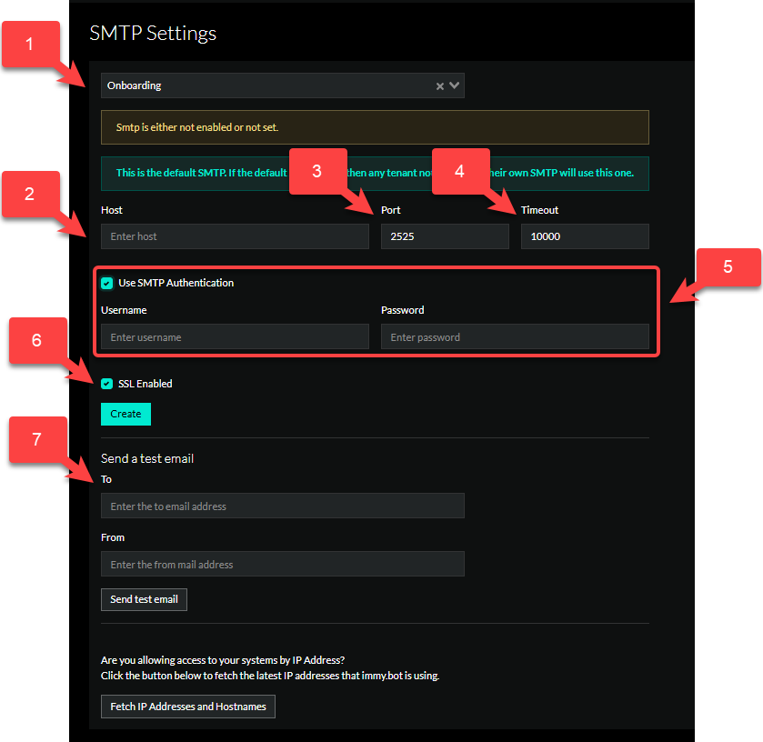

# Managing SMTP

:::danger Unauthenticated SMTP Deprecation
Beginning with ImmyBot 75.0, ImmyBot will no longer support unauthenticated SMTP.
:::

> [!WARNING] "From" address needs to be changed in Show More > Branding
> Please see the [Branding](./branding.md) for more information.

## Overview

SMTP settings allow you to specify SMTP settings per tenant.
We recommend you set the Onboarding tenant's SMTP settings first, as that will be used by default if
another tenant doesn't have SMTP settings set, and you're sending maintenance emails.

## Settings

1. Tenant selection - Select the tenant that these settings will apply to
2. Host - Input your SMTP host here
   - [Microsoft 365](https://learn.microsoft.com/en-us/exchange/mail-flow-best-practices/how-to-set-up-a-multifunction-device-or-application-to-send-email-using-microsoft-365-or-office-365)
   - [GSuite](https://support.google.com/a/answer/176600?hl=en)
3. Port - This is the SMTP port we need to use. Typically its 25, 465 or 587
4. Timeout - How long do you want to want before the email is considered failed. By default this should be 10000
5. Use SMTP Authentication - Do we need to authenticate to your SMTP host? If yes, check this box
   - Username
   - Password
6. SSL Enabled - Do we need to use SSL for emails? If yes, check this box
7. Send Test email
   - To
   - From

## Best Practices
Please see the [SMTP](/Documentation/GettingStarted/instance-best-practices) best practices