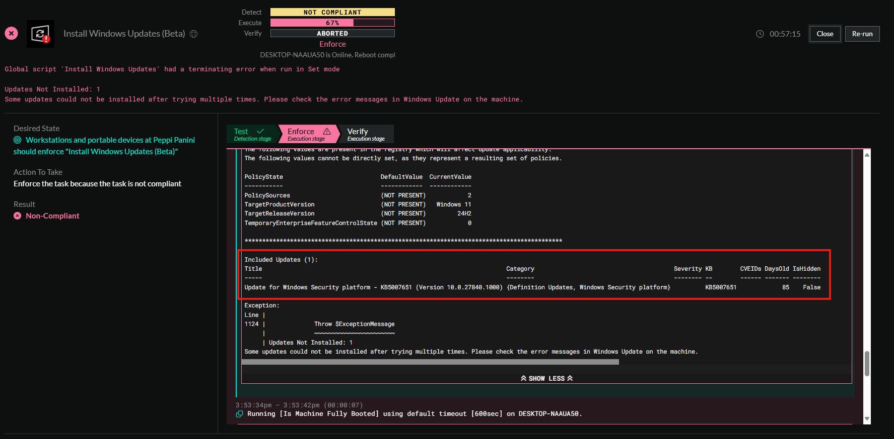

<!-- How To Template -->
# Update Windows 10 to Windows 11

## Overview
With the upcoming retirement of Windows 10, we have published this document to give you guidance on upgrading Windows 10 to Windows 11 utilizing ImmyBot.
At a high level this document will inform you on the proper deployments to utilize to upgrade Windows 10 to Windows 11 as well give you some best practices that you can integrate into your deployment projects.

## Prerequisites
- An active ImmyBot subscription
- Advanced knowledge on creating and managing Deployments using Tags.

## Best Practices
  1. Utilize tags to tag individual computers that you're needing to upgrade. Create your tag and apply said tag to those computers before creating the deployments.
     - Tag 1: **Windows 11 Upgrade Check**
        - This tag will apply to a Cross Tenant Deployment that will run the **Windows 11 Readiness Check** and allow you to determine if the computer can be upgraded to Windows 11
     - Tag 2: **Windows 11 Upgrade Stage**
        - This tag will apply to a Cross Tenant Deployment that will run the **Windows Target Feature Update Version** and set the appropriate registry keys to allow your PCs to upgrade to Windows 11.
     - Tag 3: **Windows 11 Upgrade Execute**
        - This tag will apply to a Cross Tenant Deployment that will run the **Install Windows Updates (Beta)** to push the actual update.
        - ::: info If you're using **Install Windows Updates (Beta)** in your deployments already, we recommend creating a Single Tenant Deployment to ignore this task so that you have a controlled deployment otherwise you will run into issue where the Windows 11 upgrade is pushed outside of your deployment window.

## Process

::: danger Regarding tags
There is potentially A LOT of changing tags in this process. You can do this en masse via batch actions either in the Computers tab, or Tenants > Click on the Tenant > Computers tab
:::
## Before Day of Deployment
### Step 1. Ensure computers don't have any pending updates
  1. Utilize ImmyBot to confirm there are not pending updates by running maintenance sessions that include a deployment **Install Windows Updates** with the default parameters in the Deployment.

### Step 2. Windows 11 Hardware Readiness
::: info
Set this deployment to Audit so that you can view the results Cross Tenant in the Dashboard
:::
  1. Create a deployment with the task **Windows 11 Hardware Readiness**, and set this to be an adhoc deployment and set the target to Cross Tenant, and apply it to all computers with a tag **Windows 11 Upgrade Check**
    - If you have created this Cross Tenant Deployment already, you don't need to make it again.
  2. Tag all target computer with the Tag **Windows 11 Upgrade Check**
  3. Run adhoc session against all targeted computers and confirm hardware compatibility.
  4. Remove tags from PCs that return a failure in the audit. These need to be replaced, not upgraded.

## Day of Deployment
### Step 3. Windows Target Feature Update Version
  1. Create a deployment with the task **Windows Target Feature Update Version**, set this to be an enforced deployment and set the target to Cross Tenant, and apply it to all computers with a tag **Windows Target Feature Update Version**
     - For this deployment you need to set the following parameters
       -  Set ProductVersion to Windows 11
       -  Set TargetReleaseVersionInfo to (LATEST)
       -  Edit the deployment ordering (**Library** > **Deployment Ordering**) so that  "Windows Target Feature Update version"  in the "Beginning" column
     - If you have created this Cross Tenant Deployment already, you don't need to make it again.
  2. All computers that have the tag **Windows 11 Upgrade Check** and have passed the Windows 11 Hardware Readiness check should have their **Windows 11 Upgrade Check** tags replaced with **Windows 11 Upgrade Stage**
  3. Run an adhoc deployment for **Windows Target Feature Update Version**, this will set up the computers to allow Windows 11 to be installed via registry changes.

## Deployment Time
::: info Schedule this
If you're an ImmyBot Standard customer, you can schedule this.
:::

### Step 4. **Install Windows Updates**
  1. Create a deployment with the task **Install Windows Updates**, set this to be an enforced deployment and set the target to Cross Tenant, and apply it to all computers with a tag **Windows 11 Upgrade Execute**
     - Leave this deployment without any changes, unless you, based on your SOPs, need to change anything.
     - If you have created this Cross Tenant Deployment already, you don't need to make it again.
  2. All computers that have the tag **Windows 11 Upgrade Check** and have passed the Windows 11 Hardware Readiness check should have their **Windows 11 Upgrade Execute** tags replaced with **Windows 11 Upgrade Execute**
  3. Schedule or manually run maintenance sessions for this task **with Forced Reboots**

## Advise and Issues

### Advice
- You don't **NEED** to use tags for this. If you want you can use single tenant deployments for all of this, we recommend tags as a way to manage this en masse without having to do the same thing over and over again.

### Issues We Ran Into
- We ran into an issue where Windows 11 installed correctly but the session returned a failure. This is because there was another update that failed the install while Windows 11 was installing. This is why we recommend installing all patches before pushing Windows 11.

- ImmyBot still shows Windows 10 but the desktop is Windows 11
  -  Don't fret, just run inventory again.
  -  Computers > Check the box to the left of the computer(s) in question > Batch Actions > Maintenance > Set drop down to Inventory Scripts > Click Run. After that session is complete, you should see that ImmyBot sees Windows 11.

   
>[!NOTE] Document information
>Author: Mark Gomez
 
>Date Published: 2025/08
> 
>Date Revised: N/A
> 
>Version Number: 1.0
