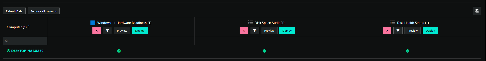

<!-- How To Template -->
# Update Windows 10 to Windows 11

## Overview
With the upcoming retirement of Windows 10, we have published this document to give you guidance on upgrading Windows 10 to Windows 11 utilizing ImmyBot.
At a high level this document will inform you on the proper deployments to utilize to upgrade Windows 10 to Windows 11 as well give you some best practices that you can integrate into your deployment projects.

## Prerequisites
- An active ImmyBot subscription
- Advanced knowledge on creating and managing Deployments using Tags.

## Best Practices
 - Utilize tags to tag individual computers that you're needing to upgrade. Create your tag and apply said tag to those computers before creating the deployments.
 - Utilize Cross Tenant Deployments to prevent repeating processes where possible.

## Process
::: danger Regarding tags
There is potentially A LOT of changing tags in this process. You can do this en masse via batch actions either in the Computers tab, or Tenants > Click on the Tenant > Computers tab
:::
### Set up your Instance
#### Set up your Tags
- Tag 1: **Windows 11 Upgrade Check**
  - This tag will apply to a Cross Tenant Deployment that will run the **Windows 11 Readiness Check**, **Disk Space Audit**,  and **Disk Health Status** to allow you to determine if the computer can be upgraded to Windows 11
- Tag 2: **Windows 11 Upgrade Stage**
  - This tag will apply to a Cross Tenant Deployment that will run the **Windows Target Feature Update Version** and set the appropriate registry keys to allow your PCs to upgrade to Windows 11.
- Tag 3: **Windows 11 Upgrade Execute**
  - This tag will apply to a Cross Tenant Deployment that will run the **Install Windows Updates (Beta)** to push the actual update.

::: info If you're using **Install Windows Updates (Beta)** in your deployments already, we recommend creating a Single Tenant Deployment to ignore this task so that you have a controlled deployment otherwise you will run into issue where the Windows 11 upgrade is pushed outside of your deployment window.
:::

#### Set up your Deployments

::: info
If you have created these exact Cross Tenant Deployments already, you don't need to make them again.
:::

  1. Create a deployment with the task **Windows 11 Hardware Readiness**
      - Task Mode: Audit
      - Parameters: Leave default
      - Target Enforcement: Adhoc
      - Target Scope: Cross Tenant
        - Target Type: Tag
          - Tag Name: **Windows 11 Upgrade Check**
        - Target Filter: Workstations and Portable Devices

  2. Create a deployment with the task **Disk Space Audit**
      - Task Mode: Audit
      - Parameters: Leave default
      - Target Enforcement: Adhoc
      - Target Scope: Cross Tenant
        - Target Type: Tag
          - Tag Name: **Windows 11 Upgrade Check**
        - Target Filter: Workstations and Portable Devices
        -
  3. Create a deployment with the task **Disk Health Status**
      - Task Mode: Audit
      - Parameters: Leave default
      - Target Enforcement: Adhoc
      - Target Scope: Cross Tenant
        - Target Type: Tag
          - Tag Name: **Windows 11 Upgrade Check**
        - Target Filter: Workstations and Portable Devices

  4.  Create a deployment with the task **Windows Target Feature Update Version**,
      - Task Mode: Enforce
      - Parameters:
        - Set ProductVersion to Windows 11
        -  Set TargetReleaseVersionInfo to (LATEST)
      - Target Enforcement: Required
      - Target Scope: Cross Tenant
        - Target Type: Tag
          - Tag Name: **Windows Target Feature Update Version**
        - Target Filter: Workstations and Portable Devices

  5. Create a deployment with the task **Install Windows Updates**
      - Task Mode: Enforce
      - Parameters: Leave default
      - Target Enforcement: Required
      - Target Scope: Cross Tenant
        - Target Type: Tag
          - Tag Name: **Windows 11 Upgrade Execute**
        - Target Filter: Workstations and Portable Devices

  6.  Edit the deployment ordering (**Library** > **Deployment Ordering**) so that  "Windows Target Feature Update version"  in the "Beginning" column

## Before Day of Deployment

### Step 1. Ensure computers don't have any pending updates
  1. Utilize ImmyBot to confirm there are not pending updates by running maintenance sessions that include a deployment **Install Windows Updates** with the default parameters in the Deployment.

### Step 2. Windows 11 Hardware Readiness
::: info Dashboard Monitoring
If you're planning on using the dashboard, you should set that up now so that deployments can be reviewed and exported.

:::

  1. Tag all target computers with the Tag **Windows 11 Upgrade Check**
  2. Run adhoc sessions for the following deployments against all targeted computers and confirm hardware compatibility.
     -  **Windows 11 Hardware Readiness**, **Disk Space Audit**, **Disk Health Status**
     - You can monitor this from the dashboard, and export the results if need be.
  3. Review the computers that return a failure from the audit
     - **Windows 11 Hardware Readiness** failures - Remove tags from PCs that return a failure here. These need to be replaced, not upgraded.
     -   **Disk Space Audit** failures - Review computer drive, you need 25GB of free space to help ensure a successful upgrade
     -   **Disk Health Status** failures - Remove tags from PCs that return a failure here. The drive need to be replaced or the computer needs to be replaced, not upgraded.

## Day of Deployment
### Step 3. Windows Target Feature Update Version

  1. All computers that have the tag **Windows 11 Upgrade Check** and have passed the 3 health deployments should have their **Windows 11 Upgrade Check** tags replaced with **Windows 11 Upgrade Stage**
  2. Run an adhoc deployment for **Windows Target Feature Update Version**, this will set up the computers to allow Windows 11 to be installed via registry changes.

## Deployment Time
::: info Schedule this
If you're an ImmyBot Standard customer, you can schedule this.
:::

### Step 4. **Install Windows Updates**

  1. All computers that have the tag **Windows 11 Upgrade Check** and have passed the Windows 11 Hardware Readiness check should have the **Windows 11 Upgrade Execute** tag added to their computers.
  2. Schedule or manually run maintenance sessions for this task **with Forced Reboots**

### After Successful Upgrade
1. Remove the tags **Windows 11 Upgrade Stage** and **Windows 11 Upgrade Check** from computers

## Advise and Issues

### Advice
- You don't **NEED** to use tags for this. If you want you can use single tenant deployments for all of this, we recommend tags as a way to manage this en masse without having to do the same thing over and over again.

### Issues We Ran Into
- We ran into an issue where Windows 11 installed correctly but the session returned a failure. This is because there was another update that failed the install while Windows 11 was installing. This is why we recommend installing all patches before pushing Windows 11.

- ImmyBot still shows Windows 10 but the desktop is Windows 11
  -  Don't fret, just run inventory again.
  -  Click on Computers > Check the box to the left of the computer(s) in question > Batch Actions > Maintenance > Set drop down to Inventory Scripts > Click Run. After that session is complete, you should see that ImmyBot sees Windows 11.

   
>[!NOTE] Document information
>Author: Mark Gomez
 
>Date Published: 2025/08
> 
>Date Revised: N/A
> 
>Version Number: 1.0
