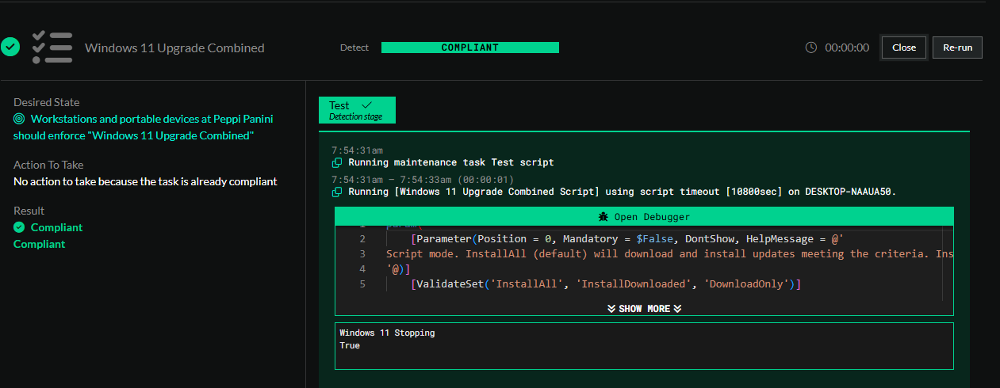

<!-- How To Template -->
# Update Windows 10 to Windows 11

## Overview
With the upcoming retirement of Windows 10, we have published this document to give you guidance on upgrading Windows 10 to Windows 11 utilizing ImmyBot.
At a high level this document will inform you on the proper deployments to utilize to upgrade Windows 10 to Windows 11 as well give you some best practices that you can integrate into your deployment projects.

## Prerequisites
- An active ImmyBot subscription
- Advanced knowledge on creating and managing Deployments using Tags.

## Best Practices
- Utilize Cross Tenant Deployments to prevent repeating processes where possible.

## Computer Targeting Guidance
:::warning About running this task in Audit mode
Audit mode will only run the test action against the machine. Part of this script is to verify if the computer is already on Windows 11, and to return a true to ImmyBot if it is. With that said, if a computer is Windows 10 and passes all of the tests it will also return  a true to ImmyBot.

All of this to say if you run this task against a Windows 11 machine in Audit mode with the expectation that you need to update it to Windows 11, your results will be skewed in the audit.

Only run this task in Audit mode against Windows 10 machines. You can utilize the Windows 10 Filter Script if you don't want to utilize Tags.
:::

We recommend using the **Windows 11 Upgrade** Task in Audit mode against the computers you're wanting to update. This is to ensure ahead of time that the computers are compatible with the update process.

## Process
:::warning If you're using **Install Windows Updates (Beta)** in your deployments already, we recommend creating a Single Tenant Deployment to ignore this task so that you have a controlled deployment otherwise you will run into issue where the Windows 11 upgrade is pushed outside of your deployment window.
:::

#### Set up your Tag
1. Create a tag with the name **Windows 11 Upgrade**

#### Set up your Deployment with a Tag

1. Create a deployment with the task **Windows 10 to Windows 11 Upgrade**
    - Task Mode: Enforced
    - Parameters: Leave default
    - Target Enforcement: Adhoc
    - Target Scope: Cross Tenant
      - Target Type: Tag
        - Tag Name: **Windows 11 Upgrade**
      - Target Filter: Workstations and Portable Devices
2. Tag all target computers with the tag **Windows 11 Upgrade**

#### Set up your Deployment with a Filter Script and Single Tenant Deployment

1. Create a deployment with the task **Windows 10 to Windows 11 Upgrade**
    - Task Mode: Enforced
    - Parameters: Leave default
    - Target Enforcement: Adhoc
    - Target Scope: Single Tenant
      - Tenant: Select the Tenant you need to push this to
      - Target Type: Filter Script
        - Tag Name: **Windows 10 (Global)**
      - Target Filter: Workstations and Portable Devices

## Before Day of Deployment

Ensure computers don't have any pending updates. You can utilize ImmyBot's Global Task **Install Windows Updates**.

## Deployment Time
::: info Schedule this
If you're an ImmyBot Standard or ImmyBot Forever customer, you can schedule this.
:::

Schedule or manually run maintenance sessions for this task **with Forced Reboots**

### After Successful Upgrade
1. Remove the tag **Windows 11 Upgrade** from computers
2. Remove any deployments you created to stop the Windows Update Beta from running.

## Advice
- You don't **NEED** to use tags for this. If you want you can use single tenant deployments for all of this, we recommend tags as a way to manage this en masse without having to do the same thing over and over again.

## Troubleshooting
Why does the task fail in the test phase?
- This can be for a number of reasons, but the answer is in the results of the test phase. This task checks for 4 things in the test phase:
    1. Is this computer already Windows 11? If yes, pass and do nothing else, if no, move on to step 2.
   
    2. Disk Space - Is the free space more then 25 GB? If not fail, if is it, move one to step 3
    3. Disk Health - Are there any predictive or SMART failures on the disk? If yes, fail, if not, move on to step 4
    4. Windows 11 readiness - Does the computer pass the Windows 11 readiness script from Microsoft? If no, fail, if yes move on to the execution stage.

## How We Tested

In our testing, it took on average about one hour and 54 minutes for the upgrade process to complete.

These are all fresh Windows installs. If the computer was domain joined, it had the default domain level GPO applied to it, and setting to ensure that the GPO did not block Windows 11 upgrades. See [Microsoft's Guidance](https://learn.microsoft.com/en-us/windows/deployment/update/waas-wufb-group-policy) for more information.

Specs: 8 3.7 GHz cores, 8 GB RAM, 100 GB SSD

| Windows OS Version | Domain Joined? | Time to Completion | Successful? | Issues?                                       | Notes                          |
| :----------------- | :------------- | :----------------- | :---------- | :-------------------------------------------- | :----------------------------- |
| Windows 10 22H2    | No             | 1 hr 20 min        | Yes         | None                                          | Wifi, speed: 700 Mbps download |
| Windows 10 22H2    | No             | 2 hr 30 min        | Yes         | None                                          | Wifi, speed: 7.5 Mbps download |
| Windows 10 22H2    | Yes            | 1 hr 30 min        | Yes         | None                                          | Wifi, speed: 700 Mbps download |
| Windows 10 21H2    | Yes            | 2 hr  0 min        | Yes         | Had 2 CU's that needed to get installed first | Wifi, speed: 700 Mbps download |
| Windows 10 21H2    | No             | 2 hr  0 min        | Yes         | Had 2 CU's that needed to get installed first | Wifi, speed: 700 Mbps download |
| Windows 10 21H1    | No             | 2 hr  0 min        | Yes         | Had 2 CU's that needed to get installed first | Wifi, speed: 700 Mbps download |
| Windows 10 21H1    | Yes            | 2 hr  0 min        | Yes         | Had 2 CU's that needed to get installed first | Wifi, speed: 700 Mbps download |

   
>[!NOTE] Document information
>Author: Mark Gomez
 
>Date Published: 2025/08
> 
>Date Revised: N/A
> 
>Version Number: 1.0
