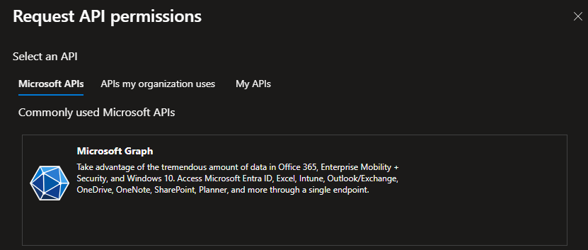
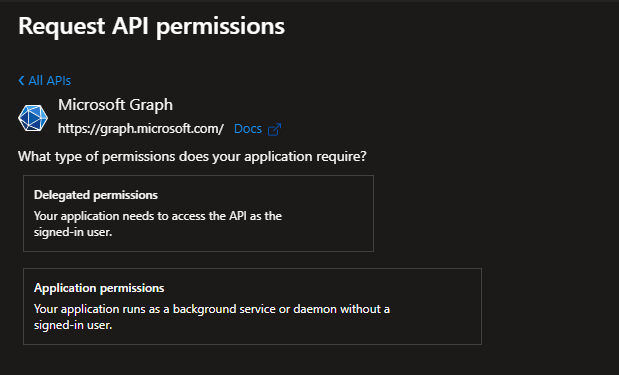
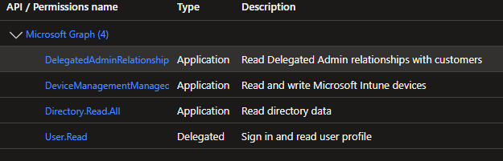
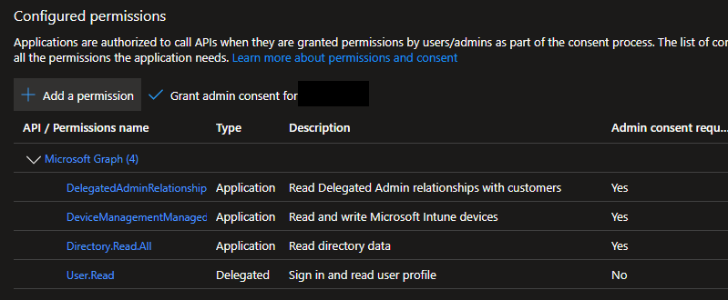

# Azure Custom Application Permissions

## Overview
This document is intended to go over the custom permissions necessary for the advanced features of ImmyBot.

## Create an App Registration

Navigate to: <https://aad.portal.azure.com/>
1. Click on app registration
:::details 📷

:::
2. Click on new registration
:::details 📷

:::
3. Name it something recognizable such as "ImmyBot Custom Application"
4. Select second radial button for (Any Microsoft Entra ID tenant - Multitenant)"
5. Add your Web redirect URI
6. Click Register
::: details 📷

:::

:::warning
**Important!** Your app registration must have a Web redirect uri of `https://<your-domain>.immy.bot/consent-callback`, replacing `<your-domain>` appropriately
:::

## Grant Permissions

See the 📷s below for the minimum permissions.
1. Click on API Permissions
2. Click Add Permissions
   ::: details 📷
   
   :::
3. Click on Microsoft Graph
   ::: details 📷
   
4. Click on Application Permissions
   :::details 📷
   
   :::
5. Add the following permissions
   1. DelegatedAdminRelationship.Read.All
   2. DeviceManagementManagedDevices.ReadWrite.All
   3. Directory.Read.All
   4. User.Read
   ::: details 📷
   
   :::
6. Click Grant Admin Consent for <'your Azure tenant name'>
   :::details 📷
   
   :::

## Create Client Secret
1. Click on Certificates & Secrets which is under Manage
2. Click on New Client Secret
   ::: details 📷
   
   :::
3. Create a meaningful description
4. Set the Expires timeline to 24 months
5. Click Add
   ::: details 📷
   
   :::
6. Copy the Secret Value and paste it into ImmyBot
   ::: details 📷
   
   :::

**Please see [GDAP Customers](/Documentation/Integrations/azure-gdap-customer-management) if you want ImmyBot to access your customers' data**.

:::info
Copy the `Application (client) ID` and `Client Secret Value` into the form in ImmyBot.
:::