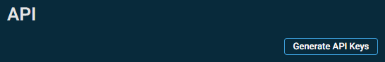
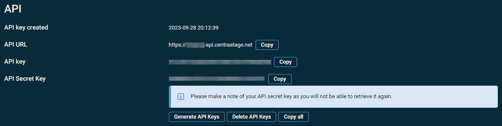

# Datto RMM

## Overview
This document will detail how to deploy Datto RMM with ImmyBot.

## Prerequisites
- An active ImmyBot subscription or trial
- Admin access to Datto RMM
- Knowledge of creating and managing [Deployments](/Documentation/HowToGuides/creating-managing-deployments)

## Integration Capabilities

- Running scripts on the device
- Agent identification by adding an inventory script to be run against all of your endpoints
- Importing agents from linked clients into ImmyBot
- Mapping clients from the integration to tenants in ImmyBot
- Getting an install token for a specific client

:::info About Running scripts through this integration
We utilize Datto RMM Quick Jobs to run scripts through this provider. This can cause an issue due to the ephemeral agent timing out before the connection can be made.

We recommend having more then one provider that can run scripts.
:::

## Process
### Create the Datto RMM API User
1. Navigate to `Setup` > `Global Settings` > `Access Control`.
2. Turn on the Enable API Access toggle.
   
4. Navigate to `Setup` > `Users`, and click the username that you would like to enable API access for.

5. Click Generate API Keys to generate an API Key and an API Secret Key for this user.

::: info  The API URL field is added to the individual user page once API keys have been generated for the user.
:::

6. The API Key and the API Secret Key will be displayed. Make a note of these and the API URL somewhere safe.

::: danger  Important
The API Secret Key will be hidden for security reasons after navigating away from this page. It will not be possible to retrieve it again. However, you can regenerate API keys at any time by returning to the page and clicking Generate API Keys. This will invalidate any keys previously generated. Similarly, clicking Delete API Keys will revoke access altogether. Regenerating and deleting API keys is irreversible, and you must confirm the action by clicking `Confirm` in the confirmation dialog box.

:::
7. Click Save User.

### Add the Ad Hoc PowerShell Component

You need to add the Ad Hoc PowerShell component to your instance if you plan on running scripts from ImmyBot through DattoRMM.

1. Navigate to `Automation` -> `ComStore`
2. Search for `Run Ad Hoc Command (PowerShell 2-5) [WIN]`
3. Click Add on the right hand side of the item

### Set up the integration

1. Navigate to `Show More` -> `Integrations`
2. Click on `Add Integration`
3. Select `Datto RMM`
4. Change the URL to your instance API URL.
5. Update the APIKey and APISecret
6. Click Update
7. Enable the integration
8. Link your clients in the client tab

### Set up the Deployment
 1. Click on `Deployments` and then Click on `New`
 2. Select `Datto RMM (Integration) `from the Software / Task drop down
 3. Select the radial button labeled `Installed` under the `Software should be`
 4. Select the `Latest` radial button under `Desired Version`
 5. Select the radial button labeled `Required` under `Target Enforcement`
 6. Select the radial button labeled `Cross Tenant` under `Target Scope`
 7. Select the radial button labeled `All Computer` under `Target Type`
 8.  Select the radial button labeled `No Filter` under `Target Filter`
 9.  Click on `Create` to save your deployment.
   ::: details 📷
   
   :::
Now the next time a session is run against a targeted computer, Datto RMM will get installed.

   
>[!NOTE] Document information
>Author: Mark Gomez
 
>Date Published: 09/19/2025
> 
>Date Revised: 11/2025
> 
>Version Number: 1.0