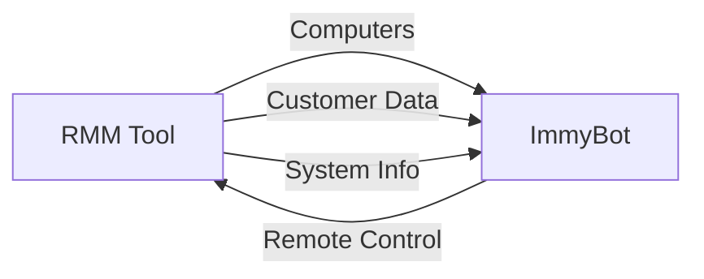
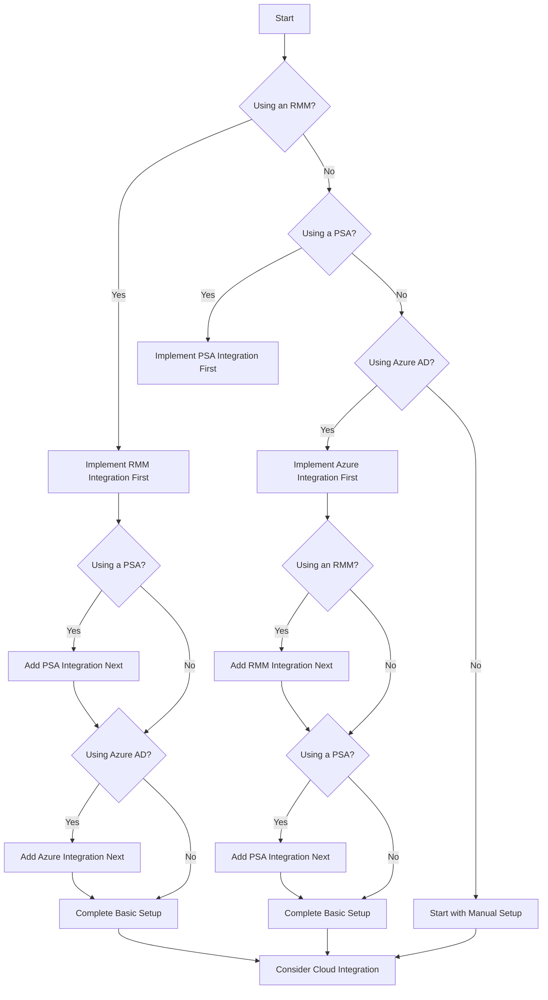

# Integration Overview

ImmyBot's power is multiplied when connected to your existing tools and systems. This guide helps you understand the available integrations, their benefits, and how to choose the right ones for your environment.

## Types of Integrations

ImmyBot offers several types of integrations, each serving different purposes:

### RMM Integrations

Remote Monitoring and Management (RMM) integrations allow ImmyBot to discover computers and gather information about them. These integrations:

- Import computers from your RMM tool
- Map customers between systems
- Enable remote control through your RMM
- Provide additional computer information

### PSA Integrations

Professional Services Automation (PSA) integrations connect ImmyBot to your business management platform. These integrations:

- Synchronize customer information
- Enable ticket creation from ImmyBot
- Provide technician tools within tickets
- Track time spent on maintenance

## Available Integrations

ImmyBot currently supports the following integrations:

| Integration          | Type     | Key Features                         |
| -------------------- | -------- | ------------------------------------ |
| ConnectWise Automate | RMM      | Computer discovery, remote control   |
| ConnectWise Control  | RMM      | Remote control, session recording    |
| N-Central            | RMM      | Computer discovery, customer mapping |
| NinjaRMM             | RMM      | Computer discovery, customer mapping |
| ConnectSecure        | RMM      | Remote control, session recording    |
| ConnectWise Manage   | PSA      | Customer sync, ticket integration    |
| HaloPSA              | PSA      | Customer sync, ticket integration    |
| Azure                | Identity | User/group import, authentication    |

## Choosing the Right Integrations

When selecting integrations for your ImmyBot environment, consider:

1. **Current Tools**: Start with integrations for tools you already use
2. **Primary Needs**: Prioritize based on your most important requirements
3. **Integration Depth**: Some integrations offer more features than others
4. **Maintenance Overhead**: Each integration requires some maintenance

### Decision Guide

Use this flowchart to help decide which integrations to implement first:

## Integration Setup Process

Most integrations follow a similar setup process:

1. **Gather Prerequisites**: Collect API keys, credentials, and endpoints
2. **Configure ImmyBot**: Add integration details in ImmyBot settings
3. **Test Connection**: Verify that systems can communicate
4. **Map Entities**: Connect customers, users, and computers between systems
5. **Configure Options**: Set up integration-specific options
6. **Test Functionality**: Verify that all features work as expected

## Next Steps

Ready to set up your integrations? Choose from the following guides:

- [ConnectWise Automate Setup](/Documentation/Integrations/connectwise-automate-integration-setup.md)
- [ConnectWise Control Setup](/Documentation/Integrationsconnectwise-control-integration-setup.md)
- [ConnectWise Manage Setup](/Documentation/Integrationsconnectwise-manage-integration-setup.md)
- [N-Central Setup](/Documentation/Integrationsncentral-integration-setup.md)
- [NinjaRMM Setup](/Documentation/Integrationsninjarmm-integration-setup.md)
- [HaloPSA Setup](/Documentation/Integrationshalo-integration-setup.md)
- [Azure Setup](/Documentation/Integrationsazure-graph-permissions-setup.md)
- [Build Your Own Integration](/Documentation/Integrationsbuild-your-own-integration.md)
