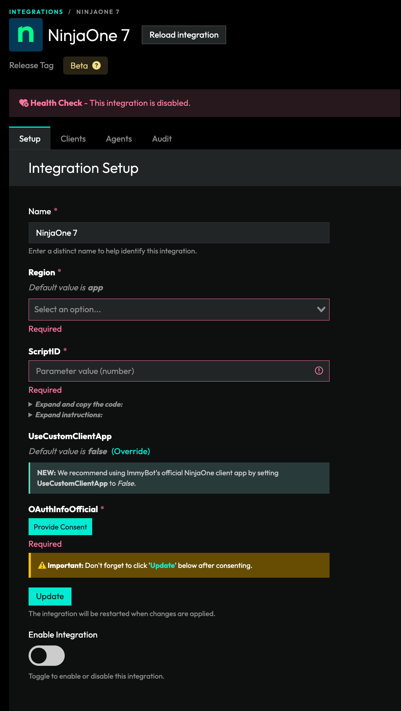
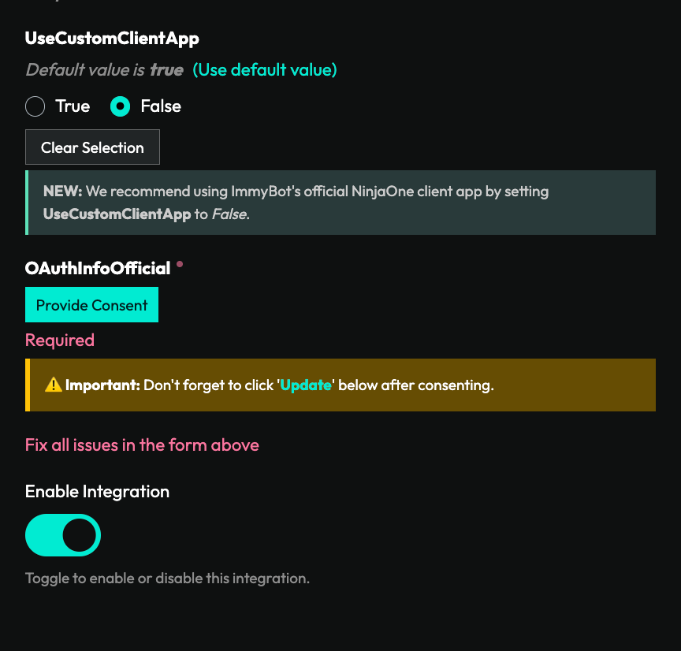
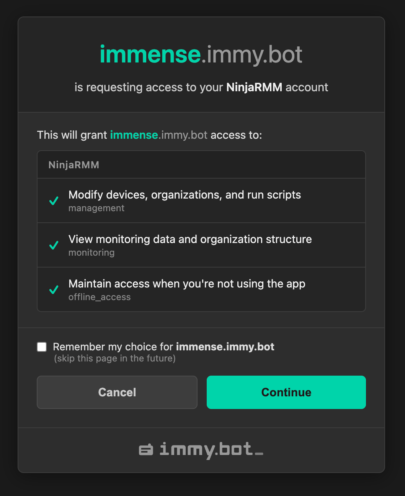
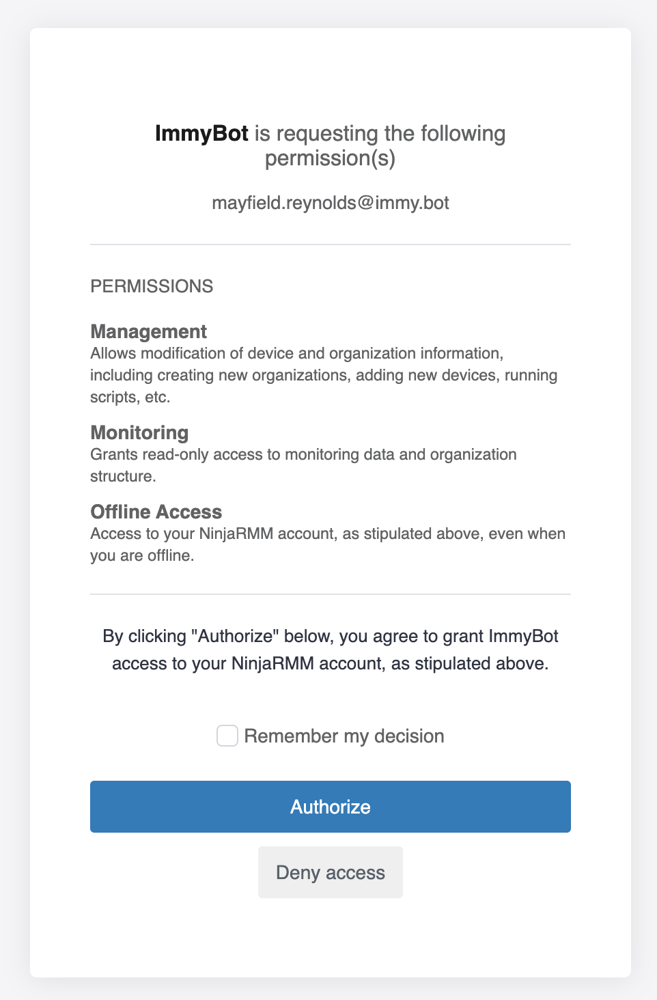

# NinjaRMM Dynamic Integration

## Setting up this integration allows you to:

- Import customers from NinjaRMM
- Import computers from NinjaRMM
- Manage all computers in NinjaRMM without deploying the ImmyBot Agent
- Create ImmyBot Role in NinjaRMM

## Configure the following in general settings (Administration -> General -> Settings)

- Ninja Agent uninstall prevention -> OFF (Optional: This permission is only needed so ImmyBot can also uninstall the Ninja agent)
- Advanced Installer Options -> ON

## Create a script in the NinjaRMM Automation library
(`Administration` -> `Library` -> `Automation` -> `Add` -> `New Script`)

```powershell
Param(
    [Parameter(Mandatory=$true)]
    [string]$code
)

$bytes = [System.Convert]::FromBase64String($code)
$DecodedCommand = [System.Text.Encoding]::UTF8.GetString($bytes)

# Execute Script Content
iex $DecodedCommand
Write-Host "Ephemeral Agent started"
```
The script should be set to
- Name: ImmyBot
- Language: Powershell
- Operating System: Windows
- Architecture: All
- Run As: System

### Note the Script ID
Before leaving the script, also create a `Script Variable`.
1. Hit `+ Add` next to `Script Variables`.
2. Select the `String/Text` type.
3. Enter `Code` as the variable name.
4. Hit `Add` to save it.

::: info Get the script ID from the URL
 Get the script Id in the URL `https://{region}.ninjarmm.com/#/editor/script/71` -> `71`.
It will be needed as one of the parameters in the integration setup to run scripts.
:::

## Create the integration in ImmyBot
(`Show More` -> `Integrations` -> `Add Integration` -> `NinjaRMM`)

1. Add the required parameters and authenticate the OAuthInfo parameter with a NinjaRMM user with sufficient privileges:
     - Name: NinjaRMM
     - Region: This is the subdomain
     - ScriptID: From the URL in the [script step above](/Documentation/Integrations/ninjarmm-integration-setup.html#note-the-script-id)
     - UseCustomClientApp: This is optional and not recommended
    ::: details <font style="font-size:20px">📷</font>
    
    :::
2. Once that is filled out, click on Provide Concent, and follow the onscreen instructions.
3. Once that is done click update and enable the integration.

> [!WARNING]
> Currently the UI element for the OAuthInfo parameter button will not persist when you refresh the browser window.
> This will not kill your integration, so just leave it as is.

## Migrating to the official ImmyBot NinjaOne integration

You need to do this if you want to utlize the sliding refresh token provided by Ninja. This will prevent you from having to constantly consent through oAuth.

:::info
You only need to follow this if you created your integration prior to January 21, 2026.
:::

> [!WARNING] Minimum requirements
> You must be upgraded to ImmyBot .76.0 in order to utilize the official client app.

1. Click Override for UseCustomClientApp then select False
   ::: details <font style="font-size:20px">📷</font>
   
   :::
2. Click Provide Consent
3. Continue through our consent page
   ::: details <font style="font-size:20px">📷</font>
   
   :::
4. Continue through Ninja's consent page
   ::: details <font style="font-size:20px">📷</font>
   
   :::
5. Once you get back to the confirmation page, close it to go back to the integration settings page
   ::: details <font style="font-size:20px">📷</font>
   
   :::
6. Finally, click Update

Congratulations! You've migrated to the official client app in Ninja for ImmyBot!

## Deprecated - Create a client app in your NinjaRMM instance using above permissions

:::info
You no longer need to do this, but it is still an option if you want to create your own app in Ninja.
:::

### ImmyBot currently requires the following client app scopes to operate correctly

- Monitoring
- Management
- Control

### As well as the following grant types

- Authorization Code
- Refresh Token

(`Administration` -> `Apps` -> `Api` -> `Add`)

1. Set the Application platform to Web
2. Set the Name to ImmyBot or whatever you want
3. Set the redirect URI to `https://<instance>.immy.bot/consent-callback`
   - You need to press Enter after inputting your URI.
   > [!WARNING]
   > Note: Change the "instance" in the redirect uri to your ImmyBot subdomain

4. Under scopes check `Monitoring`, `Management`, and `Control`
5. Under Allowed Grant Types select `Authorization Code` and `Refresh Token`


At this point, you should be able to map clients. Once clients are mapped, agents will start getting identified.


