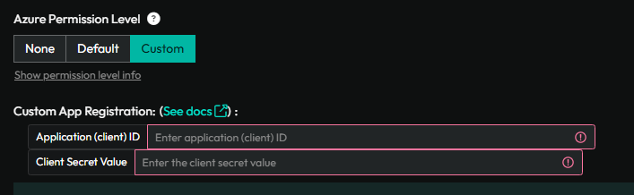

# App Registration Secret Expired

## Overview
This document will go over what to do if your App Registration Secret Expired. This only applies if you created the Custom Permissions set up for Azure.

## Prerequisites
An active ImmyBot subscription or [trial](https://www.immy.bot/pricing/)

Admin access to your Azure Portal, or the necessary permissions to manage Enterprise Applications.

## Process

### Find your Application ID
1. Log into ImmyBot and navigate to the tenant that has the expired Client Secret Value.
2. Click on the Azure Tab.
3. Copy the Application ID from the right hand column.
    

### Delete the old Enterprise Application
1. Log into your Azure Portal.
2. Find your Enterprise Application that was built when you created the Azure Custom Application in ImmyBot.
3. Delete it.

### Recreate the Enterprise Application
1. Follow this guide to recreate the custom application: [Guide](/Documentation/Integrations/azure-custom-application-permissions)
2. Once complete, come back to this page

### Authorize your Azure Tenants again
1. In your ImmyBot instance, navigate to `Show More` -> `Azure`
2. Go through your clients, and reauthorize the Azure integration for them.

   
>[!NOTE] Document information
>Author:
 
>Date Published:
> 
>Date Revised:
> 
>Version Number:
