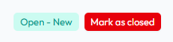

# ImmyBot Customer Portal

## Overview
This document is an overview of the ImmyBot Customer portal. Specifically, where to log in, how to manage tickets, how you're registered and what you can see.

## Prerequisites
An active ImmyBot subscription or [trial](https://www.immy.bot/pricing/)

## URL

https://help.immy.bot/tickets-view

## Gaining access
You will be automatically granted access when you open a ticket. Notification will come by email, you will need click on the link to register your account.

## Access Control

### Your tickets
When you log into the customer portal, you'll automatically see tickets that are associated with your email address. These are tickets where you're listed as the contact or requester. You can view, reply to, and track the status of any ticket you've created or been assigned to.

### Your company's tickets
If your contact record in HubSpot is marked as a Company Ticket Admin, you can view all tickets linked to that company - not just your own. This gives you visibility into support requests from other team members at your organization. You can filter the ticket list to show only your tickets or all company tickets using the view options at the top of the ticket list.

To switch between the views, click on the view drop down and select Owned by Organization

To gain access as a Company Ticket Admin, please open a ticket with support to request that access.

## Managing tickets

### Opening a ticket
To create a new support ticket:
1. Click the "Open a Support ticket" button (Top right corner or bottom center of the page)
2. Fill in the ticket form with
3. Click "Submit" to create the ticket
4. You'll receive a confirmation email with your ticket number

### Closing a ticket
Tickets are typically closed by the support team once your issue is resolved. However, you can close them if your issue is resolved.

Simply click on "Mark as Closed" at the top right corner of your ticket.

### Responding to a ticket

You can respond to a ticket via this portal or in an email response to the support update. We are not taking down the existing infrastructure to get support.

To reply to an existing ticket in the portal:
1. Click on the ticket from your ticket list to open it
2. Scroll to the bottom of the ticket thread
3. Type your response in the reply box
4. Add any necessary attachments
5. Click "Send" to submit your message

   
>[!NOTE] Document information
>Author: Mark Gomez
 
>Date Published:
> 
>Date Revised:N/A
> 
>Version Number: 1.0
