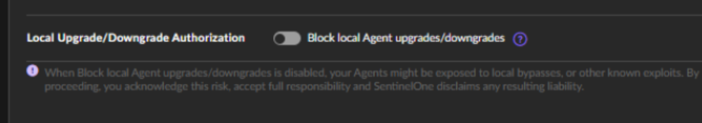
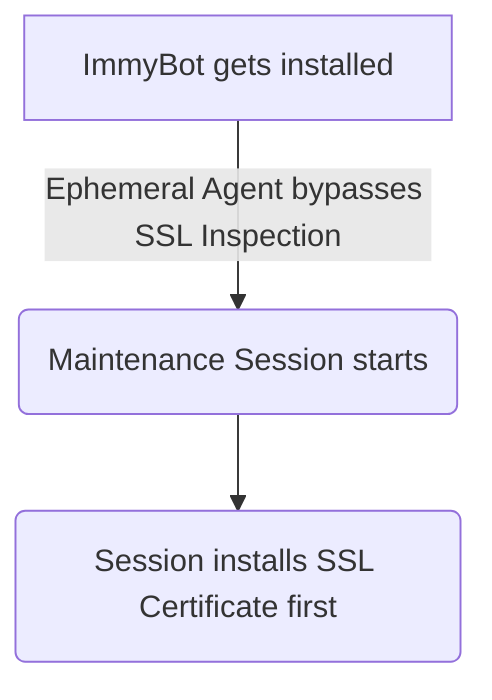

<!-- How To Template -->
# Security Software Exclusions

## Overview
This document lists out security exclusion recommendations. These exclusions are intended to keep ImmyBot running effectively.

## Prerequisites
Admin access to your security platforms.

## Security Software Exclusions

Ideally you would instruct your security software would support excluding code signed by

::: warning
ImmyBot's current code-signing certificate is set to change on Feb. 11th, 2025.
Please add both our upcoming and existing certificate exlusions to ensure no issues.

Please see the [FAQ section for more details](https://docs.immy.bot/FAQ.html#what-should-i-do-about-immybot-s-upcoming-code-signing-certificate-change)
:::
This certificate is used to sign our Agent binaries & installers delivered to machines.

Unfortunately, our new certificate's `Organization(O)` and `Common Name(CN)` fields are changing from `Immense Networks` to `ImmyBot LLC`.

New Certificate on Feb. 11th, 2025:
```
CN=ImmyBot LLC, O=ImmyBot LLC, L=Baton Rouge, S=Louisiana, C=US
```

Existing Certificate:
```
CN=Immense Networks, O=Immense Networks, L=Baton Rouge, S=Louisiana, C=US
```

Add ***both*** certificates to avoid issues if following before Feb. 11th, 2025 ***OR*** your instance has existing machines installed (which may have agents installed with older certificate)!

Exclusions based on code signing certificate are an industry standard feature and should be a standard feature in any best-in-class security software. However, if your security software is unable to exclude based on code signing certificate, create an exclusion for your instance's Script Path.

::: tip  Finding the script Path for your instance
Your script path can be found under **Settings** -> **Preferences** -> **Script Path**


:::

## ThreatLocker

1. Application Control-> Applications
2. Create New Application
3. Put the following value into Certificate and click Add

::: warning
ImmyBot's current code-signing certificate is set to change on Feb. 11th, 2025.
Please add both our upcoming and existing certificate exlusions to ensure no issues.

Please see the [FAQ section for more details](https://docs.immy.bot/FAQ.html#what-should-i-do-about-immybot-s-upcoming-code-signing-certificate-change)
:::
This certificate is used to sign our Agent binaries & installers delivered to machines.

Unfortunately, our new certificate's `Organization(O)` and `Common Name(CN)` fields are changing from `Immense Networks` to `ImmyBot LLC`.

New Certificate on Feb. 11th, 2025:
```
CN=ImmyBot LLC, O=ImmyBot LLC, L=Baton Rouge, S=Louisiana, C=US
```

Existing Certificate:
```
CN=Immense Networks, O=Immense Networks, L=Baton Rouge, S=Louisiana, C=US
```

Add ***both*** certificates to avoid issues if following before Feb. 11th, 2025 ***OR*** your instance has existing machines installed (which may have agents installed with older certificate)!

1. Add your instance’s [script path](#script-path-exclusion)

Ultimately it should look like this:

1. Create a New Application Policy
 

## Sophos Central

**Tenant Specific**
Manual Addition:

1. Launch Client Shell
2. Navigate to Global Settings - Allowed Applications
3. Select "Add apps"
4. In the "allow by:" dropdown, select certificate and add the following

New Certificate on Feb. 11th, 2025:
```
CN=ImmyBot LLC, O=ImmyBot LLC, L=Baton Rouge, S=Louisiana, C=US
```

Existing Certificate:
```
CN=Immense Networks, O=Immense Networks, L=Baton Rouge, S=Louisiana, C=US
```

Event Log Method:
If Sophos reports that Immy Bot has been blocked, you have the option of going to the Event Log and and select the option to allow by Certificate. This will only work if Sophos has picked up an alert for a process signed by the Immy Bot code signing certificate

**Partner Global Templates**

1. Navigate to Settings & Policies - Global Templates and select the template you would like to modify
2. Once in the template, navigate to Global Settings - Allowed Applications
3. Follow steps 3 and 4 listed in the **Tenant Specific** section above

## BitDefender

BitDefender will intermittently block script execution unless you disable Aggressive scanning mode or add a your instance's [Script Path](#security-software-exclusions) to your policy's exclusion list.

1. Edit the policy->Antimalware->Settings->In-policy Exclusions
2. Add a folder exclusion for your [Script Path](#security-software-exclusions)

## CrowdStrike

CrowdStrike uses AI to decide what to allow and disallow. Periodically this AI will mark the ImmyBot Agent or ImmyBot Ephemeral Agent as malicious. This usually happens after we update it. Marking it as a false positive in your CrowdStrike portal will train the global AI to not treat it as malicious.

## Microsoft Defender for Endpoint

Add a your instance's [Script Path](#security-software-exclusions) to your policy's exclusion list.
<https://docs.microsoft.com/en-us/mem/intune/configuration/device-restrictions-configure#create-the-profile>

## Cylance

Cylance blocks our websocket making the ImmybotAgent log look like this:

```
2022-09-21 12:24:26.562 -04:00 [INF] Process exiting.
2022-09-21 12:24:40.106 -04:00 [DBG] Closing Websocket...
2022-09-21 12:24:49.743 -04:00 [INF] Marked ConnectionState as disconnected.
2022-09-21 12:24:50.171 -04:00 [ERR] Application shutting down (App lifetime token cancelled)
System.IO.IOException: Cannot access a closed stream.
at System.Net.Http.HttpConnection.RawConnectionStream.WriteAsync(ReadOnlyMemory`1 buffer, CancellationToken cancellationToken)
```

To correct it, you need to bypass SSL Inspection for your instances hostnames/IPs, which are found under
 Show more > integrations > Fetch IP Address and Hostnames

## SentinelOne

 Sentinel requires BOTH your instance's Script path and the ImmyBot Agent process excluded. With only the script path excluded, devices will regularly have issues running the ImmyBot Agent to download the ephemeral agent. This is apparent in two cases:
  1. Importing devices - The new agent can't download the ephemeral agent to start running inventory.
  2. Updating ImmyBot Agents - The new agent can't download the corresponding new ephemeral agent when attempting to run deployments or scripts.

You can also set your Exclusion Mode to "Interoperability - Extended".

:::danger Updating SentinelOne through ImmyBot
If you want ImmyBot to handle SentinelOne updates, you must enable "Local Upgrade/Downgrade Authorization" found in:

**Sentinels** > **Policy** > **Agent**



:::

## DNSFilter

There have been reports indicating that DNSFilter, along with potentially other DNS filtering tools, is not directly blocking subdomain.immy.bot but has failed to resolve some DNS queries.

Specifically, in the case of DNSFilter, it was confirmed that ImmyBot was not being blocked. However, the failure in DNS resolution meant that connection attempts to the backend were unsuccessful.

Explicitly allowing the DNS for subdomain.immy.bot (replacing "subdomain" with your specific ImmyBot instance subdomain) was verified to resolve the issue of failed DNS resolutions.

For guidance on managing allow and block lists, please refer to: https://help.dnsfilter.com/hc/en-us/articles/1500008111381-Allow-and-Block-Lists

## SSL Inspection

::: danger ImmyBot does not support SSL Inspection
Our agents can detect SSL inspection and will log it in the platform. Part of troubleshooting will be to turn off SSL inspection if any of our agents cannot connect.
:::

1. Add the security exclusions for your instance to your firewall
   - This is going to vary firewall to firewall, please consult your firewall vendor's manual.
   - You can find the domains and IP addresses you need to exclude by going to `Show more` -> `SMTP` -> `Click on "Fetch IP Addresses and Hostnames"`
   - additionally you will need to exclude
2. Duplicate the certificate task
   - Duplicate the "Import Certificate" task in ImmyBot, rename it something self documenting such as "Corp Office - SSL Inspection"
3. Create deployment for that duplicate task
   - Create a deployment using the task you created in step 2, configure it with the SSL Certificate for the SSL inspection. Set the targeting as you need.
4. Update deployment ordering so that this deployment item is first in the beginning column.
   - `Library` -> `Deployment Ordering`
   - Move the task you created in step 2 to the top of the beginning column.

Intended workflow:



<br><br><br>
>[!NOTE] Document information
>Author:
<br>
>Date Published:
><br>
>Date Revised:
><br>
>Version Number:
