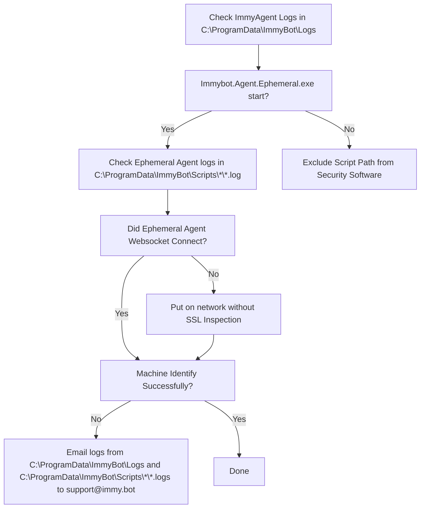
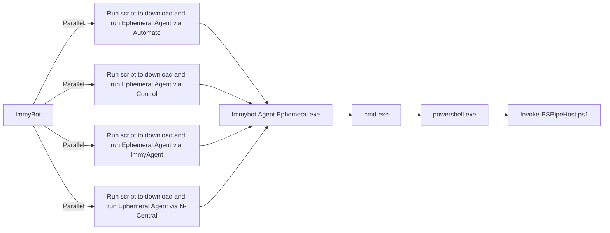

# Troubleshooting Guide

> [!WARNING] *ImmyBot's EV code-signing certificate is changing on Feb. 11th, 2025*
> Please see the [FAQ section for more details](https://docs.immy.bot/FAQ.html#what-should-i-do-about-immybot-s-upcoming-code-signing-certificate-change) on updating security exclusions.

::: danger *ImmyBot no longer supports Windows 7, Server 2008 (or Server 2012 w/o [ESUs](https://learn.microsoft.com/en-us/windows-server/get-started/extended-security-updates-overview)) machines.*
Please see the [FAQ section for more details](https://docs.immy.bot/FAQ.html#what-windows-versions-does-immyagent-support)
:::

This comprehensive guide will help you troubleshoot common issues with ImmyBot, including agent connectivity problems, identification failures, security software conflicts, and more. Follow the step-by-step instructions to diagnose and resolve issues quickly.

## Identification Failures

### Needs a Manual Decision

Generally you will click "Agent Re-installed"

Often when an RMM Agent gets re-installed, it will get a new id in the RMM (ComputerId in Automate, SessionID in Control). ImmyBot will recognize that it is the same computer, but due to the fact that virtualization technologies and hard drive cloning can lead to the same scenario, we require you to tell us whether we should overwrite the existing RmmComputer, or keep both. 99% of the time you will click "Overwrite Existing". If the machine was in fact cloned, you would click Keep Both, in which case Immy shims the duplicate UUID with its own to prevent collisions.

## Pending Computers

Computers in the pending status have yet to be identified.

Computers may get stuck here if we are unable to run our Ephemeral Agent



Top 3 reasons for Identification Failures

1. SSL Inspection blocking our websocket
1. Security Software blocking PowerShell
1. Incorrect time is preventing SSL/TLS connection

To understand the various reasons identification can fail, it helps to understand how ImmyBot executions PowerShell

1. RMM or ImmyAgent runs Immybot.Agent.Ephemeral.exe
1. Immybot.Agent.Ephemeral.exe establishes a secure websocket to wss://subdomain.immy.bot and runs Invoke-PSPipeHost.ps1
1. Immybot.Agent.Ephemeral.exe feeds Invoke-PSPipeHost.ps1 PowerShell over a pipe from the websocket session



The most common cause of identification failure is security software.

To know if this is the case, pull the logs from C:\ProgramData\ImmyBot\Logs and C:\ProgramData\ImmyBot\Scripts\*\*.logs

Normal Immybot Agent logs look like this:

```
2022-06-14 00:02:25.560 -05:00 [DBG] Hosting starting
2022-06-14 00:02:25.799 -05:00 [INF] Starting Immybot Agent
2022-06-14 00:02:25.943 -05:00 [INF] Using configuration file stored at: C:\ProgramData\ImmyBotAgentService\config.json
2022-06-14 00:02:26.875 -05:00 [DBG] Initializing IoT Hub connection
2022-06-14 00:02:35.023 -05:00 [INF] Application started. Hosting environment: Production; Content root path: C:\WINDOWS\TEMP\.net\Immybot.Agent.Service\lreaszzz.wwx\
2022-06-14 00:02:35.024 -05:00 [DBG] Hosting started
2022-06-14 00:02:40.552 -05:00 [WRN] IoT Hub connection status Changed Status => [Connected] Reason => [Connection_Ok]
2022-06-14 02:06:32.159 -05:00 [DBG] Process started; ID: 12724
2022-06-14 02:06:37.358 -05:00 [DBG] Running C:\ProgramData\ImmyBot\Scripts\840290f2bd2142e2bd2c612542436763\Immybot.Agent.Ephemeral.exe --ImmyScriptPath C:\ProgramData\ImmyBot\Scripts\840290f2bd2142e2bd2c612542436763 --BackendAddress wss://immense.immy.bot/ --SessionID c946e1d1-f5fd-d36d-0489-d2a9ad9084e0
2022-06-14 02:06:38.335 -05:00 [DBG] PID 16184 <----- Indicates successful execution
2022-06-14 02:06:38.372 -05:00 [DBG] Process exited; Code: 0
```

Windows Defender will make the logs look like this:

```
2022-11-17 13:13:36.604 +11:00 [DBG] Hosting starting
2022-11-17 13:13:36.817 +11:00 [INF] Starting Immybot Agent
2022-11-17 13:13:36.840 +11:00 [INF] Using configuration file stored at: C:\ProgramData\ImmyBotAgentService\config.json
2022-11-17 13:13:37.590 +11:00 [DBG] Initializing IoT Hub connection
2022-11-17 13:13:37.860 +11:00 [DBG] Hosting started
2022-11-17 13:13:38.598 +11:00 [WRN] IoT Hub connection status Changed Status => [Connected] Reason => [Connection_Ok]
2022-11-17 13:13:39.157 +11:00 [WRN] Dirty-Shutdown detected! Dirty-File created at: "2022-11-07T04:11:59.3975026Z" UTC
2022-11-17 13:13:41.686 +11:00 [DBG] Process started; ID: 5660
2022-11-17 13:13:44.674 +11:00 [DBG] Running C:\ProgramData\ImmyBot\Scripts\4303da9b790b41c6978b50b872fe17cb\Immybot.Agent.Ephemeral.exe --ImmyScriptPath C:\ProgramData\ImmyBot\Scripts\4303da9b790b41c6978b50b872fe17cb --BackendAddress wss://ericom.immy.bot/ --SessionID a92c0ed1-ea3b-7f8a-d9c6-946d9b44ccc5
2022-11-17 13:13:49.577 +11:00 [DBG] WMI Error 2
```

DNS Filtering/Issues make the logs look like this

```
2022-09-20 20:39:59.712 +10:00 [INF] RESPONSE: {
  "Resource": "installer/challenge/request",
  "Method": "POST",
  "StatusCode": 0,
  "ErrorException": {
    "ClassName": "System.Net.WebException",
    "Message": "No such host is known. (XXXX.immy.bot:443)"
```

To correct it, you need to exclude DNS filtering for your instances hostnames, which are found under
 Show more > integrations > Fetch IP Address and Hostnames

If Powershell is failing to start on the endpoint within 60 seconds a timeout will occur.

Here is a suggestion on a cause and possible fix for that one <https://www.reddit.com/r/PowerShell/comments/rx68fw/powershell_slow_to_open_long_load_timesfixed>


## Group Policy Objects

PowerShell execution policies set through Group Policy can affect ImmyBot's ability to run scripts. Ensure the following GPO settings are configured correctly:

**Required GPO Settings:**
- Computer Configuration | Policies | Administrative Templates | Windows Components | Windows PowerShell | Turn on Script Execution (Enabled)
- User Configuration | Policies | Administrative Templates | Windows Components | Windows PowerShell | Turn on Script Execution (Enabled)

These GPOs have been known to cause issues with running scripts if not properly configured. We recommend setting the execution policy to "RemoteSigned" or "Unrestricted" for ImmyBot to function properly.

## Working With Support

When you've tried all the troubleshooting steps and still need assistance, our support team is ready to help.

**Support Contact Information:**
- Email: `support@immy.bot`

## Preparing for Support

To help our support team resolve your issue quickly, please provide the following information:

1. **Detailed Description:**
   - What you were trying to do
   - What happened instead
   - Any error messages you received
   - When the issue started occurring

2. **Environment Information:**
   - ImmyBot version
   - Agent version
   - Operating system version
   - Security software in use

3. **Logs and Diagnostics:**
   - Agent logs from C:\ProgramData\ImmyBot\Logs
   - Script logs from C:\ProgramData\ImmyBot\Scripts\*\*.logs
   - Any additional diagnostic information as described below
   - A session link or number (if applicable)

## Gather an Endpoint Trace Log

Windows Performance Recorder can generate a detailed log of an endpoint's activity, which can be used to identify environmental causes for issues running the ImmyBot Agent.

> [!NOTE]
> These traces can be resource intensive and may require 2-4 GB available RAM, depending on how active an endpoint is and how long a trace is running.

**Steps to Collect a Trace:**

1. From an elevated CMD prompt, run:
```bat
wpr.exe -start CPU -start Minifilter -start FileIO -start Registry
```
2. Recreate the issue that you're experiencing.
3. Wait 3-5 minutes, depending on the available RAM, and run:
```bat
wpr.exe -stop "C:\PerfLogs\examplefilename.etl" -compress
```

If the `wpr -stop` command fails, try running without the "-compress" parameter.

This ETL file can be reviewed in Windows Performance Analyzer from the Windows Performance Toolkit SDK.


## Next Steps

After resolving your issue, consider reviewing these related resources:

- [Common Issues](/Documentation/Troubleshooting/common-issues.md) - Solutions to frequently encountered problems
- [Security Software Configuration](/Documentation/Troubleshooting/security-software-exclusions.md) - Configure security software to work with ImmyBot
- [FAQ](/Documentation/FAQ.md) - Answers to common questions about ImmyBot
