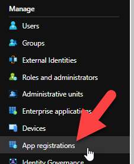
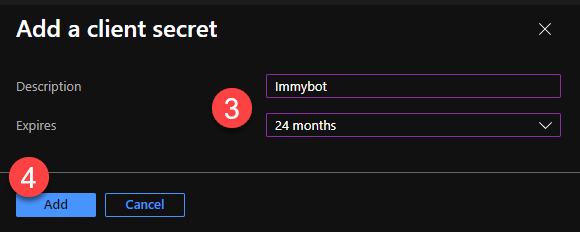

# AzureAD/365 Graph Permissions

Your first ImmyBot tenant will be automatically linked to the Azure tenant that you signed up for ImmyBot with. You can link other ImmyBot tenants to Azure from the tenant Azure tab.

## Linking to an Azure Tenant

After creating an ImmyBot tenant, link it to an Azure tenant by navigating to the Azure tab in ImmyBot and entering the Azure tenant's principal id or domain and clicking `Save`.

## Azure Permission Level

Once your ImmyBot tenant has been linked to Azure, you can set the **Azure Permission Level** from the tenant Azure tab. This allows ImmyBot to:

1. Sync all users from the Azure tenant
2. Sync all users from your customer's tenants (if your Azure tenant is a Partner tenant)
3. Install the 365 applications a user is licensed for (Apps for business/Apps for entrprise/Project/Visio)
4. Deploy software to Teams, On-Premises Security Groups (Ex. Everyone in the Engineering Team gets AutoCAD 2022)

The **Azure Permission Level** has two options: _Default_ and _Custom_

### Default

In this mode, you don't need to create an app registration. You consent as an administrator, allowing ImmyBot access users in your tenant and your customers tenants (if you have established GDAP relationships with your customers).

### Custom

In this mode, you create an App Registration and provide its Application (client) Id and Secret to ImmyBot, allowing you to customize the permissions Immy has to you and your customer's environments.

#### Create an App Registration

Navigate to: <https://aad.portal.azure.com/>

**Important!** Your app registration must have a Web redirect uri of `https://<your-domain>.immy.bot/consent-callback`, replacing `<your-domain>` appropriately

#### Grant Permissions

See the screenshots below for the minimum permissions.

#### Create Client Secret

#### Assign GDAP Permissions to ImmyBot Service Principal

- Create a Security Group in Azure AD called "ImmyBot Security Group"
- Add the ImmyBot Service Principal to that group
- For each customer in the Partner Center, add the "ImmyBot Security Group" and add the "Directory Readers" and "Global Reader" role.

#### Copy the `Application (client) ID` and `Client Secret Value` into the form in ImmyBot.