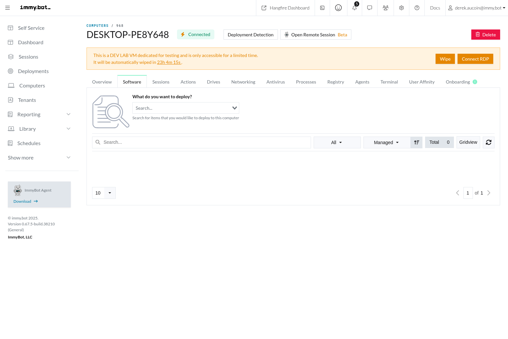

# Computer Management

This section provides comprehensive information about managing computers in ImmyBot, based on the actual implementation in the codebase.

## Computer Inventory

The Computer Inventory is the central repository of all computers managed by ImmyBot. It provides a comprehensive view of your environment and serves as the foundation for all computer management activities.

### Viewing Your Computer Inventory

The Computer List page displays all computers in your inventory, organized into tabs based on their current state:

1. **Active**: Computers that are currently in use and properly onboarded
2. **New**: Recently discovered computers that need to be onboarded
3. **Pending**: Computers in the process of being onboarded
4. **Stale**: Computers that haven't connected to ImmyBot within the configured stale threshold period
5. **Lab**: Development lab virtual machines for testing
6. **Deleted**: Computers that have been removed from active management


Each tab shows a count of computers in that state, allowing you to quickly assess your environment's status.

### Managing Your Inventory

To effectively manage your computer inventory:

1. **Filtering and Searching**:
   - Use the search box to find computers by name, IP, user, or other attributes
   - Apply filters to narrow down the list by specific criteria
   - Save custom views for frequently used filter combinations

2. **Bulk Actions**:
   - Select multiple computers using the checkboxes
   - Use the Actions menu to perform operations on all selected computers
   - Available actions include maintenance, tagging, and tenant assignment

3. **Organizing Computers**:
   - Add tags to computers for logical grouping
   - Assign computers to tenants (MSP feature)
   - Create dynamic groups based on computer attributes

4. **Inventory Maintenance**:
   - Regularly review and clean up stale computers
   - Move lab computers to the appropriate tab
   - Delete computers that are no longer in use

### Common Issues and Solutions

| Issue | Possible Causes | Solution |
|-------|----------------|----------|
| Computer not appearing in inventory | Agent not installed, Network issues, Firewall blocking | Verify agent installation, Check network connectivity, Configure firewall exceptions |
| Computer showing in wrong state | State transition failed, Manual state change needed | Check agent logs, Manually update computer state |
| Duplicate computers in inventory | Computer reimaged without proper cleanup, Hardware change | Use the merge function to combine duplicates, Delete the older entry |
| Stale computers accumulating | Computers retired without proper cleanup | Implement offboarding process, Schedule regular inventory cleanup |

### Best Practices

- **Implement a naming convention** for computers to make identification easier
- **Use tags strategically** to organize computers by department, location, or purpose
- **Regularly audit your inventory** to identify and resolve issues
- **Document your inventory management procedures** for consistency
- **Train technicians** on proper inventory management techniques

## Agent Management

The ImmyBot Agent is the software component installed on managed computers that enables communication with the ImmyBot server and executes maintenance actions. Effective agent management is crucial for maintaining a healthy environment.

### Agent Types

ImmyBot uses two types of agents:

1. **Persistent Agent**: 
   - Runs as a Windows service
   - Maintains constant communication with the ImmyBot server
   - Handles scheduled maintenance and real-time commands
   - Provides continuous monitoring and status updates

2. **Ephemeral Agent**: 
   - Temporary agent that runs for a specific task
   - Does not require installation
   - Used for initial onboarding and one-time operations
   - Automatically terminates after completion

### Agent Installation Methods

There are several ways to install the ImmyBot agent:

1. **Manual Installation**:
   - Download the agent installer from the ImmyBot portal
   - Run the installer on the target computer
   - Follow the installation wizard

2. **Remote Installation**:
   - Use the "Deploy Agent" function from the ImmyBot portal
   - Requires administrative credentials for the target computer
   - Works with computers already on the network

3. **Integration-Based Installation**:
   - Deploy through RMM tools like ConnectWise Automate
   - Use Group Policy for domain-joined computers
   - Integrate with deployment tools like Microsoft Intune

4. **Onboarding Link**:
   - Generate an onboarding link in the ImmyBot portal
   - Share the link with end-users
   - Users click the link to download and run the agent installer

### Agent Configuration

The agent can be configured with various parameters:

1. **Basic Configuration**:
   - Tenant assignment
   - Communication settings
   - Logging level

2. **Advanced Configuration**:
   - Custom installation path
   - Proxy settings
   - Certificate configuration
   - Custom agent parameters

Example PowerShell command for silent installation with parameters:

```powershell
.\ImmyAgent.exe /S /TENANT="Contoso" /TAGS="Sales,Remote" /PROXY="http://proxy.contoso.com:8080"
```

### Agent Troubleshooting

Common agent issues and their solutions:

1. **Agent Not Connecting**:
   - Check network connectivity
   - Verify firewall settings
   - Ensure the agent service is running
   - Check for certificate issues

2. **Agent Crashes or Errors**:
   - Review agent logs at `C:\ProgramData\ImmyBot\Logs`
   - Check Windows Event Viewer for service errors
   - Verify sufficient system resources
   - Reinstall the agent if necessary

3. **Agent Performance Issues**:
   - Optimize agent logging level
   - Check for resource contention
   - Verify hardware meets minimum requirements
   - Update to the latest agent version

### Agent Management Best Practices

- **Keep agents updated** to the latest version
- **Monitor agent health** through the ImmyBot dashboard
- **Implement proper error handling** for agent deployment
- **Document agent deployment procedures** for consistency
- **Test agent updates** in a lab environment before deploying widely
- **Use tags during installation** to properly categorize computers
- **Configure appropriate logging levels** for troubleshooting

## Computer Details

The Computer Details page provides comprehensive information about a specific computer and offers various management options. This page is organized into tabs, each focusing on a different aspect of the computer.

### Accessing Computer Details

To access the Computer Details page:
1. Navigate to the Computers page
2. Find the computer in the list using search or filters
3. Click on the computer name to open the details page


### Overview Tab

The Overview tab provides essential information about the computer, including:

- Hardware specifications (CPU, RAM, disk space)
- Operating system details and version
- Network information (IP addresses, MAC addresses)
- Primary user and additional users
- Last check-in time and agent status
- Tags and tenant information
- Maintenance exclusion status


How to use the Overview tab effectively:
- Review hardware specifications to identify upgrade needs
- Check OS version for compliance with security policies
- Verify primary user assignment for accurate reporting
- Monitor last check-in time to identify connectivity issues
- Use the quick action buttons for common tasks

### Software Tab

The Software tab lists all software installed on the computer, with multiple views and filtering options:

- **Inventory**: All software detected on the computer
- **Assignable**: Software that can be managed through ImmyBot
- **Unassignable**: Software that cannot be managed through ImmyBot
- **Assigned**: Software currently managed by ImmyBot deployments



Key software management tasks:
1. **Viewing Software Details**:
   - Click on a software item to view version information
   - Check installation date and size
   - View deployment associations

2. **Installing Software**:
   - Use the Quick Deploy button to install new software
   - Select from available software packages
   - Configure installation parameters
   - Monitor installation progress

3. **Updating Software**:
   - Identify outdated software versions
   - Select the software to update
   - Choose the target version
   - Initiate the update process

4. **Uninstalling Software**:
   - Select the software to remove
   - Click the Uninstall button
   - Confirm the uninstallation
   - Monitor the removal process

### Sessions Tab

The Sessions tab shows all maintenance sessions that have been run on the computer, including:

- Session status (completed, failed, in progress)
- Actions performed during each session
- Timestamps for session start and completion
- Detailed logs for troubleshooting
- Options to cancel, rerun, or resume sessions


How to use the Sessions tab:
1. **Viewing Session Details**:
   - Click on a session to view detailed information
   - Review the actions performed during the session
   - Check the status of each action
   - Analyze logs for troubleshooting

2. **Managing Active Sessions**:
   - Monitor progress of running sessions
   - Cancel sessions that are stuck or unnecessary
   - Pause sessions to resume later
   - Prioritize critical sessions

3. **Troubleshooting Failed Sessions**:
   - Identify the specific action that failed
   - Review error messages and logs
   - Address the underlying issue
   - Rerun the session after fixing the problem

### Registry Tab

The Registry tab allows you to remotely navigate the computer's registry and generate configuration tasks from selected values. Features include:

- Browse registry keys and values in a tree view
- Search for specific registry keys or values
- View different data types (String, DWORD, Binary, etc.)
- Generate configuration tasks from selected registry values
- Real-time connection to the computer's registry via an ephemeral agent


How to use the Registry tab:
1. **Navigating the Registry**:
   - Expand keys to view their subkeys and values
   - Use the search function to find specific keys
   - Navigate to common registry locations using shortcuts
   - View value data in appropriate formats

2. **Creating Configuration Tasks**:
   - Select a registry value
   - Click "Create Configuration Task"
   - Configure task parameters
   - Save the task for future use

3. **Best Practices for Registry Management**:
   - Always document registry changes
   - Test registry modifications in a lab environment first
   - Create backup tasks that restore original values
   - Use proper error handling in registry tasks

### Additional Tabs

The Computer Details page includes several other tabs for comprehensive management:

1. **Actions Tab**:
   - View pending maintenance actions
   - Prioritize and schedule actions
   - Cancel or modify actions as needed

2. **Drives Tab**:
   - Monitor disk space and usage
   - View partition information
   - Check drive health and status
   - Identify storage issues

3. **Networking Tab**:
   - View network adapters and configurations
   - Check IP addresses and DNS settings
   - Monitor network connectivity
   - Troubleshoot network issues

4. **Antivirus Tab**:
   - Check antivirus status and definitions
   - Verify protection settings
   - Identify security issues
   - Initiate antivirus actions

5. **Processes Tab**:
   - View running processes and resource usage
   - Identify problematic processes
   - Start or stop processes remotely
   - Monitor system performance

6. **Terminal Tab**:
   - Access a command-line interface to the computer
   - Run PowerShell or CMD commands
   - View command output in real-time
   - Execute scripts and commands remotely

7. **User Affinity Tab**:
   - Manage primary and additional users
   - Set user-computer relationships
   - Configure user-specific settings
   - View user login history

8. **Onboarding Tab**:
   - Track onboarding progress
   - View onboarding steps and status
   - Troubleshoot onboarding issues
   - Restart or modify onboarding process

## Computer Lifecycle

Managing the computer lifecycle in ImmyBot involves several stages from initial discovery to retirement. Understanding this lifecycle helps ensure efficient management of your environment.

### Discovery and Onboarding

The first stage in the computer lifecycle is discovery and onboarding:

1. **Discovery Methods**:
   - Manual agent installation
   - Integration with RMM tools
   - Network scanning
   - User-initiated onboarding

2. **Onboarding Process**:
   - Agent installation
   - Initial inventory collection
   - Tenant and tag assignment
   - Baseline software deployment
   - Configuration and compliance checks

3. **Onboarding Status Tracking**:
   - New: Computer discovered but not onboarded
   - Pending: Onboarding in progress
   - Active: Successfully onboarded and managed

### Active Management

Once onboarded, computers enter the active management phase:

1. **Regular Maintenance**:
   - Software updates and patching
   - Configuration management
   - Compliance monitoring
   - Health checks and remediation

2. **User Management**:
   - Primary user assignment
   - User affinity tracking
   - User-specific deployments
   - User experience optimization

3. **Inventory Updates**:
   - Hardware changes detection
   - Software inventory refreshes
   - Configuration drift monitoring
   - Compliance status updates

### Stale and Inactive Computers

Computers that haven't connected to ImmyBot for an extended period enter the stale state:

1. **Stale Detection**:
   - Based on configurable threshold (default: 30 days)
   - Automatic status change to "Stale"
   - Notification to administrators

2. **Stale Computer Management**:
   - Investigation of connectivity issues
   - Agent reinstallation if needed
   - Computer recovery procedures
   - Decision to retire or reactivate

3. **Reactivation Process**:
   - Agent reconnection
   - Inventory refresh
   - Compliance verification
   - Status change back to "Active"

### Computer Retirement

The final stage in the computer lifecycle is retirement:

1. **Retirement Triggers**:
   - Hardware replacement
   - Employee departure
   - Asset decommissioning
   - Extended inactivity

2. **Retirement Process**:
   - Software uninstallation
   - Data migration or backup
   - Agent removal
   - Status change to "Deleted"

3. **Post-Retirement Actions**:
   - Record archiving
   - Asset disposition tracking
   - License reclamation
   - Documentation updates

### Lifecycle Automation

ImmyBot provides several automation options for lifecycle management:

1. **Automated Onboarding**:
   - Scripted agent deployment
   - Automatic tenant assignment
   - Baseline deployment triggers
   - Status transitions

2. **Maintenance Automation**:
   - Scheduled maintenance sessions
   - Compliance-triggered actions
   - Event-based maintenance
   - Self-healing capabilities

3. **Retirement Automation**:
   - Stale computer detection
   - Automatic cleanup tasks
   - Integration with asset management
   - Notification workflows

### Best Practices for Lifecycle Management

- **Document your lifecycle policies** for consistency
- **Implement clear onboarding procedures** for new computers
- **Regularly review stale computers** for potential issues
- **Create a formal retirement process** to ensure proper cleanup
- **Use automation** to streamline lifecycle transitions
- **Maintain accurate inventory records** throughout the lifecycle
- **Train technicians** on proper lifecycle management

## User Computer Affinity

User Computer Affinity in ImmyBot refers to the relationship between users and their computers. This feature helps track which users are associated with which computers, enabling user-centric management and reporting.

### Understanding User Affinity

User affinity consists of two main components:

1. **Primary User**:
   - The main user of a computer
   - Used for reporting and organization
   - Basis for user-specific deployments
   - Only one primary user per computer

2. **Additional Users**:
   - Secondary users who also use the computer
   - Tracked for comprehensive user management
   - May receive specific deployments
   - Multiple additional users per computer

### Managing User Affinity

User affinity can be managed through several methods:

1. **Manual Assignment**:
   - Navigate to the computer's User Affinity tab
   - Set or change the primary user
   - Add or remove additional users
   - Save the changes

2. **Automated Detection**:
   - Agent-based login tracking
   - Most frequent user determination
   - Automatic primary user suggestion
   - Administrator approval workflow

3. **Bulk Management**:
   - Select multiple computers in the Computer List
   - Use the "Set Primary User" action
   - Assign the same primary user to all selected computers
   - Confirm the changes

4. **Integration-Based Assignment**:
   - Import user-computer relationships from Azure AD
   - Sync with RMM tool assignments
   - Update from HR systems
   - Maintain consistency across platforms

### User Affinity in Deployments

User affinity plays a key role in deployments:

1. **User-Targeted Deployments**:
   - Deploy software to all computers with a specific primary user
   - Configure user-specific settings
   - Ensure consistent experience across multiple devices
   - Track user-specific compliance

2. **User-Based Filtering**:
   - Filter computers by primary user
   - Group computers by department or role
   - Create reports based on user attributes
   - Identify user-specific issues

3. **User Experience Optimization**:
   - Deploy personalization settings
   - Configure application preferences
   - Manage user-specific licenses
   - Optimize performance for user workloads

### Common Issues and Solutions

| Issue | Possible Causes | Solution |
|-------|----------------|----------|
| Incorrect primary user | Manual error, Outdated information, Automated detection issue | Manually update the primary user, Review detection settings, Sync with authoritative source |
| Missing user information | Integration failure, User not in directory, Synchronization issue | Check integration status, Add user to directory, Trigger manual sync |
| Multiple computers per user | User has multiple devices, Duplicate computer records | Verify if legitimate, Merge duplicate records, Update affinity settings |
| User-specific deployments not applying | Affinity not set correctly, Deployment targeting issue | Verify user affinity, Check deployment target configuration, Run manual maintenance |

### Best Practices

- **Establish a process** for maintaining accurate user affinity
- **Regularly audit** user-computer relationships
- **Integrate with authoritative sources** like Azure AD
- **Document your user affinity strategy** for consistency
- **Train help desk staff** on proper user affinity management
- **Use user affinity for reporting** and asset management
- **Consider user roles** when setting up affinity-based deployments

## Maintenance Management

Maintenance Management in ImmyBot involves planning, scheduling, and executing maintenance activities on managed computers. Effective maintenance management ensures computers remain secure, up-to-date, and compliant with organizational policies.

### Maintenance Sessions

Maintenance sessions are the primary mechanism for applying changes to computers:

1. **Session Types**:
   - **Standard Maintenance**: Applies all applicable deployments
   - **Quick Deploy**: Installs specific software or runs specific tasks
   - **Targeted Maintenance**: Applies specific deployments only
   - **Onboarding Maintenance**: Initial setup during onboarding

2. **Session Initiation Methods**:
   - Manual initiation from the Computer Details page
   - Scheduled execution based on maintenance windows
   - Event-triggered execution (e.g., user login)
   - API-initiated sessions from integrations

3. **Session Execution Process**:
   - Deployment resolution to determine applicable actions
   - Pre-execution checks and validation
   - Sequential or parallel action execution
   - Post-execution verification and reporting

4. **Session Monitoring and Management**:
   - Real-time progress tracking
   - Log viewing and analysis
   - Session control (pause, resume, cancel)
   - Failure handling and retry mechanisms

### Maintenance Planning

Effective maintenance requires proper planning:

1. **Maintenance Windows**:
   - Define time periods for scheduled maintenance
   - Configure different windows for different computer groups
   - Set recurrence patterns (daily, weekly, monthly)
   - Specify blackout periods for critical business times

2. **Maintenance Policies**:
   - Establish standard maintenance procedures
   - Define escalation paths for failures
   - Set retry policies for failed actions
   - Configure notification settings

3. **Resource Planning**:
   - Stagger maintenance to manage server load
   - Consider network impact of large deployments
   - Plan for potential reboots and downtime
   - Allocate support resources during maintenance periods

### Maintenance Exclusions

Sometimes computers need to be temporarily excluded from maintenance:

1. **Exclusion Types**:
   - **Full Exclusion**: No maintenance allowed
   - **Partial Exclusion**: Only critical updates allowed
   - **Time-Limited Exclusion**: Excluded for a specific period
   - **Deployment-Specific Exclusion**: Excluded from specific deployments

2. **Setting Exclusions**:
   - Navigate to the computer's Overview tab
   - Click the "Exclude from Maintenance" button
   - Configure exclusion parameters
   - Save the exclusion settings

3. **Managing Exclusions**:
   - Review active exclusions regularly
   - Remove expired exclusions
   - Document reasons for long-term exclusions
   - Report on excluded computers

### Troubleshooting Maintenance Issues

Common maintenance issues and their solutions:

1. **Failed Maintenance Sessions**:
   - Review session logs for specific errors
   - Check computer connectivity and agent status
   - Verify deployment configuration
   - Address underlying issues and retry

2. **Incomplete Maintenance**:
   - Identify actions that didn't complete
   - Check for dependencies or prerequisites
   - Verify sufficient resources (disk space, memory)
   - Complete missing actions manually if needed

3. **Maintenance Performance Issues**:
   - Optimize deployment configurations
   - Review action execution order
   - Consider breaking large sessions into smaller ones
   - Schedule resource-intensive maintenance during off-hours

4. **Recurring Failures**:
   - Identify patterns in failure logs
   - Create test deployments to isolate issues
   - Implement more robust error handling
   - Consider environmental factors affecting maintenance

### Best Practices

- **Document your maintenance strategy** for consistency
- **Test maintenance actions** in a lab environment first
- **Communicate maintenance windows** to affected users
- **Monitor maintenance sessions** for completion and success
- **Regularly review maintenance logs** to identify trends
- **Implement a change management process** for deployments
- **Have rollback plans** for critical maintenance actions
- **Train support staff** on troubleshooting maintenance issues

## In-App Documentation

ImmyBot provides contextual help documentation throughout the application to assist users in understanding and using the Computer Management features effectively.

### Accessing In-App Documentation

In-app documentation can be accessed in several ways:

1. **Help Icons**: Click the question mark icons next to features
2. **Help Menu**: Access comprehensive documentation from the main menu
3. **Contextual Help**: View feature-specific guidance on each page
4. **Tooltips**: Hover over elements for quick explanations

### Documentation Content

The in-app documentation covers various aspects of Computer Management:

1. **Feature Overviews**: Explanations of what each feature does
2. **Step-by-Step Guides**: Instructions for common tasks
3. **Best Practices**: Recommendations for effective use
4. **Troubleshooting Tips**: Solutions for common issues
5. **Reference Information**: Detailed technical information

### Using Documentation Effectively

To get the most out of the in-app documentation:

1. **Start with Overviews**: Understand the big picture before diving into details
2. **Follow Guided Workflows**: Use step-by-step instructions for complex tasks
3. **Check Related Topics**: Explore connections between different features
4. **Provide Feedback**: Use the feedback mechanisms to improve documentation
5. **Supplement with Training**: Combine documentation with formal training

### Documentation Updates

The in-app documentation is regularly updated to reflect new features and improvements:

1. **Version-Specific Content**: Documentation matches your ImmyBot version
2. **Release Notes**: Highlights of new and changed features
3. **Improvement Process**: Continuous refinement based on user feedback
4. **Notification System**: Alerts about significant documentation updates
