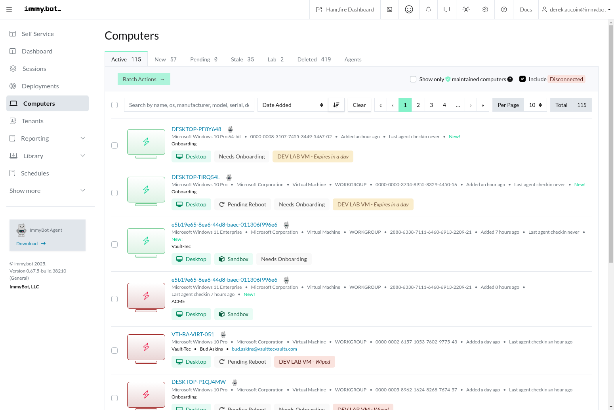
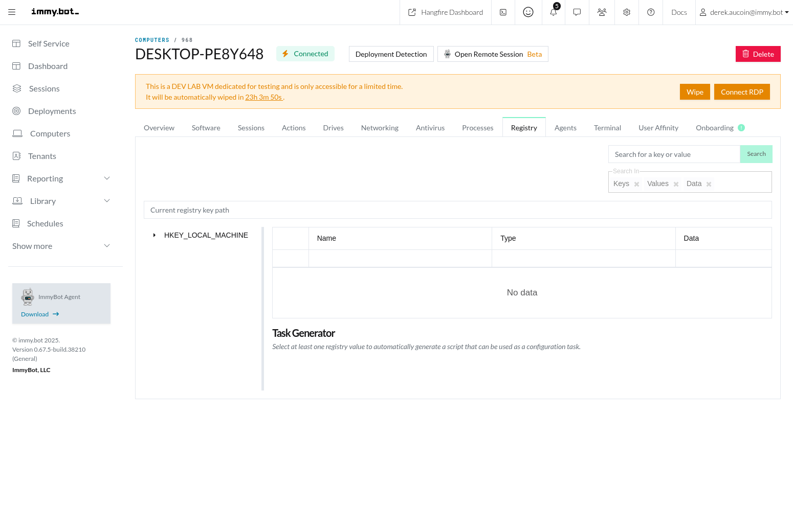

# Computer Management

Computer Management in ImmyBot allows you to view, organize, and maintain all computers across your organization or client base. This section provides comprehensive information about managing computers in ImmyBot, based on the actual implementation in the codebase.

## Computer Inventory

The Computer Inventory in ImmyBot provides a comprehensive view of all managed devices in your environment, allowing you to track hardware, software, and configuration details.

### Computer List View

The Computer List is the central hub for managing all computers, organized into tabs that represent different computer states:

- **Active**: Computers that are currently in use and properly onboarded
- **New**: Recently discovered computers that need to be onboarded
- **Pending**: Computers with pending agent identification issues
- **Stale**: Computers that haven't connected to ImmyBot within the configured stale threshold period
- **Lab**: Development lab virtual machines for testing
- **Deleted**: Computers that have been removed from active management



### How to Use the Computer List

1. **Navigating the List**:
   - Use the tabs at the top to filter computers by state
   - Each tab shows a count of computers in that state
   - The Active tab is your primary view for day-to-day management

2. **Filtering and Searching**:
   - Use the search box to find computers by name, IP, or other attributes
   - Click the filter icon to access advanced filtering options
   - Toggle the "Show Offline" button to include or exclude offline computers
   - Save custom filters for frequently used views

3. **Performing Bulk Actions**:
   - Select multiple computers using the checkboxes
   - Click the "Actions" button to see available bulk actions
   - Choose an action such as "Run Maintenance" or "Change Tenant"
   - Confirm the action in the dialog that appears

4. **Managing Tags**:
   - Select one or more computers
   - Click "Manage Tags" from the Actions menu
   - Add or remove tags in the dialog that appears
   - Tags help organize computers and can be used in deployment targeting

### Common Issues with Computer Inventory

- **Missing Computers**: If computers aren't appearing in the list, check that the agent is installed and connected
- **Duplicate Entries**: Sometimes computers may appear twice due to reinstallation or cloning; use the merge function to combine duplicates
- **Incorrect Information**: If inventory data is incorrect, run "Re-inventory" to update the information
- **Slow Loading**: Large computer lists may load slowly; use filters to narrow down the view

### Best Practices for Computer Inventory

- Implement a consistent naming convention for computers
- Use tags to organize computers by department, location, or function
- Regularly review the Stale tab to identify computers that may need attention
- Clean up the Deleted tab periodically to remove old computer records
- Export inventory data regularly for backup and reporting purposes

## Agent Management

ImmyBot uses agents to communicate with and manage computers. The agent is a lightweight service that runs on the computer and communicates with the ImmyBot server.

### Agent Types

ImmyBot supports several types of agents:

- **Standard Agent**: The primary agent for ongoing management
- **Ephemeral Agent**: Temporary agent for specific tasks like registry access
- **Provider Agents**: Agents from integrated providers (ConnectWise, N-Central, etc.)

### Agent Installation Methods

1. **Manual Installation**:
   ```powershell
   # Download and run the agent installer
   Invoke-WebRequest -Uri "https://your-immybot-instance/agent/download" -OutFile "ImmyAgent.exe"
   .\ImmyAgent.exe /quiet TENANT="Your Tenant Name"
   ```

2. **Group Policy Deployment**:
   - Create a GPO that runs the agent installer
   - Target the GPO to the appropriate computers
   - Include the tenant parameter for automatic assignment

3. **RMM Tool Deployment**:
   - Use your existing RMM tool to deploy the agent
   - Create a deployment package with the agent installer
   - Include the tenant parameter for automatic assignment

4. **Integration-Based Installation**:
   - Configure the integration in ImmyBot settings
   - Use the integration's deployment mechanism
   - The agent will automatically register with your ImmyBot instance

### Agent Troubleshooting

If an agent is not connecting or functioning properly:

1. **Check Agent Service**:
   - Verify the "ImmyBot Agent" service is running on the computer
   - Restart the service if it's stopped or not responding

2. **Check Network Connectivity**:
   - Ensure the computer can reach the ImmyBot server
   - Verify firewall rules allow the agent to communicate

3. **Check Agent Logs**:
   - Review logs at `C:\ProgramData\ImmyBot\Logs`
   - Look for connection errors or authentication issues

4. **Reinstall the Agent**:
   - Uninstall the existing agent
   - Clear the agent directory at `C:\ProgramData\ImmyBot`
   - Install a fresh copy of the agent

### Best Practices for Agent Management

- Keep agents updated to the latest version
- Monitor agent health through the Agents tab
- Use agent settings to configure proxy settings if needed
- Configure appropriate agent permissions based on security requirements
- Implement a process for agent deployment on new computers

## Computer Details

The Computer Details page provides comprehensive information about a specific computer, organized into tabs that give you access to different aspects of the computer's configuration and status.

### Overview Tab

The Overview tab provides essential information about the computer, including:

- Hardware specifications (CPU, RAM, disk space)
- Operating system details and version
- Network information (IP addresses, MAC addresses)
- Primary user and additional users
- Last check-in time and agent status


#### How to Use the Overview Tab

1. **Viewing Computer Information**:
   - Click on a computer in the Computer List to open its details
   - The Overview tab opens by default
   - Scroll through the sections to view different information categories

2. **Managing Primary User**:
   - Find the Primary User section
   - Click "Change" to select a different user
   - Choose from recent users or search for a specific user
   - The primary user is used for targeting user-specific deployments

3. **Managing Tags**:
   - Find the Tags section
   - Click "Add Tag" to assign new tags
   - Click the "X" next to a tag to remove it
   - Tags can be used for filtering and deployment targeting

4. **Viewing Maintenance Status**:
   - Check the Maintenance Exclusion status
   - View the Last Check-in time to verify agent connectivity
   - See the Agent Status to confirm the agent is functioning properly

### Software Tab

The Software tab lists all software installed on the computer, with multiple views and filtering options:

- **Inventory**: All software detected on the computer
- **Assignable**: Software that can be managed through ImmyBot
- **Unassignable**: Software that cannot be managed through ImmyBot
- **Assigned**: Software currently managed by ImmyBot deployments


#### How to Use the Software Tab

1. **Viewing Installed Software**:
   - Navigate to the Software tab
   - Use the filter tabs to view different software categories
   - Search for specific software using the search box
   - Click on a software item to view details

2. **Installing Software**:
   - Click "Quick Deploy" to install new software
   - Select the software from the catalog
   - Configure installation parameters if needed
   - Click "Deploy" to start the installation

3. **Uninstalling Software**:
   - Find the software in the list
   - Click the "Uninstall" button
   - Confirm the uninstallation
   - Monitor the progress in the Sessions tab

4. **Checking Compliance**:
   - Click "Check Compliance" to verify software status
   - View compliance status for each deployed software
   - Address non-compliant items by running maintenance

### Sessions Tab

The Sessions tab shows all maintenance sessions that have been run on the computer, including:

- Session status (completed, failed, in progress)
- Actions performed during each session
- Timestamps for session start and completion
- Detailed logs for troubleshooting


#### How to Use the Sessions Tab

1. **Viewing Session History**:
   - Navigate to the Sessions tab
   - Sessions are listed in chronological order
   - Click on a session to view details
   - Expand sections to see specific actions and logs

2. **Managing Active Sessions**:
   - Active sessions appear at the top of the list
   - Click "Cancel" to stop a running session
   - Click "Resume" to continue a paused session
   - Monitor progress through the status indicators

3. **Troubleshooting Failed Sessions**:
   - Click on a failed session to view details
   - Expand the "Logs" section to see error messages
   - Check individual actions for specific failures
   - Use the information to resolve issues and retry

4. **Rerunning Sessions**:
   - Find the session you want to rerun
   - Click "Rerun" to start a new session with the same actions
   - Monitor the new session for success or failure

### Registry Tab

The Registry tab allows you to remotely navigate the computer's registry and generate configuration tasks from selected values.



#### How to Use the Registry Tab

1. **Browsing the Registry**:
   - Navigate to the Registry tab
   - Use the tree view to expand registry keys
   - Click on a key to view its values
   - Search for specific keys using the search box

2. **Viewing Registry Values**:
   - Select a registry key in the tree view
   - View values in the right panel
   - See value names, types, and data
   - Use this information for troubleshooting or configuration

3. **Creating Registry Tasks**:
   - Find the registry value you want to configure
   - Click "Create Task" to generate a configuration task
   - Configure the task parameters
   - Save the task for future use or deployment

4. **Registry Security Considerations**:
   - Registry access requires an online agent
   - Changes to the registry can affect system stability
   - Test registry changes on non-production systems first
   - Document registry changes for future reference

### Common Issues with Computer Details

- **Missing Data**: If information is missing, run "Re-inventory" to update
- **Slow Tab Loading**: Some tabs may load slowly on computers with large amounts of data
- **Registry Connection Failures**: Ensure the computer is online and the agent is connected
- **Software Detection Issues**: Some software may not be detected correctly; use the Software tab's search function to find it

### Best Practices for Computer Details

- Regularly review the Overview tab to ensure information is current
- Use the Software tab to maintain an accurate software inventory
- Monitor the Sessions tab for failed maintenance actions
- Document registry changes made through the Registry tab
- Use the additional tabs for comprehensive system management

## Computer Lifecycle

Computers in ImmyBot go through several states throughout their lifecycle, from initial discovery to retirement.

### New Computer Onboarding

When a new computer is discovered, it appears in the New tab. To onboard a new computer:

1. **Prepare the Computer**:
   - Ensure the computer meets minimum requirements
   - Verify network connectivity to the ImmyBot server
   - Log in with administrative credentials

2. **Install the Agent**:
   - Deploy the agent using your preferred method
   - Verify the agent connects to the ImmyBot server
   - The computer should appear in the New tab

3. **Start Onboarding**:
   - Select the computer in the New tab
   - Click "Start Onboarding" from the Actions menu
   - Assign the computer to a tenant if not already assigned
   - Configure onboarding options if prompted

4. **Monitor Onboarding Progress**:
   - The computer moves to the Pending tab during onboarding
   - Monitor the onboarding session in the Sessions tab
   - Address any issues that arise during onboarding
   - Once complete, the computer moves to the Active tab

### Active Computer Management

Once a computer is onboarded, it enters the active management phase:

1. **Regular Maintenance**:
   - Schedule regular maintenance sessions
   - Monitor compliance with deployments
   - Address issues as they arise
   - Keep the agent updated

2. **Software Management**:
   - Deploy new software as needed
   - Update existing software
   - Remove unnecessary software
   - Monitor software compliance

3. **Configuration Management**:
   - Apply configuration tasks
   - Manage registry settings
   - Configure system policies
   - Document custom configurations

4. **User Management**:
   - Assign and update primary users
   - Track user logins and activity
   - Configure user-specific deployments
   - Manage user permissions

### Computer Retirement

When a computer reaches the end of its lifecycle:

1. **Prepare for Retirement**:
   - Back up important data
   - Document custom configurations
   - Remove sensitive information
   - Uninstall proprietary software

2. **Delete the Computer**:
   - Select the computer in the Active tab
   - Click "Delete" from the Actions menu
   - Confirm the deletion
   - The computer moves to the Deleted tab

3. **Post-Retirement**:
   - The computer record remains in the Deleted tab
   - Historical data is retained for reference
   - The computer can be restored if needed
   - Eventually, old records can be permanently removed

### Common Issues with Computer Lifecycle

- **Failed Onboarding**: Check agent connectivity and permissions
- **Stuck in Pending**: Manually resolve identification issues
- **Premature Deletion**: Restore from the Deleted tab if needed
- **Lifecycle State Confusion**: Use the tabs to track computer state

### Best Practices for Computer Lifecycle

- Document the onboarding process for consistency
- Implement a standard naming convention for new computers
- Create a checklist for computer retirement
- Regularly review computer lifecycle states
- Automate lifecycle transitions where possible

## User Computer Affinity

ImmyBot tracks the relationship between users and computers through User Computer Affinity, which helps target deployments and track computer usage.

### Setting Primary User

Each computer can have a designated primary user:

1. **Automatic Assignment**:
   - ImmyBot can automatically assign the primary user based on login frequency
   - This is configured in the system settings
   - The most frequent user becomes the primary user

2. **Manual Assignment**:
   - Navigate to the Computer Details page
   - In the Overview tab, find the Primary User section
   - Click "Change" to select a different user
   - Choose from recent users or search for a specific user

3. **Bulk Assignment**:
   - Select multiple computers in the Computer List
   - Click "Set Primary User" from the Actions menu
   - Select the user to assign
   - Confirm the assignment

### Managing Additional Users

ImmyBot also tracks additional users who have logged into the computer:

1. **Viewing User History**:
   - Navigate to the User Affinity tab
   - View the list of users who have logged into the computer
   - See login frequency and last login time
   - Use this information for user tracking and auditing

2. **Promoting Secondary Users**:
   - In the User Affinity tab, find the user you want to promote
   - Click "Set as Primary" to make them the primary user
   - The previous primary user becomes a secondary user
   - Update any user-targeted deployments if needed

### User-Based Targeting

User Computer Affinity enables user-based targeting for deployments:

1. **Creating User-Targeted Deployments**:
   - When creating a deployment, select "User" as the target type
   - Choose specific users or user groups
   - The deployment will apply to the primary computers of those users
   - This ensures users have consistent software regardless of which computer they use

2. **User Group Targeting**:
   - Create user groups in the Users section
   - Assign users to groups based on role or department
   - Target deployments to user groups
   - This simplifies management for role-based software

### Common Issues with User Computer Affinity

- **Incorrect Primary User**: Manually update if the automatic assignment is wrong
- **Missing User Information**: Ensure Active Directory integration is configured correctly
- **User-Targeted Deployments Not Applying**: Verify the primary user assignment
- **Multiple Users on Shared Computers**: Consider using computer-based targeting instead

### Best Practices for User Computer Affinity

- Regularly review and update primary user assignments
- Use user-based targeting for role-specific software
- Document the process for changing primary users
- Consider user affinity when planning deployments
- Implement a naming convention that includes the primary user

## Maintenance Management

Maintenance is the process of applying deployments to computers, ensuring software is installed and configured according to your requirements.

### Running Maintenance

To manually run maintenance on a computer:

1. **Single Computer Maintenance**:
   - Select the computer in the Computer List
   - Click "Run Maintenance" from the Actions menu
   - Choose the maintenance options:
     - Full Maintenance: Apply all applicable deployments
     - Selected Maintenance Items: Choose specific items to apply
     - Skip Detection: Apply without re-evaluating deployments
   - Click "Run" to start the maintenance session

2. **Batch Maintenance**:
   - Select multiple computers in the Computer List
   - Click "Run Maintenance" from the Actions menu
   - Configure the maintenance options
   - Click "Run" to start maintenance on all selected computers

3. **Scheduled Maintenance**:
   - Configure maintenance schedules in Settings
   - Assign schedules to tenants or computer groups
   - Maintenance will run automatically according to the schedule
   - Monitor results in the Sessions tab

### Maintenance Options

When running maintenance, you can configure several options:

1. **Detection Options**:
   - Run Detection: Evaluate which deployments apply before running
   - Skip Detection: Use the last detection results
   - Force Detection: Re-evaluate all deployments regardless of previous results

2. **Maintenance Items**:
   - All Items: Apply all applicable deployments
   - Selected Items: Choose specific software or tasks to apply
   - Categories: Apply deployments by category

3. **Execution Options**:
   - Parallel Actions: Run multiple actions simultaneously
   - Sequential Actions: Run actions one at a time
   - Timeout: Set a maximum time for maintenance to run

### Monitoring Maintenance

To monitor maintenance progress and results:

1. **Active Sessions**:
   - Navigate to the Sessions tab
   - Active sessions appear at the top with a "Running" status
   - Expand the session to see individual actions
   - Monitor progress through the status indicators

2. **Completed Sessions**:
   - Review completed sessions in the Sessions tab
   - Check for success or failure status
   - Expand failed sessions to see error details
   - Use this information for troubleshooting

3. **Maintenance Reports**:
   - Generate maintenance reports from the Reports section
   - Filter by date range, tenant, or status
   - Export reports for documentation or analysis
   - Use reports to track maintenance compliance

### Common Issues with Maintenance

- **Failed Actions**: Check logs for specific error messages
- **Stuck Sessions**: Cancel and restart if a session appears stuck
- **Software Detection Issues**: Run "Run Detection with Inventory" to update
- **Scheduled Maintenance Not Running**: Check schedule configuration and computer online status

### Best Practices for Maintenance

- Schedule maintenance during off-hours to minimize user disruption
- Use maintenance windows to control when maintenance can run
- Test deployments on lab computers before applying to production
- Monitor maintenance results regularly
- Document maintenance procedures for consistency

## In-App Documentation

For quick reference while using ImmyBot, each Computer Management page includes contextual help documentation that provides essential information about the current view and its features. This documentation is accessible through the help icon in the top-right corner of each page.

The in-app documentation provides:
- Quick reference for page features
- Step-by-step instructions for common tasks
- Links to more detailed documentation
- Context-sensitive help based on the current view

For more comprehensive information, refer to the external documentation at [docs.immy.bot](https://docs.immy.bot).
