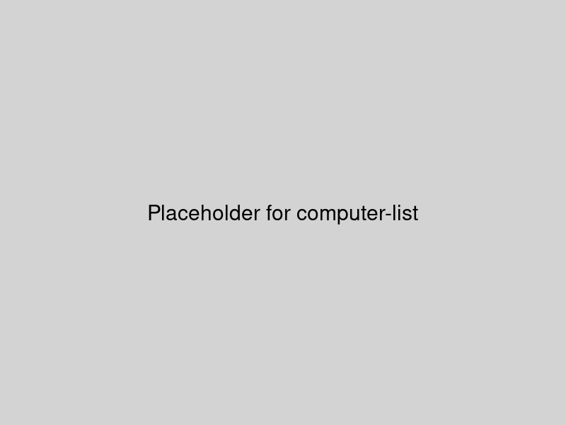
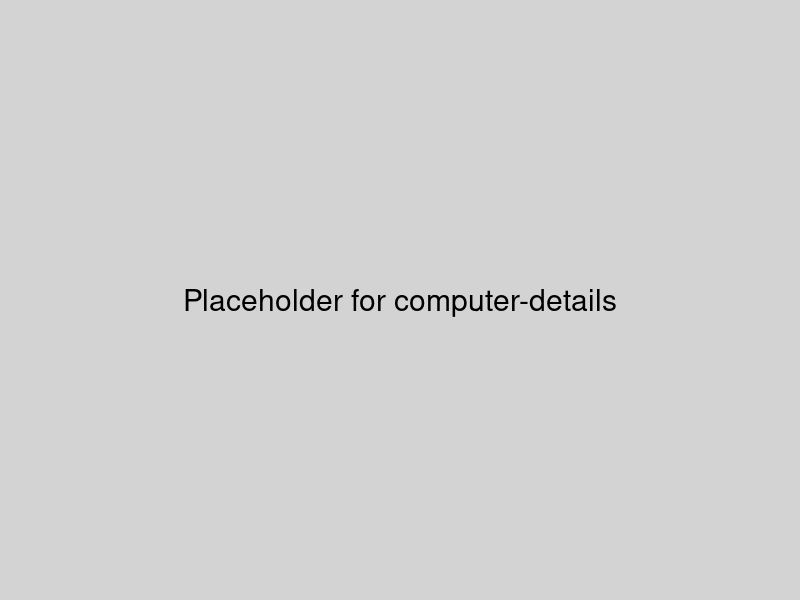
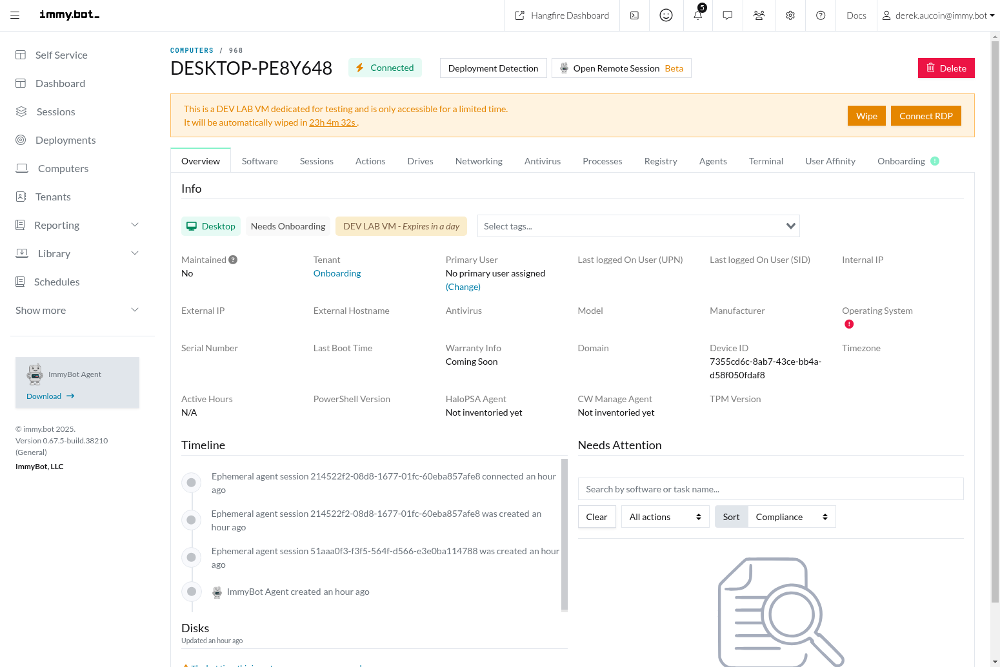
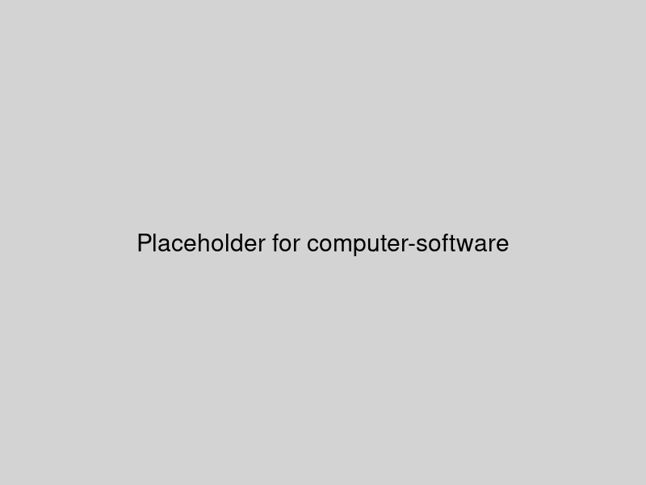
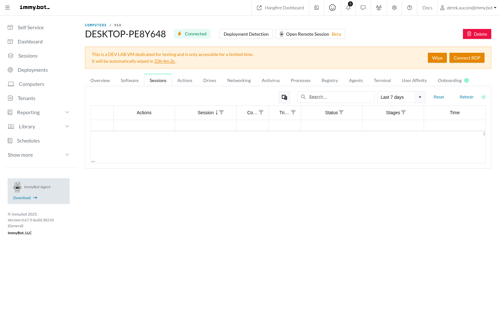
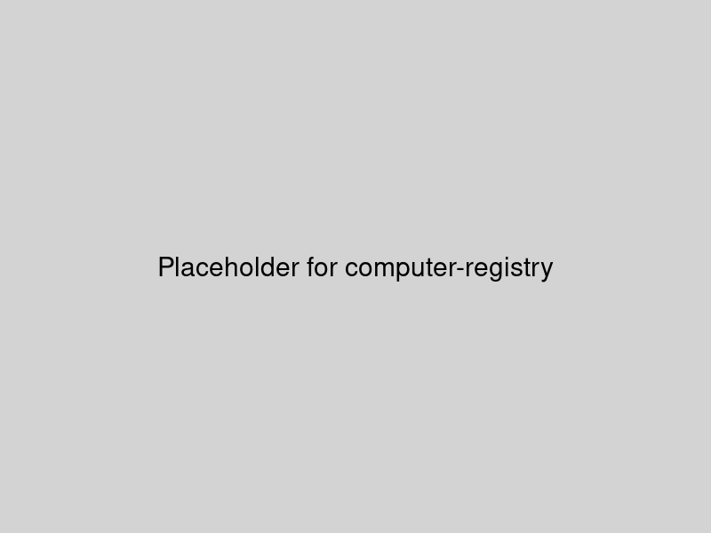

# Computers

The Computers page in ImmyBot provides a comprehensive view of all managed computers in your environment. This page allows you to monitor, manage, and perform actions on computers individually or in bulk.

## Computer List

The Computer List view displays all computers managed by ImmyBot, with filtering and search capabilities to help you find specific machines.

### Key Features

- **Search and Filter**: Quickly find computers by name, IP, user, or other attributes
- **Status Indicators**: Visual indicators show the online/offline status of each computer
- **Bulk Actions**: Select multiple computers to perform actions in bulk
- **Custom Views**: Save and load custom views with specific filters and columns

## Computer Details

Clicking on a computer in the list opens the detailed view for that specific machine, providing comprehensive information and management options.

### Computer Details Tabs

The Computer Details page is organized into several tabs:

#### Overview Tab

The Overview tab provides essential information about the computer, including:

- Hardware specifications
- Operating system details
- Network information
- Primary user
- Last check-in time

#### Software Tab

The Software tab lists all software installed on the computer, allowing you to:

- View installed software and versions
- Install new software
- Uninstall existing software
- Update software to newer versions

#### Sessions Tab

The Sessions tab shows all maintenance sessions that have been run on the computer, including:

- Session status (completed, failed, in progress)
- Actions performed during each session
- Timestamps for session start and completion
- Detailed logs for troubleshooting

#### Registry Tab

The Registry tab allows you to remotely navigate the computer's registry and generate configuration tasks from selected values.

## Actions

From the Computers page, you can perform various actions:

- Start maintenance sessions
- Install or uninstall software
- Run scripts
- Access remote control (if configured)
- View detailed system information

## Related Features

- [Deployments](./deployments.md): Configure software and task deployments for computers
- [Maintenance Sessions](./terminology.md#maintenance-session): Learn more about how maintenance sessions work
- [Software Management](./terminology.md#software): Understand how software is managed in ImmyBot
