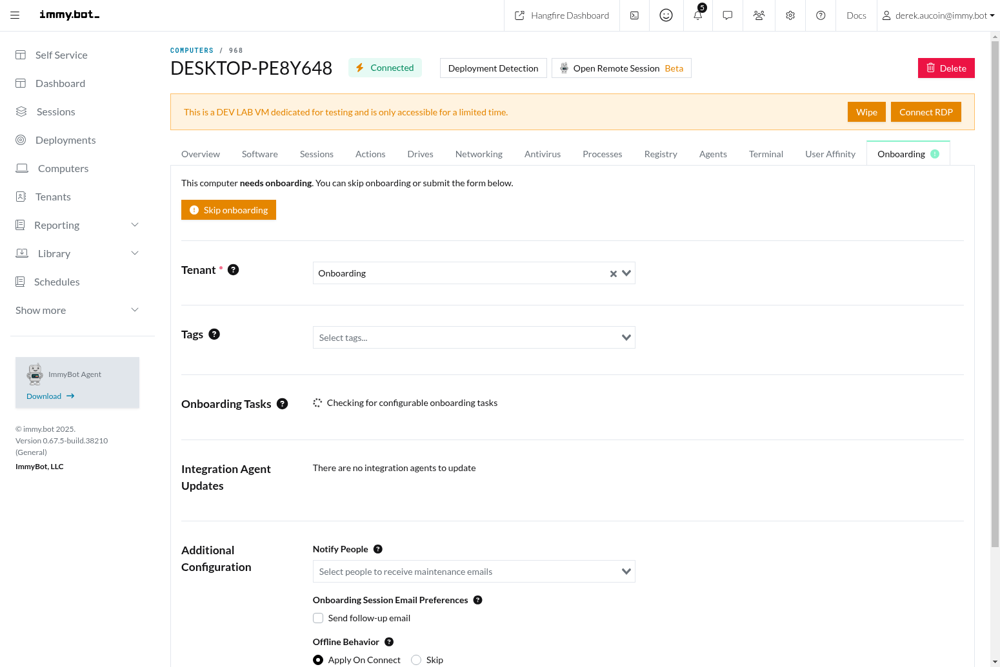

# Computers

The Computers page in ImmyBot provides a comprehensive view of all managed computers in your environment. This page allows you to monitor, manage, and perform actions on computers individually or in bulk.

## Computer List

The Computer List view displays all computers managed by ImmyBot, organized into tabs for different computer states: Active, New, Pending, Stale, Lab, and Deleted. Each tab shows a count of computers in that state.

### Key Features

- **Status Tabs**: Quickly filter computers by their current status (Active, New, Pending, Stale, Lab, Deleted)
- **Search and Filter**: Find computers by name, IP, user, or other attributes
- **Status Indicators**: Visual indicators show the online/offline status of each computer
- **Bulk Actions**: Select multiple computers to perform actions in bulk
- **Tag Management**: Add or remove tags from multiple computers at once
- **Tenant Management**: Change tenant assignments for computers (MSP administrators only)

### Computer States

- **Active**: Computers that are currently in use and properly onboarded
- **New**: Recently discovered computers that need to be onboarded
- **Pending**: Computers in the process of being onboarded
- **Stale**: Computers that haven't connected to ImmyBot within the configured stale threshold period
- **Lab**: Development lab virtual machines for testing
- **Deleted**: Computers that have been removed from active management

## Computer Details

Clicking on a computer in the list opens the detailed view for that specific machine, providing comprehensive information and management options.

### Computer Details Tabs

The Computer Details page is organized into several tabs:

#### Overview Tab

The Overview tab provides essential information about the computer, including:

- Hardware specifications (CPU, RAM, disk space)
- Operating system details and version
- Network information (IP addresses, MAC addresses)
- Primary user and additional users
- Last check-in time and agent status
- Tags and tenant information
- Maintenance exclusion status

#### Software Tab

The Software tab lists all software installed on the computer, with multiple views and filtering options:

- **Inventory**: All software detected on the computer
- **Assignable**: Software that can be managed through ImmyBot
- **Unassignable**: Software that cannot be managed through ImmyBot
- **Assigned**: Software currently managed by ImmyBot deployments

The tab allows you to:
- View installed software and versions
- Install new software through Quick Deploy
- Check compliance against deployments
- Uninstall existing software
- Update software to newer versions
- Filter software by name or status

#### Sessions Tab

The Sessions tab shows all maintenance sessions that have been run on the computer, including:

- Session status (completed, failed, in progress)
- Actions performed during each session
- Timestamps for session start and completion
- Detailed logs for troubleshooting
- Options to cancel, rerun, or resume sessions

#### Registry Tab

The Registry tab allows you to remotely navigate the computer's registry and generate configuration tasks from selected values. Features include:

- Browse registry keys and values in a tree view
- Search for specific registry keys or values
- View different data types (String, DWORD, Binary, etc.)
- Generate configuration tasks from selected registry values
- Real-time connection to the computer's registry via an ephemeral agent

#### Additional Tabs

The Computer Details page includes several other tabs for comprehensive management:

- **Actions**: View and manage pending maintenance actions
- **Drives**: Monitor disk space and drive information
- **Networking**: View network adapters, IP configurations, and connectivity
- **Antivirus**: Check antivirus status and protection levels
- **Processes**: View and manage running processes
- **Terminal**: Access a command-line interface to the computer
- **User Affinity**: Manage primary and additional users associated with the computer
- **Onboarding**: Track and manage the computer onboarding process

## Actions

From the Computers page, you can perform various actions:

- **Start Maintenance Sessions**: Run maintenance sessions to apply deployments
- **Software Management**: Install, uninstall, or update software
- **Run Scripts**: Execute scripts on selected computers
- **Remote Control**: Access remote control sessions (if configured)
- **Inventory**: Trigger re-inventory of computers to update information
- **Onboarding**: Manage the onboarding process for new computers
- **Tenant Management**: Change tenant assignments for computers
- **Tag Management**: Add or remove tags from computers
- **Maintenance Exclusion**: Exclude computers from automated maintenance

## Related Features

- [Deployments](./deployments.md): Configure software and task deployments for computers
- [Maintenance Sessions](./terminology.md#maintenance-session): Learn more about how maintenance sessions work
- [Software Management](./terminology.md#software): Understand how software is managed in ImmyBot
- [User Affinity](./terminology.md#user-computer-affinity): Learn about user associations with computers
