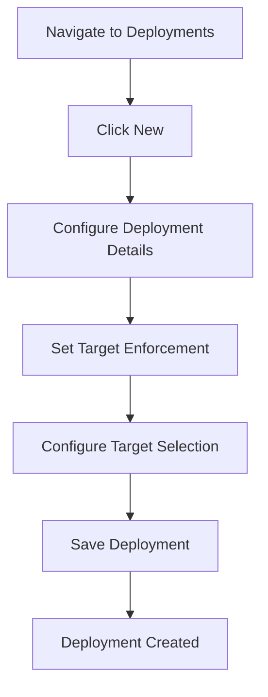

# Creating and Managing Deployments

This guide provides step-by-step instructions for creating and managing deployments in ImmyBot. Deployments are the central mechanism for defining how computers should be configured and what software should be installed.

## Understanding Deployment Components

Before creating a deployment, it's helpful to understand its core components:

### 1. Content

The content defines what the deployment will install or configure:

- **Software**: Applications to install, update, or remove
- **Tasks**: Scripts or commands to configure settings or perform actions

### 2. Targets

Targets determine which computers will receive the deployment:

- **Computers**: Individual computers or computer groups
- **Tenants**: All computers in specific tenants
- **Users**: Computers associated with specific users
- **Filter Scripts**: Dynamic targeting based on computer attributes

### 3. Enforcement Type

The enforcement type determines how and when the deployment is applied:

- **Required**: Automatically applied during maintenance
- **Optional**: Available for manual installation
- **Adhoc**: Only runs when manually triggered
- **Onboarding**: Only runs during initial computer setup

### 4. Additional Settings

Additional settings that control deployment behavior:

- **Notes**: Documentation about the deployment's purpose
- **License**: Associated software license (if applicable)
- **Visibility**: Where the deployment appears (Self-Service, Technician Tools)

## Creating a Basic Deployment

Follow these steps to create a new deployment:

### Step 1: Navigate to the Deployments Page

1. In the left sidebar, click **Deployments**
2. Click the **New** button in the top-right corner

### Step 2: Configure Deployment Details

1. In the **Deployment Details** section:
   - For software deployments:
     - Select **Software** as the maintenance item type
     - Choose the software from the dropdown
     - Select the desired version
     - Choose whether to install or uninstall
   - For task deployments:
     - Select **Task** as the maintenance item type
     - Choose the task from the dropdown
     - Configure any task parameters

2. If applicable, select a license from the **License** dropdown

### Step 3: Set Target Enforcement

1. In the **Target Enforcement** section, select one of the following:
   - **Required**: Automatically enforced during maintenance
   - **Optional**: Available for manual installation
   - **Adhoc**: Only runs when manually triggered
   - **Onboarding**: Only runs during initial computer setup

### Step 4: Configure Target Selection

1. In the **Target Selection** section:
   - Select the target category (Computer, Tenant, User)
   - Choose the specific target type:
     - For computers: All Computers, Specific Computer, Computer Group, etc.
     - For tenants: All Tenants, Specific Tenant, etc.
     - For users: All Users, Specific User, etc.
   - Select the specific targets based on the chosen type
   - Configure any additional targeting options

### Step 5: Save the Deployment

1. Review the deployment preview on the right side
2. Click **Create** to save the deployment
3. Alternatively, click **Create and go back** to save and return to the deployments list



## Managing Existing Deployments

### Viewing Deployments

1. Navigate to **Deployments** in the left sidebar
2. Use the search and filter options to find specific deployments
3. Click on a deployment to view its details

### Editing a Deployment

1. Navigate to **Deployments** in the left sidebar
2. Click on the deployment you want to edit
3. Make the necessary changes to the deployment settings
4. Click **Update** to save your changes

### Duplicating a Deployment

1. Navigate to **Deployments** in the left sidebar
2. Click on the deployment you want to duplicate
3. Click the three-dot menu in the top-right corner
4. Select **Duplicate**
5. Modify the duplicate deployment as needed
6. Click **Create** to save the new deployment

### Enabling or Disabling a Deployment

1. Navigate to **Deployments** in the left sidebar
2. Click on the deployment you want to enable or disable
3. Click the three-dot menu in the top-right corner
4. Select **Enable** or **Disable**
5. Confirm your action when prompted

### Deleting a Deployment

1. Navigate to **Deployments** in the left sidebar
2. Click on the deployment you want to delete
3. Click the three-dot menu in the top-right corner
4. Select **Delete**
5. Confirm the deletion when prompted

## Advanced Deployment Configurations

### Using Filter Scripts for Dynamic Targeting

Filter scripts allow you to target computers based on specific criteria:

1. In the **Target Selection** section, select **Filter Script** as the target type
2. Write or select a PowerShell script that returns `$true` for computers that should receive the deployment
3. The script will run against each computer during maintenance to determine eligibility

Example filter script for targeting Windows 10 computers:

```powershell
$osInfo = Get-CimInstance Win32_OperatingSystem
$osInfo.Caption -like "*Windows 10*"
```

### Configuring Deployment Visibility

Control where your deployment appears:

1. In the **Target Selection** section, look for the visibility options
2. Select from:
   - **Self-Service**: Makes the deployment available in the Self-Service Portal
   - **Technician Tools**: Makes the deployment available in integrated PSA tools

### Managing Deployment Dependencies

Some software or tasks may have dependencies on other deployments:

1. Create the prerequisite deployments first
2. Ensure they have the appropriate enforcement type (usually Required)
3. Create the dependent deployment
4. ImmyBot will automatically resolve dependencies during maintenance

## Deployment Best Practices

### Naming Conventions

Use clear, descriptive names for your deployments:

- Include the software name and version
- Indicate the target audience if specific
- Use prefixes for organization (e.g., "SW:" for software, "TASK:" for tasks)

Examples:
- "SW: Google Chrome - All Users"
- "TASK: Configure Windows Settings - Accounting"

### Targeting Strategy

- Start with smaller, specific targets before expanding to larger groups
- Use filter scripts for complex targeting scenarios
- Test deployments on a small group before applying to all computers

### Documentation

- Add detailed notes to each deployment explaining its purpose
- Document any special configurations or requirements
- Include information about who requested the deployment and when

### Testing and Validation

- Test deployments on a small group before applying to all computers
- Monitor maintenance logs for deployment issues
- Regularly review and update deployments as needed

## Troubleshooting Deployments

### Deployment Not Applying

If a deployment isn't applying to a computer:

1. Check that the computer matches the target criteria
2. Verify that the enforcement type is appropriate
3. Check for conflicting deployments with higher priority
4. Review maintenance logs for errors

### Duplicate Deployments

If you receive a duplicate deployment warning:

1. Review the existing deployment to see if it meets your needs
2. Choose to either:
   - Fix your deployment to make it unique
   - Replace the existing deployment with your new one

### Software Installation Failures

If software fails to install:

1. Check the maintenance logs for specific error messages
2. Verify that the computer meets the software requirements
3. Test the installation manually on the computer
4. Update the software package or installation script as needed

## Related Topics

- [Deployments Overview](./deployments.md)
- [Deployment Resolution](./deployment-resolution.md)
- [Targets & Targeting](./targets-targeting.md)
- [Maintenance Sessions](./maintenance-sessions.md)
- [Software Library](./software-library.md)
- [Maintenance Tasks](./maintenance-tasks.md)

---

**Next Steps:** [Deployment Resolution →](./deployment-resolution.md) | [Targets & Targeting →](./targets-targeting.md)
