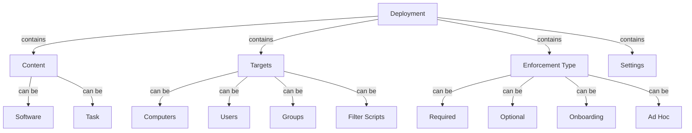

# Creating and Managing Deployments

This guide walks you through the process of creating and managing deployments in ImmyBot, from basic setup to advanced configurations.

## Understanding Deployments

Deployments are the core building blocks of ImmyBot. They define what should be installed or configured on which computers. A deployment consists of:

1. **Content**: The software or task to deploy
2. **Targets**: The computers or users that should receive the deployment
3. **Enforcement Type**: How strictly the deployment should be applied
4. **Settings**: Additional configuration options



## Creating a Basic Deployment

### Step 1: Navigate to Deployments

1. Log in to your ImmyBot instance
2. Click on **Deployments** in the left navigation menu
3. Click **New** to create a new deployment


### Step 2: Select Content Type

Choose the type of content you want to deploy:

- **Software**: Install or uninstall an application
- **Task**: Run a script or configuration task

For software deployments:
1. Select **Software** as the content type
2. Search for the software you want to deploy
3. Select the desired version (or choose "Latest" to always use the newest version)

For task deployments:
1. Select **Task** as the content type
2. Search for the task you want to run
3. Configure any parameters required by the task

### Step 3: Configure Enforcement Type

Select how strictly the deployment should be enforced:

- **Required**: Automatically installed during maintenance
- **Optional**: Available for manual installation
- **Onboarding**: Applied only during computer onboarding
- **Ad Hoc**: Only run when explicitly triggered

### Step 4: Select Targets

Define which computers should receive this deployment:

1. Click **Add Target**
2. Choose a target type:
   - **All Computers**: Apply to every computer
   - **Computer Group**: Apply to a specific group of computers
   - **Computer**: Apply to a specific computer
   - **Tenant**: Apply to all computers in a tenant
   - **Filter Script**: Apply based on script results

3. Configure the selected target type
4. Add additional targets if needed

### Step 5: Configure Additional Settings

Depending on the content type, you may have additional settings to configure:

- **Desired State**: Whether the software should be installed or uninstalled
- **Visibility**: Where the deployment should be visible (Self-Service Portal, Technician Tools)
- **Schedule**: When the deployment should be applied
- **Dependencies**: Other deployments that must be applied first
- **Supersedence**: Deployments that this deployment replaces

### Step 6: Save the Deployment

1. Review your deployment configuration
2. Click **Create** to save the deployment

## Managing Existing Deployments

### Viewing Deployments

1. Navigate to **Deployments** in the left menu
2. Use the search and filter options to find specific deployments
3. Click on a deployment to view its details

### Editing Deployments

1. Navigate to the deployment you want to edit
2. Make your changes directly in the deployment details page
3. Click **Update** to save your changes

### Disabling Deployments

To temporarily disable a deployment without deleting it:

1. Navigate to the deployment
2. Click the **More Actions** dropdown next to the page title
3. Select **Disable**
4. Confirm the action if prompted

### Deleting Deployments

1. Navigate to the deployment you want to delete
2. Click the **More Actions** dropdown next to the page title
3. Select **Delete**
4. Confirm the deletion when prompted

## Advanced Deployment Configurations

### Using Filter Scripts

Filter scripts allow you to dynamically determine which computers should receive a deployment based on custom criteria:

1. When adding a target, select **Filter Script**
2. Choose an existing filter script or create a new one
3. Configure any parameters for the script

Example filter script (checks if computer has sufficient disk space):

```powershell
param(
    [Parameter(Mandatory=$true)]
    [int]$RequiredSpaceGB
)

$systemDrive = Get-WmiObject Win32_LogicalDisk -Filter "DeviceID='C:'"
$freeSpaceGB = [math]::Round($systemDrive.FreeSpace / 1GB, 2)

if ($freeSpaceGB -ge $RequiredSpaceGB) {
    return $true
} else {
    return $false
}
```

### Deployment Dependencies

Dependencies ensure that deployments are applied in the correct order:

1. When creating or editing a deployment, go to the **Dependencies** section
2. Click **Add Dependency**
3. Select the deployment that must be applied first
4. Configure the dependency type:
   - **Hard**: The dependent deployment must succeed
   - **Soft**: The dependent deployment must run, but can fail

### Supersedence

Supersedence allows you to replace older deployments with newer ones:

1. When creating or editing a deployment, go to the **Supersedence** section
2. Click **Add Superseded Deployment**
3. Select the deployment that this new deployment replaces
4. The superseded deployment will be automatically disabled when this deployment is enabled

## Best Practices

### Naming Conventions

Use clear, descriptive names for your deployments:

- Include the software name and version
- Indicate the target audience if specific
- Use prefixes for organization (e.g., "SW:" for software, "TASK:" for tasks)

Examples:
- "SW: Google Chrome - All Users"
- "TASK: Configure Windows Settings - Accounting"

### Targeting Strategy

- Start with smaller, specific targets before expanding to larger groups
- Use filter scripts for complex targeting scenarios
- Test deployments on a small group before applying to all computers

### Maintenance Windows

For disruptive deployments:

1. Create a maintenance window by editing the deployment
2. Under **Schedule**, set specific days and times
3. Configure notification settings to alert users

### Testing Deployments

Before deploying to production:

1. Create a test deployment with a limited target (e.g., a test computer)
2. Run a maintenance session to apply the deployment
3. Verify that the deployment works as expected
4. Monitor for any issues or errors
5. Expand the target to include production computers

## Troubleshooting

### Deployment Not Applying

If a deployment isn't being applied during maintenance:

1. Check the maintenance logs for errors
2. Verify that the computer matches the target criteria
3. Ensure the deployment is enabled
4. Check for dependencies that might be failing
5. Verify the enforcement type is set correctly

### Software Installation Failures

If software installations are failing:

1. Check the installation logs in the maintenance session
2. Verify that the installation source is accessible
3. Test the installation manually on a test computer
4. Check for conflicts with existing software
5. Verify that the computer meets the system requirements

## Related Topics

- [Deployments](./deployments.md)
- [Maintenance Sessions](./maintenance-sessions.md)
- [Software Library](./software-library.md)
- [Maintenance Tasks](./maintenance-tasks.md)

---

**Next Steps:** [Deployments →](./deployments.md) | [Maintenance Sessions →](./maintenance-sessions.md)
