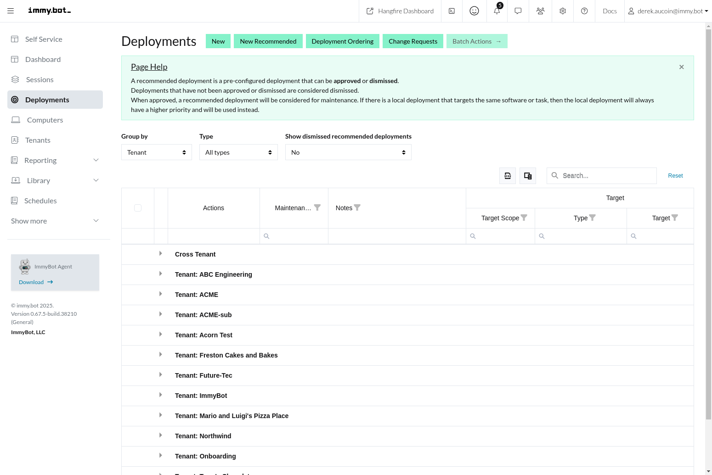
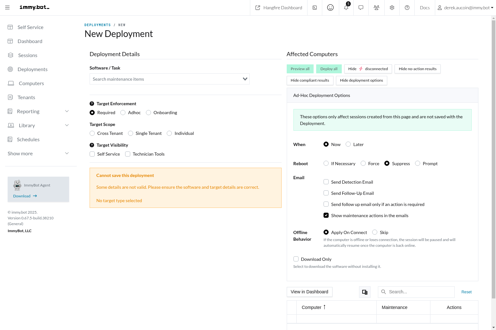
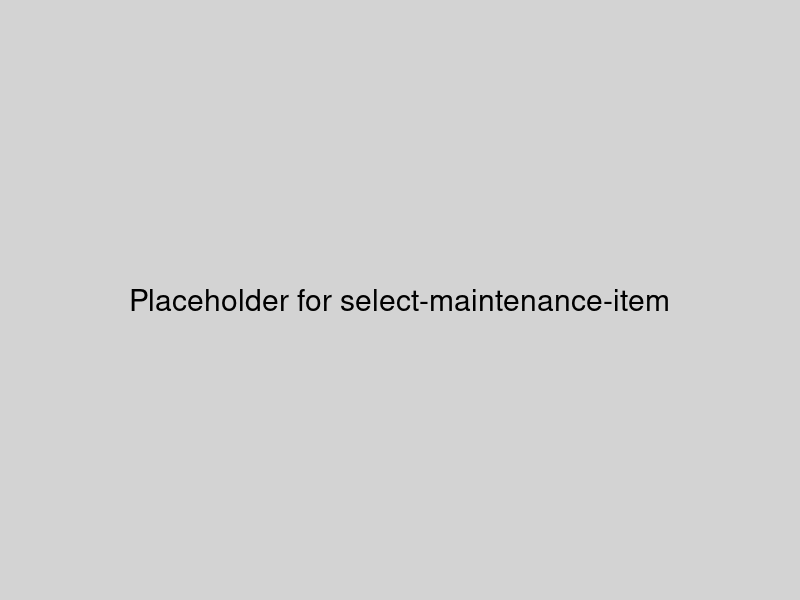
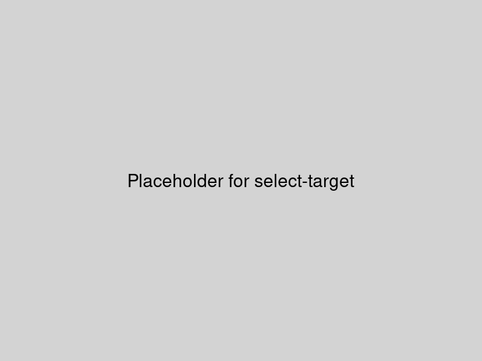
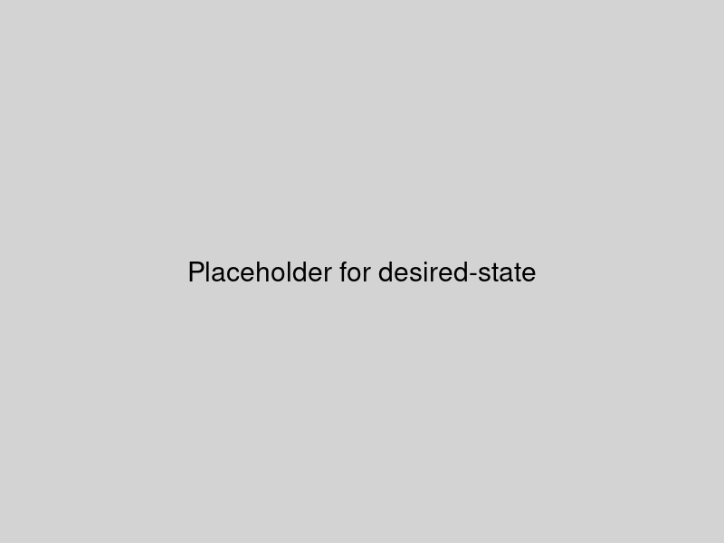
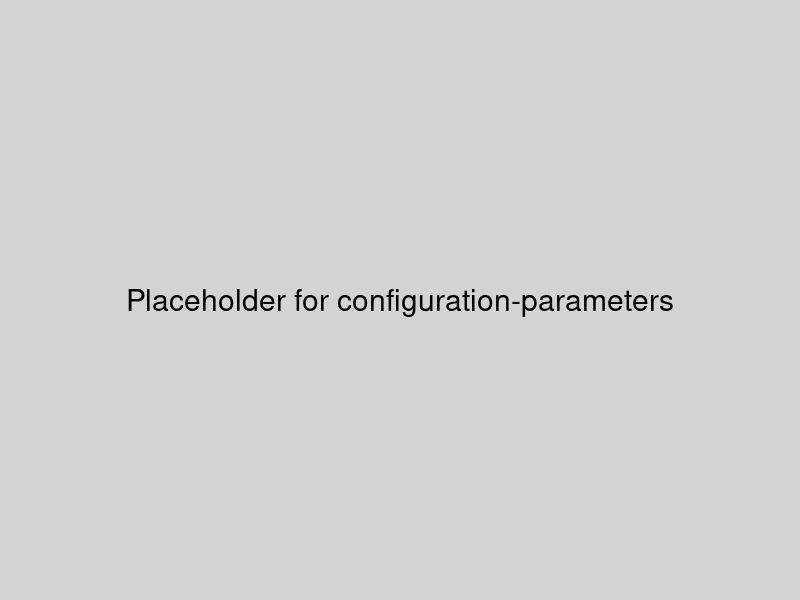
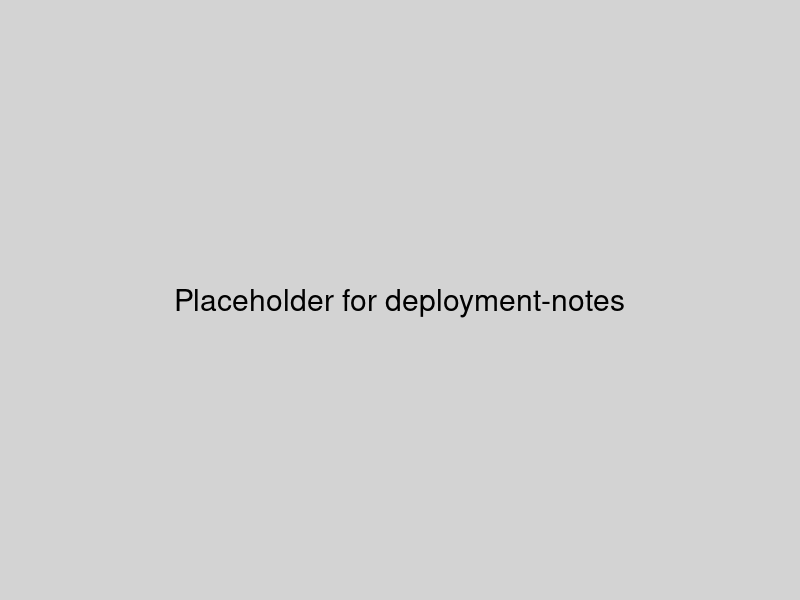
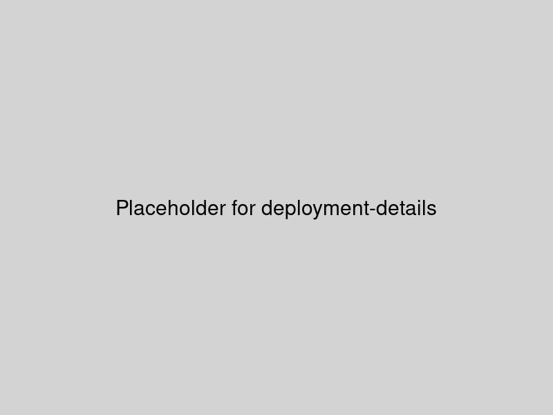
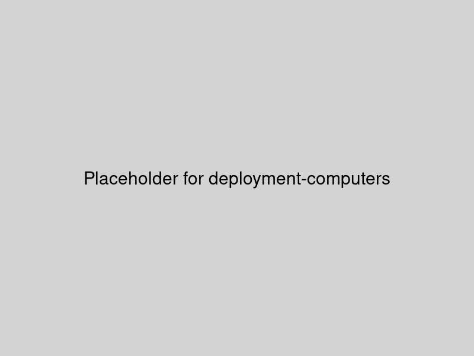
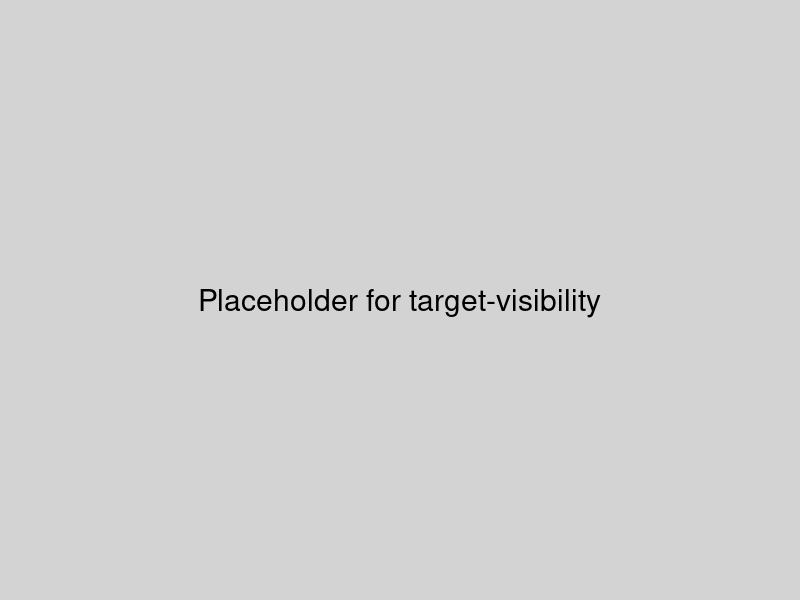

# Deployments

Deployments in ImmyBot are rules that assign Software or Tasks (collectively known as "Maintenance Items") to a Target. They function similarly to Group Policies in Windows environments, allowing administrators to define what software or configurations should be applied to specific computers or groups.

## Deployment List

The Deployment List view shows all deployments configured in your ImmyBot environment, allowing you to manage and monitor them from a central location.

### Key Features

- **Filter and Search**: Quickly find deployments by name, target, or maintenance item
- **Status Indicators**: Visual indicators show the compliance status of each deployment
- **Bulk Actions**: Select multiple deployments to perform actions in bulk
- **Tag Management**: Add or remove tags from multiple deployments at once
- **Deployment Cloning**: Create new deployments based on existing ones
- **Export Options**: Export deployment data for reporting and analysis

## Creating a Deployment

To create a new deployment, click the "New Deployment" button in the Deployment List view. This opens the deployment creation form where you can configure all aspects of the deployment.

### Deployment Configuration

When creating or editing a deployment, you'll need to configure the following:

#### 1. Maintenance Item

Select the Software or Task that you want to deploy. This can be:
- **Software from the Global Software catalog**: Standard software packages available to all tenants
- **Software from your My Software catalog**: Custom software packages specific to your tenant
- **Tasks**: Custom scripts or configuration tasks you've created
- **Integration-linked Software**: Software managed through third-party integrations

#### 2. Target

Define which computers or tenants should receive this deployment. Targets can be:
- **All Computers**: Apply to every computer in the system or tenant
- **Specific Tenants**: Apply to all computers in selected tenants
- **Specific Computers**: Apply to individually selected computers
- **Tags**: Apply to computers with specific tags
- **Dynamic Groups**: Apply to computers matching specific criteria
- **Azure AD Groups**: Apply to computers associated with specific Azure AD groups

#### 3. Desired State

For Software deployments, specify the desired state:
- **Installed**: Ensures the software is installed
- **Latest**: Ensures the latest version is installed
- **Specific Version**: Ensures a specific version is installed
- **Uninstalled**: Ensures the software is not installed
- **Ignored**: ImmyBot will not manage this software for the target

For Task deployments, the desired state is always "Executed".

#### 4. Configuration Parameters

Some software and tasks require configuration parameters. These are displayed in the deployment form when applicable and may include:
- Installation options
- License keys
- Configuration settings
- Script parameters

For security reasons, sensitive configuration parameters for software linked to integrations are stored in the integration settings rather than in the deployment itself.

#### 5. Deployment Notes

You can add notes to a deployment to provide context or instructions for other administrators. These notes are visible in the deployment details and can include:
- Purpose of the deployment
- Special considerations
- Implementation details
- Change history context

#### 6. Schedule (Optional)

You can configure when the deployment should be applied:
- **Manual**: Only applied when manually triggered
- **Scheduled**: Applied according to a defined schedule
- **Immediate**: Applied as soon as possible
- **Maintenance Window**: Applied during defined maintenance windows

## Deployment Details

Clicking on a deployment in the list opens the detailed view for that specific deployment, providing comprehensive information and management options.

### Deployment Details Tabs

The Deployment Details page is organized into several tabs:

#### Overview Tab

The Overview tab provides essential information about the deployment, including:
- Maintenance Item details and version information
- Target details and scope
- Desired State configuration
- Configuration Parameters
- Deployment Notes
- Schedule information
- Creation and modification timestamps

#### Computers Tab

The Computers tab shows all computers affected by this deployment, allowing you to:
- View the current compliance status of each computer
- Start maintenance sessions for specific computers
- Filter and search for specific computers
- View detailed information about why computers are non-compliant
- See when the deployment was last applied to each computer

#### History Tab

The History tab shows the change history for the deployment, including:
- Who made changes
- What changes were made
- When changes were made
- Previous configuration values

## Deployment Resolution

When multiple deployments target the same computer with the same maintenance item, ImmyBot must determine which deployment "wins." This process is called Deployment Resolution.

The general rules for deployment resolution are:
1. More specific targets win over less specific targets (Computer > Tag > Tenant > All Computers)
2. Deployments with "Uninstalled" desired state win over "Installed"
3. Deployments with "Specific Version" win over "Latest"
4. If there's still a tie, the deployment with the highest priority wins

During maintenance sessions, ImmyBot evaluates all applicable deployments and determines the winning deployment for each maintenance item on each computer.

For detailed examples of deployment resolution, see the [Deployment Resolution section in Terminology](./terminology.md#deployment-resolution).

## Target Visibility

The Target Visibility feature helps control where and how deployments can be accessed in ImmyBot. When enabled, this makes the deployment visible and accessible through the technician tools interface, allowing technicians to apply deployments without needing access to the full deployment management interface.

## Deployment Actions

From the Deployments page, you can perform various actions:

- **Edit Deployment**: Modify any aspect of the deployment configuration
- **Clone Deployment**: Create a new deployment based on an existing one
- **Delete Deployment**: Remove a deployment that is no longer needed
- **Run Maintenance**: Apply the deployment to targeted computers
- **Check Compliance**: Verify if targeted computers are compliant with the deployment
- **Export Data**: Export deployment information for reporting
- **Add/Remove Tags**: Organize deployments with tags

## Related Features

- [Computers](./computers.md): View and manage computers affected by deployments
- [Schedules](./terminology.md#schedules): Configure automatic application of deployments
- [Maintenance Sessions](./terminology.md#maintenance-session): Learn more about how maintenance sessions work
- [Software Management](./terminology.md#software): Understand how software is managed in ImmyBot
- [Tasks](./terminology.md#tasks): Learn about creating and managing tasks
- [Technician Tools](./terminology.md#technician-tools): Access deployments from the technician interface
