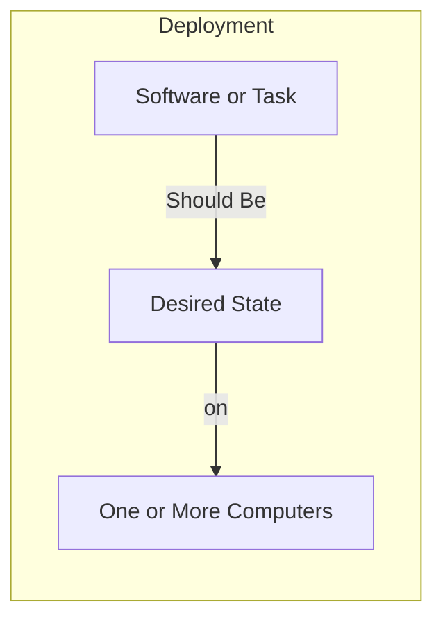
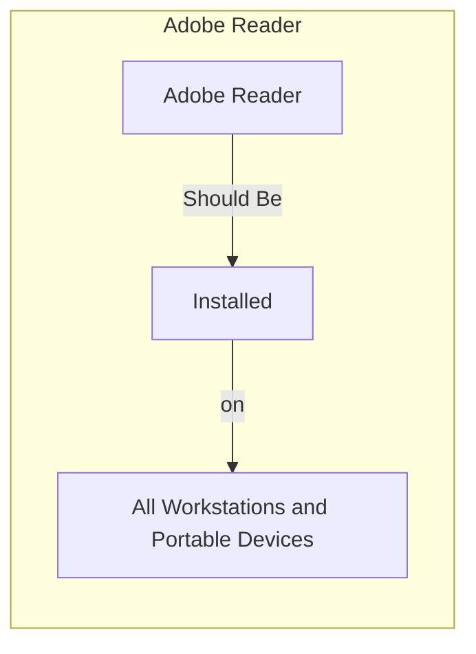
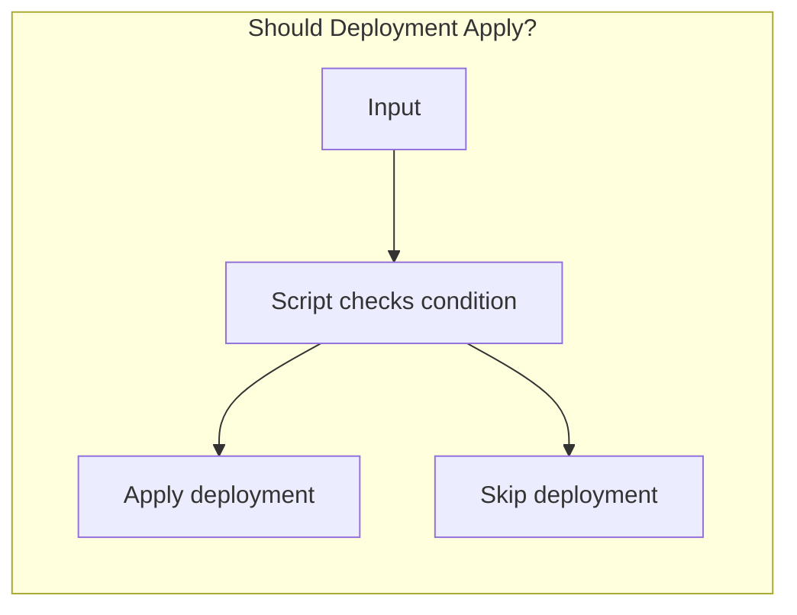
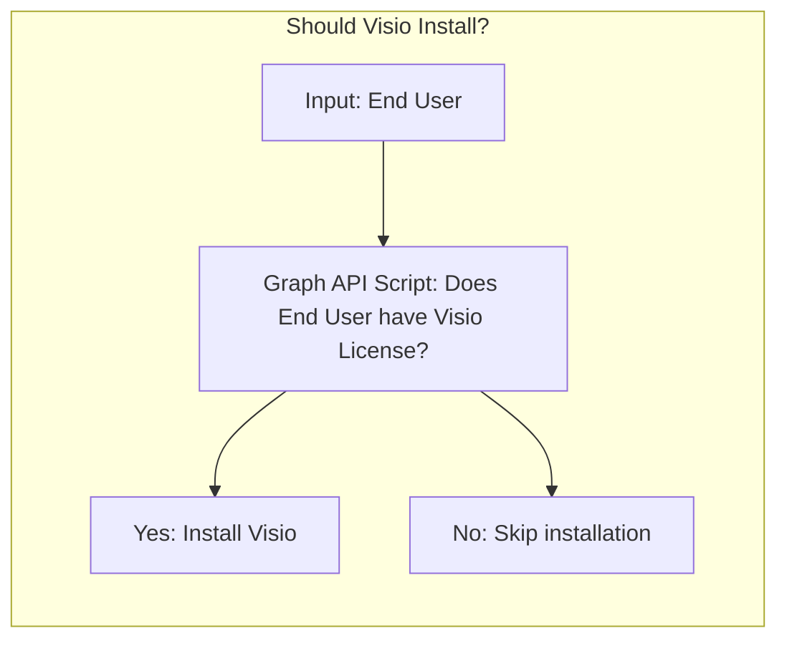

# Getting Started with ImmyBot

This guide will help you understand the core concepts of ImmyBot and get started with automating your IT management tasks.

## Introduction to ImmyBot

**The goal of ImmyBot is to setup a computer knowing only the customer and the end user.**

ImmyBot is a powerful automation platform designed to simplify IT management by automating software deployment, configuration, and maintenance across your entire fleet of devices. Unlike traditional RMM tools, ImmyBot uses a declarative approach focused on desired state configuration.

## Thinking with Immy

Thinking with Immy means thinking in terms of how things "should be" rather than the steps to make them that way. This paradigm shift allows you to focus on the end result rather than the process.

You teach ImmyBot how things "should be" by creating Deployments that define the desired state for your managed devices.

## Understanding Deployments

Deployments are the core building blocks of ImmyBot. They define what should be installed or configured on which computers.

For example, a basic deployment might specify that Adobe Reader should be installed on all workstations:

### Conditional Deployments

How things "should be" is often dependent on external factors. For example:

- Customer A should have SentinelOne because they pay for it
- Person A should have Visio 365 because they have a license for it

ImmyBot allows deployments to be conditionally applied based on the result of scripts that can check external systems or conditions:

For example, you can create a deployment that installs Visio only for users who have a license:

This powerful conditional logic is built into ImmyBot, allowing you to create sophisticated, dynamic deployment rules that adapt to your environment.

## Core Components of ImmyBot

ImmyBot deploys and manages two primary types of items:

1. **Software** - Applications and utilities installed on computers
2. **Tasks** - Configuration settings, policies, and other non-software items

### Understanding Tasks

Tasks are used for anything that isn't software installation, such as:
- Configuring Bitlocker encryption
- Setting power options
- Configuring Windows settings
- Managing registry entries
- Setting up user profiles

**Key Task Features:**
- You can use Tasks to configure software by selecting a "Configuration Task" for the software
- Configuration Tasks are useful for configuring applications (even if they weren't installed by ImmyBot)
- Configuration Tasks run after ImmyBot determines the software is installed
- Configuration Task parameters are available in all scripts related to the software

## Verification and Testing

ImmyBot tests everything it does before and after it does it, ensuring that changes are applied correctly and consistently.

### Software Verification

**Version Detection** - Runs before installation to determine if installation is necessary, and after to verify the desired version is installed:
- **DisplayName** detection methods:
  - Contains - Checks if the display name contains a specific string
  - Regex - Uses regular expressions for more complex matching
  - Traditional (Wildcard \*) - Uses wildcard patterns for matching
- **UpgradeCode** - For MSI-based installations
- **Script** - Custom detection scripts that must return a version or null

**Test Script** - If software is installed, the failure of this test (the test script returning `$false`) will trigger a "Repair" action (default Uninstall/Install) of the application:
- Example: Check to verify Foxit PDF Editor's preview handler extension is working in Windows Explorer; reinstalling the PDF Editor usually corrects this scenario

### Task Verification

- **Test script** - When using separate scripts to verify configuration
- **Combined script** - Returns `$false` when `$method` is 'test' if the configuration is not correct

## Real-World Example: Adobe Reader Deployment

We find that most MSPs install Adobe Reader by default, so ImmyBot includes a Recommended Deployment that states:
- "The latest version of Adobe Reader should be installed for all Workstations and Portable Devices"

When this rule applies (i.e., it isn't disabled or overridden by a more specific rule), ImmyBot will do the following:

1. **Find the latest version** - Run the Adobe Reader "dynamic version" script that uses a public API to return the latest full version number and download URL
2. **Check current installation** - Determine the installed version (if any) by looking for Adobe Reader in Add/Remove Programs
3. **Queue appropriate action** - Schedule an Install or Upgrade task based on the current state
4. **Configure default settings** - Set Adobe Reader to be the default PDF handler by running the "configuration task"

## Next Steps

Now that you understand the basics of ImmyBot, you might want to explore:

- [Core Concepts](./core-concepts.md) - Learn more about ImmyBot's architecture and principles
- [Quick Start Guide](./quick-start-guide.md) - Get up and running quickly with ImmyBot
- [Common Workflows](./common-workflows.md) - See how to accomplish common IT tasks with ImmyBot
