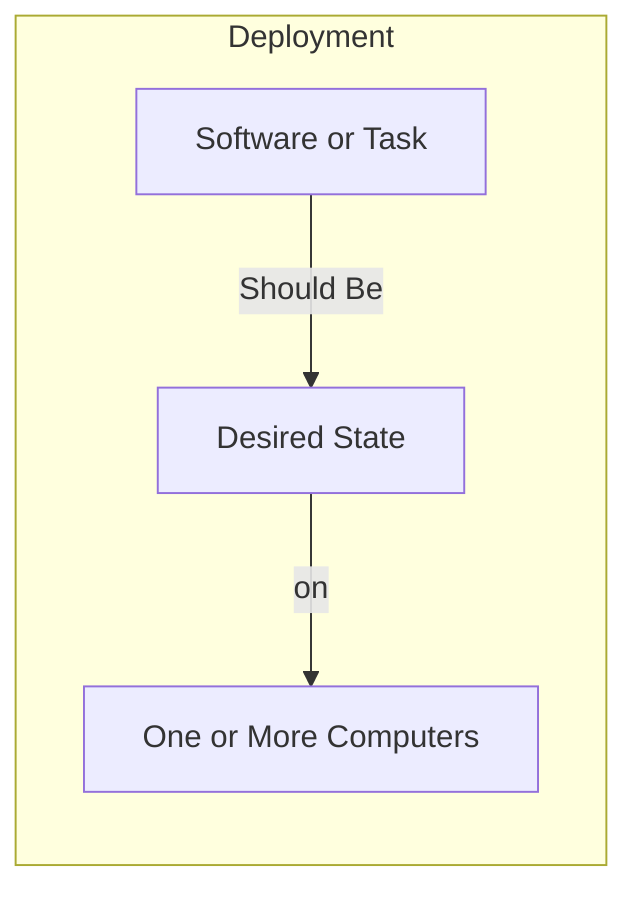
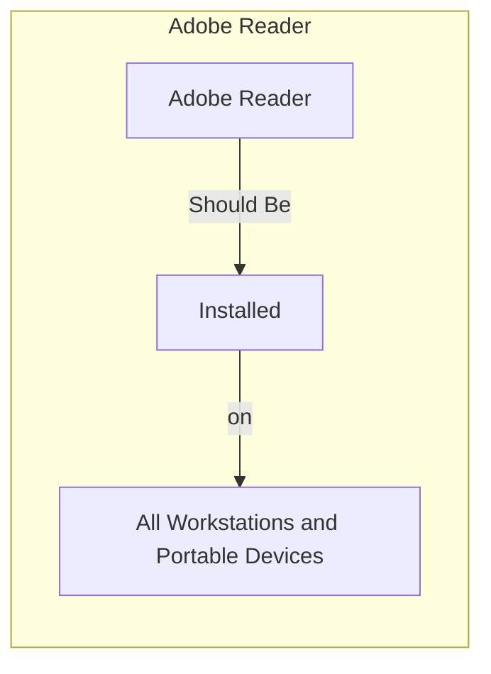
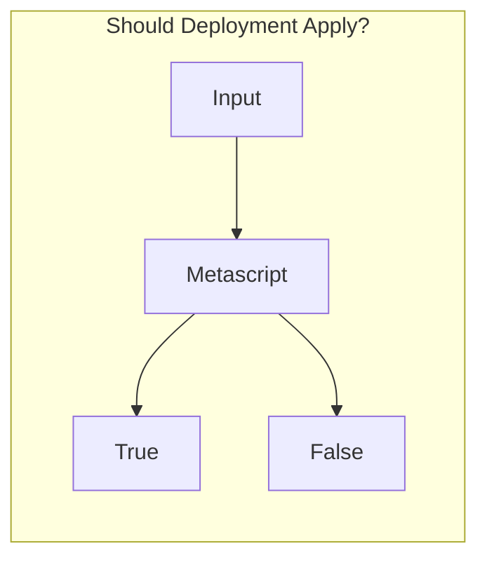
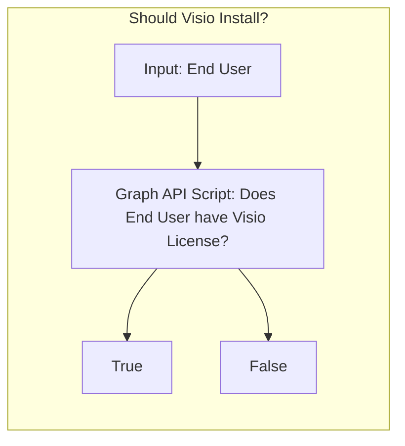

# Getting Started / Thinking with Immy

**The goal of ImmyBot is to setup a computer knowing only the customer and the end user.**

Thinking with Immy means thinking in terms of how things "Should" be.

You teach Immy how things "should" be by creating Deployments.

How things "Should" be is often dependent on external factors. For example

- Customer A should have SentinelOne because they pay for it
- Person A should have Visio 365 because he has a license for it

Luckily, deployments can be conditionally applied based on the result of scripts that reach out to external sources

This is out of the box functionality in ImmyBot. I'm just showing you how it works to illustrate the power of the rules engine.

## Overview
ImmyBot deploys 2 things:
1. Software
1. Tasks

Tasks are for anything that isn’t software, think Bitlocker, Power Options, etc.

- You can use Tasks to configure software  by selecting a "Configuration Task" for the software
- Configuration Tasks are useful for configuring the application (even if the application wasn't installed by ImmyBot)
- Configuration Tasks run after Immy determines the software is installed
- Configuration Task parameters are available in all scripts related to the software

ImmyBot tests everything it does before and after it does it.
- Software
   - Version Detection - Runs before install to determine if installation is necessary, and after to verify the desired version is installed
     - DisplayName
       - Contains
       - Regex
       - Traditional (Wildcard \*)
     - UpgradeCode (For MSI based installs)
     - Script
       - Must return a version or null
   - Test Script - If software is installed, the failure of this test (the test script returning $false) will trigger a "Repair" action (default Uninstall/Install) of the application
      - Example: Check to verify Foxit PDF Editor is the Preview handler extension is working in Windows Explorer, reinstalling the PDF Editor usually corrects this scenario
- Tasks
  - Test script (When using separate scripts)
  - Combined script returns $false when $method is 'test'

### Example: Adobe Reader
We find that most MSPs install Adobe Reader by default so ImmyBot includes a Recommended Deployment that states
- "the latest version of Adobe Reader should be installed for all Workstations and Portable Devices"

When this rule applies (i.e. it isn't disabled or overridden by a more specific rule) ImmyBot will do the following:
1. Find the latest available version of Adobe Reader by running the Adobe Reader "dynamic version" script that uses a public API to return the latest full version number of Adobe Reader, as well as the URL to download it, the latest patch version of Adobe Reader, and the URL to download it.
2. Determine the installed version (if any) by looking for Adobe Reader in Add/Remove Programs on the machine
3. Queue an Install or Upgrade task (depending on the previous step)
4. Set Adobe Reader to be the default PDF handler by running the "configuration task" that verifies that Reader is the default handler for .PDF files for each user on the machine.
