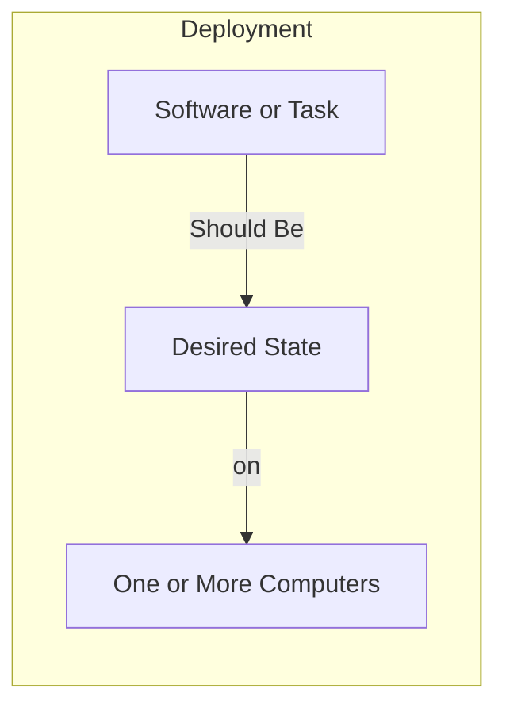
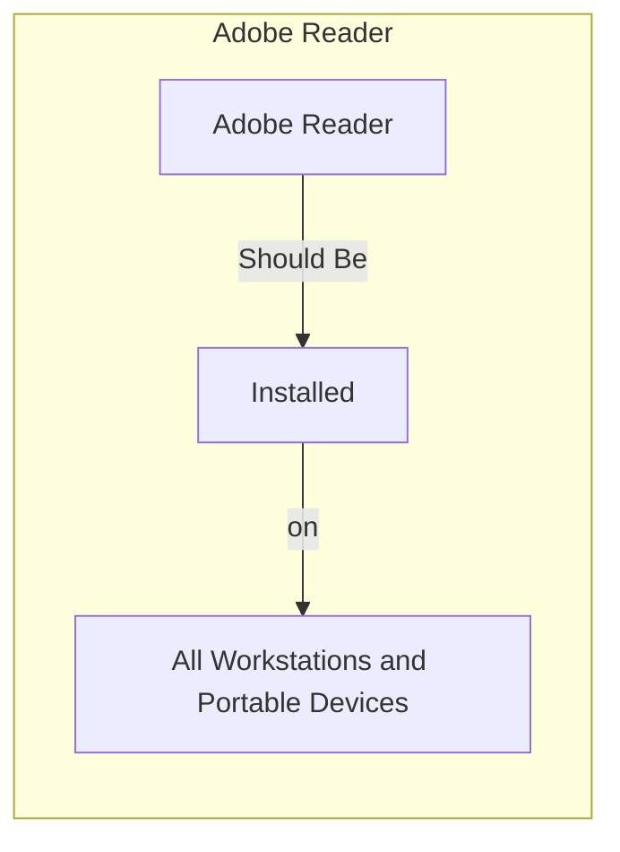
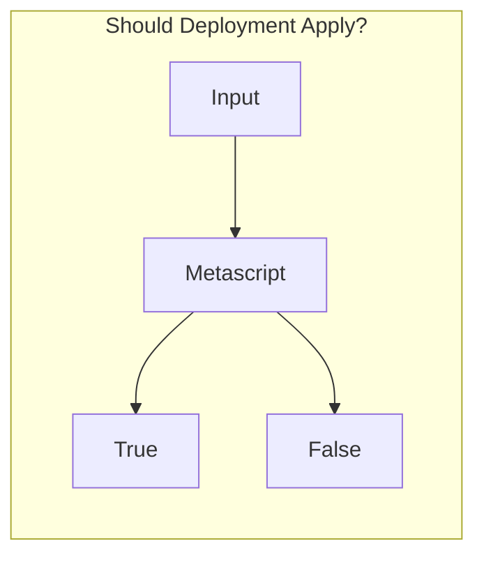
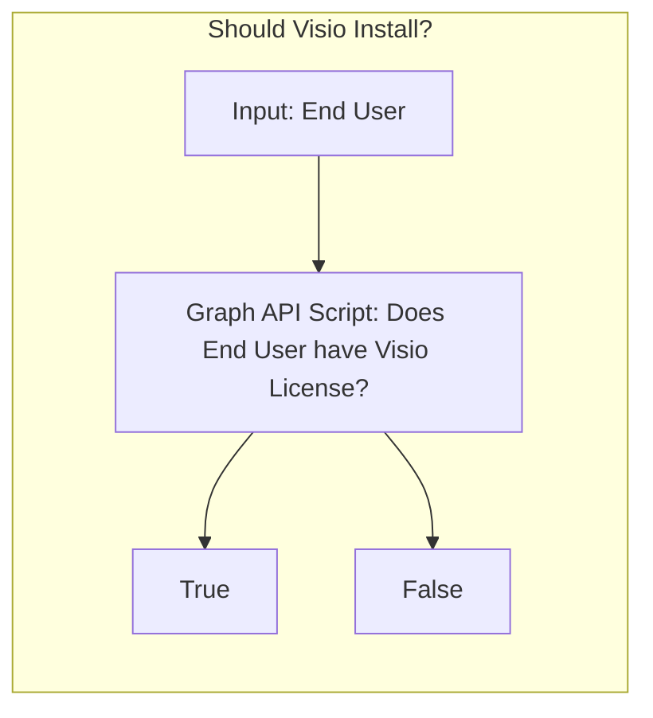
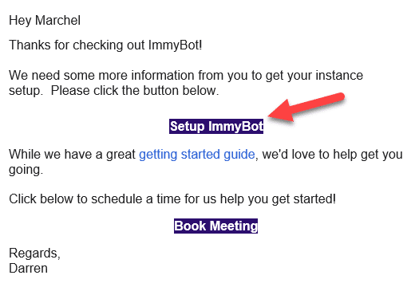
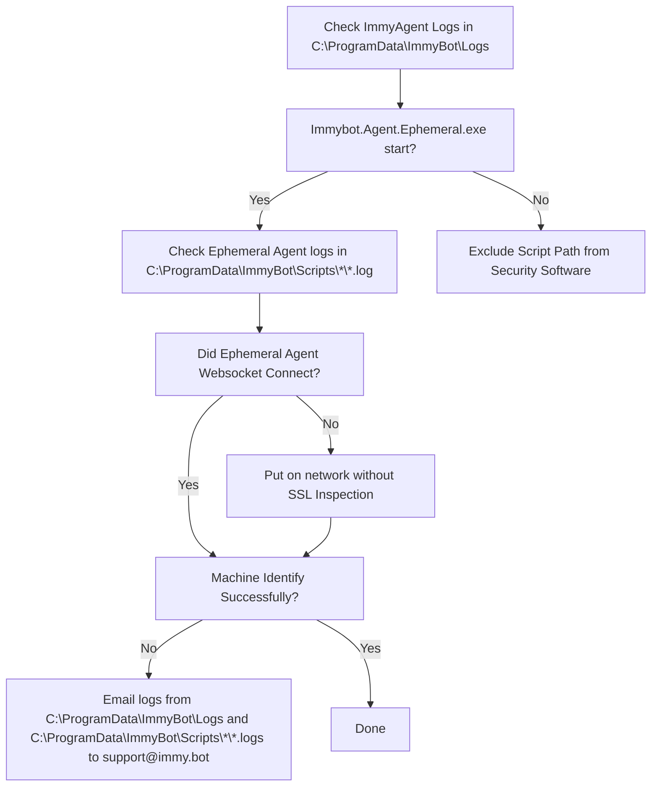
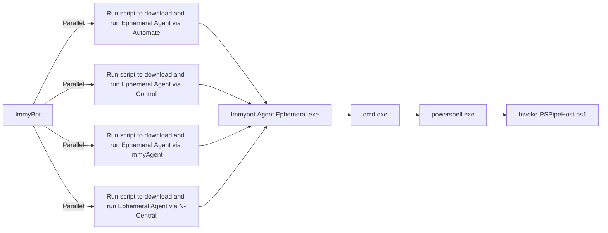

# Getting Started / Thinking with Immy

**The goal of ImmyBot is to setup a computer knowing only the customer and the end user.**

Thinking with Immy means thinking in terms of how things "Should" be.

You teach Immy how things "should" be by creating Deployments.




How things "Should" be is often dependent on external factors. For example

- Customer A should have SentinelOne because they pay for it
- Person A should have Visio 365 because he has a license for it

Luckily, deployments can be conditionally applied based on the result of scripts that reach out to external sources





This is out of the box functionality in ImmyBot. I'm just showing you how it works to illustrate the power of the rules engine.

## Overview
ImmyBot deploys 2 things:
1. Software
1. Tasks

Tasks are for anything that isn’t software, think Bitlocker, Power Options, etc.

- You can use Tasks to configure software  by selecting a "Configuration Task" for the software
- Configuration Tasks are useful for configuring the application (even if the application wasn't installed by ImmyBot)
- Configuration Tasks run after Immy determines the software is installed
- Configuration Task parameters are available in all scripts related to the software

ImmyBot tests everything it does before and after it does it.
- Software
   - Version Detection - Runs before install to determine if installation is necessary, and after to verify the desired version is installed
     - DisplayName
       - Contains
       - Regex
       - Traditional (Wildcard \*)
     - UpgradeCode (For MSI based installs)
     - Script
       - Must return a version or null
   - Test Script - If software is installed, the failure of this test (the test script returning $false) will trigger a "Repair" action (default Uninstall/Install) of the application
      - Example: Check to verify Foxit PDF Editor is the Preview handler extension is working in Windows Explorer, reinstalling the PDF Editor usually corrects this scenario
- Tasks
  - Test script (When using separate scripts)
  - Combined script returns $false when $method is 'test'

### Example: Adobe Reader
We find that most MSPs install Adobe Reader by default so ImmyBot includes a Recommended Deployment that states
- "the latest version of Adobe Reader should be installed for all Workstations and Portable Devices"

When this rule applies (i.e. it isn't disabled or overridden by a more specific rule) ImmyBot will do the following:
1. Find the latest available version of Adobe Reader by running the Adobe Reader "dynamic version" script that uses a public API to return the latest full version number of Adobe Reader, as well as the URL to download it, the latest patch version of Adobe Reader, and the URL to download it.
2. Determine the installed version (if any) by looking for Adobe Reader in Add/Remove Programs on the machine
3. Queue an Install or Upgrade task (depending on the previous step)
4. Set Adobe Reader to be the default PDF handler by running the "configuration task" that verifies that Reader is the default handler for .PDF files for each user on the machine.

## Create your trial instance

If you don't already have an ImmyBot instance, sign-up for a trial at [https://www.immy.bot/pricing](https://www.immy.bot/pricing)

**Make sure you use a valid Office 365 Email address otherwise you will not be able to login as we require SSO to Azure AD. You're welcome**

You will receive a welcome email, click Setup ImmyBot:




Do something else for 6 minutes. Or 9 minutes if you are in Australia. It takes longer there for some reason.

You’ll receive this email when your instance is ready:


## Adding Users

### Access Request
Have the person attempt to login to ImmyBot. Have them request access:


Approve that access from a yellow indicator at the top of the screen.


## Identification Failures

### Needs a Manual Decision
Generally you will click "Agent Re-installed"

Often when an RMM Agent gets re-installed, it will get a new id in the RMM (ComputerId in Automate, SessionID in Control). ImmyBot will recognize that it is the same computer, but due to the fact that virtualization technologies and hard drive cloning can lead to the same scenario, we require you to tell us whether we should overwrite the existing RmmComputer, or keep both. 99% of the time you will click "Overwrite Existing". If the machine was in fact cloned, you would click Keep Both, in which case Immy shims the duplicate UUID with its own to prevent collisions.

## Pending Computers
Computers in the pending status have yet to be identified.

Computers may get stuck here if we are unable to run our Ephemeral Agent



Top 3 reasons for Identification Failures
1. SSL Inspection blocking our websocket
1. Security Software blocking PowerShell
1. Incorrect time is preventing SSL/TLS connection

To understand the various reasons identification can fail, it helps to understand how ImmyBot executions PowerShell
1. RMM or ImmyAgent runs Immybot.Agent.Ephemeral.exe
1. Immybot.Agent.Ephemeral.exe establishes a secure websocket to wss://subdomain.immy.bot and runs Invoke-PSPipeHost.ps1
1. Immybot.Agent.Ephemeral.exe feeds Invoke-PSPipeHost.ps1 PowerShell over a pipe from the websocket session



The most common cause of identification failure is security software.

To know if this is the case, pull the logs from C:\ProgramData\ImmyBotAgentService\*.log


Normal Immybot Agent logs look like this:
```
2022-06-14 00:02:25.560 -05:00 [DBG] Hosting starting
2022-06-14 00:02:25.799 -05:00 [INF] Starting Immybot Agent
2022-06-14 00:02:25.943 -05:00 [INF] Using configuration file stored at: C:\ProgramData\ImmyBotAgentService\config.json
2022-06-14 00:02:26.875 -05:00 [DBG] Initializing IoT Hub connection
2022-06-14 00:02:35.023 -05:00 [INF] Application started. Hosting environment: Production; Content root path: C:\WINDOWS\TEMP\.net\Immybot.Agent.Service\lreaszzz.wwx\
2022-06-14 00:02:35.024 -05:00 [DBG] Hosting started
2022-06-14 00:02:40.552 -05:00 [WRN] IoT Hub connection status Changed Status => [Connected] Reason => [Connection_Ok]
2022-06-14 02:06:32.159 -05:00 [DBG] Process started; ID: 12724
2022-06-14 02:06:37.358 -05:00 [DBG] Running C:\ProgramData\ImmyBot\Scripts\840290f2bd2142e2bd2c612542436763\Immybot.Agent.Ephemeral.exe --ImmyScriptPath C:\ProgramData\ImmyBot\Scripts\840290f2bd2142e2bd2c612542436763 --BackendAddress wss://immense.immy.bot/ --SessionID c946e1d1-f5fd-d36d-0489-d2a9ad9084e0
2022-06-14 02:06:38.335 -05:00 [DBG] PID 16184 <----- Indicates successful execution
2022-06-14 02:06:38.372 -05:00 [DBG] Process exited; Code: 0
```

Windows Defender will make the logs look like this:
```
2022-11-17 13:13:36.604 +11:00 [DBG] Hosting starting
2022-11-17 13:13:36.817 +11:00 [INF] Starting Immybot Agent
2022-11-17 13:13:36.840 +11:00 [INF] Using configuration file stored at: C:\ProgramData\ImmyBotAgentService\config.json
2022-11-17 13:13:37.590 +11:00 [DBG] Initializing IoT Hub connection
2022-11-17 13:13:37.860 +11:00 [DBG] Hosting started
2022-11-17 13:13:38.598 +11:00 [WRN] IoT Hub connection status Changed Status => [Connected] Reason => [Connection_Ok]
2022-11-17 13:13:39.157 +11:00 [WRN] Dirty-Shutdown detected! Dirty-File created at: "2022-11-07T04:11:59.3975026Z" UTC
2022-11-17 13:13:41.686 +11:00 [DBG] Process started; ID: 5660
2022-11-17 13:13:44.674 +11:00 [DBG] Running C:\ProgramData\ImmyBot\Scripts\4303da9b790b41c6978b50b872fe17cb\Immybot.Agent.Ephemeral.exe --ImmyScriptPath C:\ProgramData\ImmyBot\Scripts\4303da9b790b41c6978b50b872fe17cb --BackendAddress wss://ericom.immy.bot/ --SessionID a92c0ed1-ea3b-7f8a-d9c6-946d9b44ccc5
2022-11-17 13:13:49.577 +11:00 [DBG] WMI Error 2
```
DNS Filtering/Issues make the logs look like this
```
2022-09-20 20:39:59.712 +10:00 [INF] RESPONSE: {
  "Resource": "installer/challenge/request",
  "Method": "POST",
  "StatusCode": 0,
  "ErrorException": {
    "ClassName": "System.Net.WebException",
    "Message": "No such host is known. (XXXX.immy.bot:443)"
```
To correct it, you need to exclude DNS filtering for your instances hostnames, which are found under
	Show more > integrations > Fetch IP Address and Hostnames

If Powershell is failing to start on the endpoint within 60 seconds a timeout will occur.

Here is a suggestion on a cause and possible fix for that one https://www.reddit.com/r/PowerShell/comments/rx68fw/powershell_slow_to_open_long_load_timesfixed
 
## Security Software Exclusions
Ideally you would instruct your security software would support excluding code signed by

```
CN=Immense Networks LLC, O=Immense Networks, L=Baton Rouge, S=Louisiana, C=US
```

Exclusions based on code signing certificate are an industry standard feature and should be a standard feature in any best-in-class security software. However, if your security software is unable to exclude based on code signing certificate, create an exclusion for your instance's Script Path.

Your script path can be found under Settings->Preferences->Script Path


* [ThreatLocker](#threatlocker)
* [BitDefender](#bitdefender)
* [Microsoft Defender for Endpoint](#script-path-exclusion)
* [Deep Instinct](#script-path-exclusion)
* [CrowdStrike](#script-path-exclusion)
* [AlienVault](#script-path-exclusion)

### ThreatLocker

1.	Application Control-> Applications
2.	Create New Application
3.	Put the following value into Certificate and click Add
```
CN=Immense Networks LLC, O=Immense Networks, L=Baton Rouge, S=Louisiana, C=US
```
4.	Add your instance’s [script path](#script-path-exclusion)

Ultimately it should look like this:

5.	Create a New Application Policy
	

### BitDefender
BitDefender will intermittently block script execution unless you disable Aggressive scanning mode or add a your instance's [Script Path](#script-path-exclusion) to your policy's exclusion list.

### CrowdStrike
CrowdStrike uses AI to decide what to allow and disallow. Periodically this AI will mark the ImmyBot Agent or ImmyBot Ephemeral Agent as malicious. This usually happens after we update it. Marking it as a false positive in your CrowdStrike portal will train the global AI to not treat it as malicious.

### Microsoft Defender for Endpoint
Add a your instance's [Script Path](#script-path-exclusion) to your policy's exclusion list.
https://docs.microsoft.com/en-us/mem/intune/configuration/device-restrictions-configure#create-the-profile

### Cylance
Cylance blocks our websocket making the ImmybotAgent log look like this:
```
2022-09-21 12:24:26.562 -04:00 [INF] Process exiting.
2022-09-21 12:24:40.106 -04:00 [DBG] Closing Websocket...
2022-09-21 12:24:49.743 -04:00 [INF] Marked ConnectionState as disconnected.
2022-09-21 12:24:50.171 -04:00 [ERR] Application shutting down (App lifetime token cancelled)
System.IO.IOException: Cannot access a closed stream.
at System.Net.Http.HttpConnection.RawConnectionStream.WriteAsync(ReadOnlyMemory`1 buffer, CancellationToken cancellationToken)
```
To correct it, you need to bypass SSL Inspection for your instances hostnames/IPs, which are found under
	Show more > integrations > Fetch IP Address and Hostnames

 ### Group Policy Objects

Computer Configuration | Policies | Administrative Templates | Windows Components | Windows PowerShell | Turn on Script Execution (Enabled)

User Configuration | Policies | Administrative Templates | Windows Components | Windows PowerShell | Turn on Script Execution (Enabled)

These GPOs have been known to cause issues with running scripts.

