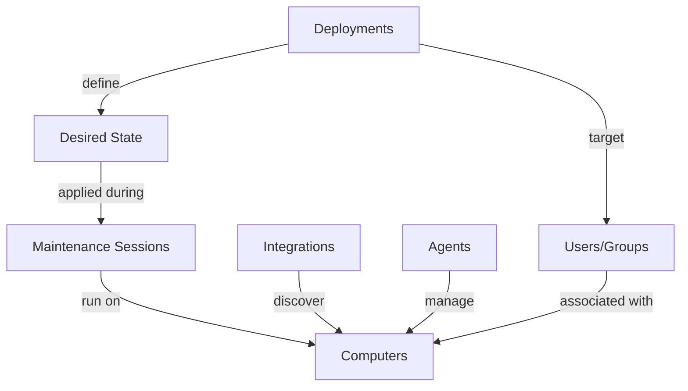

# ImmyBot Overview

## What is ImmyBot?

ImmyBot is a comprehensive IT automation platform designed specifically for Managed Service Providers (MSPs) and IT departments. It streamlines the deployment, configuration, and maintenance of software across multiple client environments, reducing manual effort and ensuring consistency.

Unlike traditional RMM tools that focus primarily on monitoring, ImmyBot takes a deployment-first approach, allowing you to define how computers "should be" and automatically bringing them into compliance.

**Key Use Cases:**
- Automated software deployment and updates
- Standardized computer onboarding
- Consistent configuration across client environments
- Integration with existing RMM and PSA tools

## Key Benefits

### Time Savings Through Automation
ImmyBot reduces the time spent on repetitive tasks by automating software deployment, updates, and configuration changes. What used to take hours of manual work can now be accomplished in minutes with minimal intervention.

### Consistency Across Client Environments
Define standards once and apply them across all clients or create client-specific exceptions when needed. ImmyBot ensures that all computers follow your defined standards, eliminating configuration drift.

### Reduced Manual Errors
By automating deployment and configuration tasks, ImmyBot eliminates human error from the process. Scripts are tested and verified before deployment, ensuring reliable results every time.

### Simplified Onboarding Process
New computer setup becomes a streamlined process. Simply connect the computer, assign it to a client and user, and ImmyBot automatically installs and configures all required software based on your predefined standards.

## Core Features Visualization

## How ImmyBot Works

ImmyBot follows a simple but powerful workflow to manage your IT environment:

1. **Discovery**: Computers are discovered through integrations with your RMM.
2. **Definition**: You create deployments that define how computers should be configured
3. **Execution**: Maintenance sessions apply these definitions to bring computers into compliance
4. **Verification**: Each action is tested before and after execution to ensure success
5. **Reporting**: Detailed logs and reports show exactly what changed and when

## Getting Started Path

Ready to start automating your IT environment with ImmyBot? Follow these steps:

1. **[Quick Start Guide →](quick-start-guide.md)** - Get up and running in under 30 minutes
2. **[First Computer Setup →](onboarding.md)** - Learn how to onboard your first computer
3. **[Core Concepts →](core-concepts.md)** - Understand the fundamental concepts of ImmyBot
4. **[Common Workflows →](common-workflows.md)** - Step-by-step guides for everyday tasks
