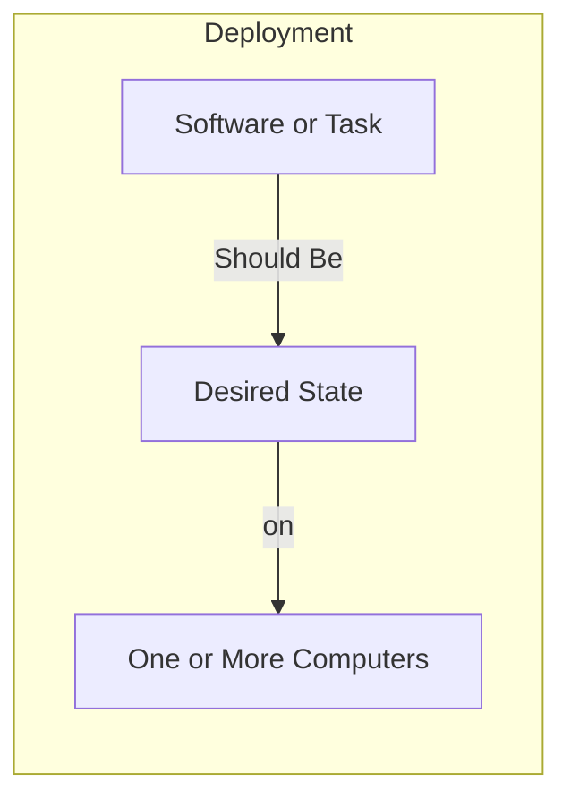
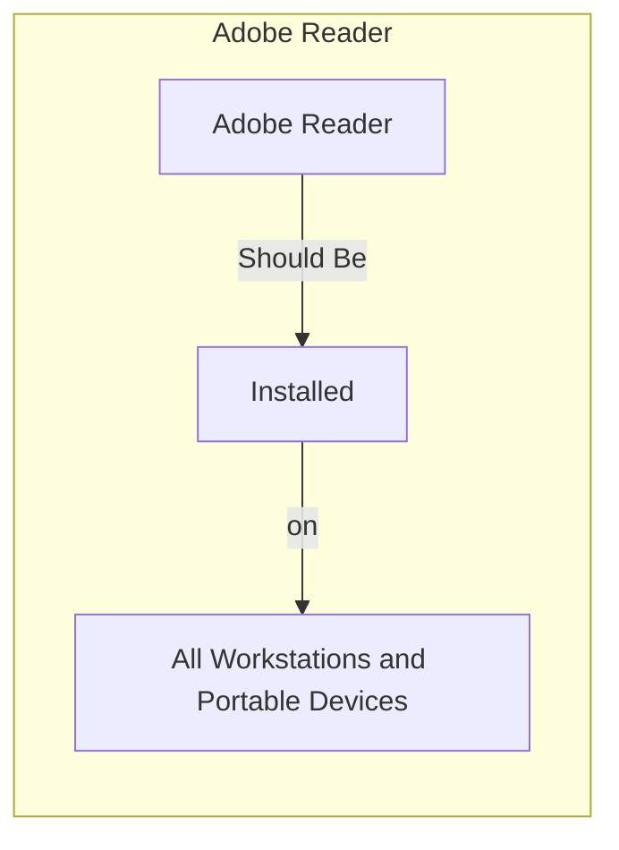

# Introduction to ImmyBot

ImmyBot is a comprehensive IT automation and management platform designed primarily for Managed Service Providers (MSPs) and IT departments. It streamlines the deployment, configuration, and maintenance of software across multiple clients and computers.

## What is ImmyBot?

ImmyBot is a cloud-based platform that helps IT professionals automate routine tasks, standardize deployments, and maintain consistency across their managed environments. It bridges the gap between traditional RMM (Remote Monitoring and Management) tools and modern deployment solutions.

**The goal of ImmyBot is to setup a computer knowing only the customer and the end user.**

Thinking with Immy means thinking in terms of how things "Should" be. You teach Immy how things "should" be by creating Deployments.

How things "Should" be is often dependent on external factors. For example:

- Customer A should have SentinelOne because they pay for it
- Person A should have Visio 365 because they have a license for it

Luckily, deployments can be conditionally applied based on the result of scripts that reach out to external sources.

### Key Capabilities

- **Automated Software Deployment**: Deploy software to multiple computers with consistent configurations
- **Remote Management**: Manage computers without requiring physical access
- **Integration with Popular Tools**: Connect with RMM and PSA platforms you already use
- **Targeted Deployments**: Deploy software based on sophisticated targeting rules
- **Script Execution**: Run scripts in various contexts (System, User, Cloud)
- **Inventory Management**: Maintain inventories of software and hardware
- **Streamlined Onboarding**: Simplify computer setup and configuration

## How ImmyBot Works

ImmyBot uses a lightweight agent to communicate with managed computers. The agent executes maintenance tasks, installs software, and reports back to the ImmyBot server. For computers that don't have the agent installed, ImmyBot can use ephemeral agents or integrate with RMM tools to perform tasks.

### Core Components

1. **ImmyBot Server**: The central management platform that orchestrates all activities
2. **ImmyBot Agent**: A lightweight service that runs on managed computers
3. **Deployments**: Rules that determine what software or tasks are applied to which targets
4. **Maintenance Sessions**: Scheduled or on-demand sessions that apply deployments
5. **Software Library**: A repository of software packages and configurations
6. **Maintenance Tasks**: Scripts and actions that configure systems or perform maintenance

## What ImmyBot Deploys

ImmyBot deploys 2 things:
1. Software
2. Tasks

Tasks are for anything that isn't software, think Bitlocker, Power Options, etc.

- You can use Tasks to configure software by selecting a "Configuration Task" for the software
- Configuration Tasks are useful for configuring the application (even if the application wasn't installed by ImmyBot)
- Configuration Tasks run after Immy determines the software is installed
- Configuration Task parameters are available in all scripts related to the software

ImmyBot tests everything it does before and after it does it:
- Software
   - Version Detection - Runs before install to determine if installation is necessary, and after to verify the desired version is installed
   - Test Script - If software is installed, the failure of this test will trigger a "Repair" action of the application
- Tasks
  - Test script (When using separate scripts)
  - Combined script returns $false when $method is 'test'

## Why Use ImmyBot?

### For MSPs

- **Standardize Client Environments**: Ensure consistent software and configurations across all clients
- **Reduce Manual Work**: Automate routine tasks and deployments
- **Improve Service Delivery**: Respond faster to client needs with pre-configured deployments
- **Simplify Onboarding**: Streamline the process of setting up new computers
- **Enhance Reporting**: Track software inventory and deployment status

### For IT Departments

- **Maintain Consistency**: Ensure all computers have the required software and configurations
- **Reduce Support Burden**: Automate common tasks and troubleshooting
- **Simplify Updates**: Deploy software updates consistently across the organization
- **Improve Security**: Ensure security software and configurations are applied to all computers
- **Streamline Onboarding**: Quickly set up new computers with standard configurations

## Getting Started

Ready to start using ImmyBot? Check out our [Quick Start Guide](./quick-start) to set up your first deployment, or explore our [Core Concepts](./tenants-organizations) to understand how ImmyBot works.

For a detailed walkthrough of ImmyBot's features and capabilities, visit the [Key Features](./deployments) section.
