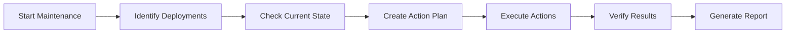

# Maintenance Sessions

Maintenance Sessions are the core mechanism through which ImmyBot applies deployments and ensures computers are properly configured. This page explains how maintenance sessions work and how to use them effectively.

## What are Maintenance Sessions?

A Maintenance Session is a structured process that:

1. Identifies applicable deployments for a computer
2. Checks the current state of the computer
3. Creates a plan to bring the computer into compliance
4. Executes that plan as a series of maintenance actions

Think of a maintenance session as similar to running `gpupdate` in a Windows domain environment, but with more intelligence and flexibility.

## Types of Maintenance Sessions

ImmyBot supports several types of maintenance sessions:

### Full Maintenance

A complete maintenance session that:
- Checks all applicable deployments
- Installs missing software
- Updates outdated software
- Runs required tasks
- Performs all necessary configurations

This is the most comprehensive type of maintenance session and ensures the computer is fully compliant with all deployments.

### Deployment Resolution

A focused maintenance session that:
- Only checks for software installations and updates
- Does not run tasks or configurations
- Is faster than a full maintenance session

Use this when you want to quickly ensure all required software is installed.

### Deployment Detection

A non-invasive maintenance session that:
- Only checks the current state of deployments
- Does not make any changes to the computer
- Updates the inventory information

Use this when you want to update the inventory without making changes.

### Inventory Scripts

A maintenance session that:
- Only runs inventory scripts
- Updates hardware and software inventory
- Does not make any changes to the computer

Use this when you want to refresh inventory information.

## Running Maintenance Sessions

### Manual Maintenance

To run a maintenance session manually:

1. Navigate to **Computers** in the left sidebar
2. Select one or more computers
3. Click **Maintenance** in the action bar
4. Choose the type of maintenance session
5. Configure any additional options
6. Click **Start**

### Scheduled Maintenance

To schedule recurring maintenance:

1. Navigate to **Settings** > **Scheduled Maintenance**
2. Click **Add Schedule**
3. Configure the schedule:
   - Frequency (daily, weekly, etc.)
   - Time of day
   - Type of maintenance
   - Target computers or tenants
4. Click **Save**

### Maintenance Options

When running a maintenance session, you can configure several options:

- **Reboot Preference**: How to handle required reboots
  - **Automatic**: Reboot automatically when needed
  - **Prompt User**: Ask the user before rebooting
  - **Skip**: Skip actions that require a reboot
  - **Force**: Force a reboot even if not required

- **User Context**: How to handle user-context actions
  - **Current User**: Run in the context of the currently logged-in user
  - **Primary User**: Run in the context of the computer's primary user
  - **Skip**: Skip actions that require a user context

- **Maintenance Window**: When to run the maintenance
  - **Now**: Start immediately
  - **After Hours**: Start during configured after-hours period
  - **Scheduled**: Start at a specific time

## Maintenance Actions

During a maintenance session, ImmyBot creates and executes a series of maintenance actions. Each action represents a specific task to be performed, such as:

- Installing software
- Running a script
- Configuring a setting
- Updating a driver

Actions are executed in a specific order based on dependencies and priorities:

1. **Pre-requisites**: Actions that must be completed before others
2. **Software Installations**: Installing required software
3. **Configuration Tasks**: Configuring installed software
4. **Post-actions**: Final cleanup and verification tasks

## Monitoring Maintenance Sessions

### Real-time Monitoring

While a maintenance session is running, you can monitor its progress:

1. Navigate to **Computers** in the left sidebar
2. Select the computer with an active maintenance session
3. Click the **Maintenance** tab
4. View the current status and progress

The maintenance log shows each action as it's executed, along with its status and any output or errors.

### Historical Logs

To view historical maintenance sessions:

1. Navigate to **Computers** in the left sidebar
2. Select a computer
3. Click the **Maintenance** tab
4. Click **View History**
5. Select a past maintenance session to view its details

Historical logs provide valuable information for troubleshooting and auditing.

## Troubleshooting Maintenance Sessions

### Common Issues

#### Maintenance Session Stuck

If a maintenance session appears to be stuck:

1. Check if the computer is online and accessible
2. Verify that the ImmyBot agent is running
3. Check for actions that might be waiting for user input
4. Consider canceling the session and starting a new one

#### Failed Actions

If specific actions fail during a maintenance session:

1. Review the error message in the maintenance log
2. Check if the software or script has specific requirements
3. Try running the action manually on the computer
4. Update the deployment or software package if needed

#### Reboot Issues

If a maintenance session is stuck waiting for a reboot:

1. Verify the reboot preference setting
2. Check if the computer has active user sessions
3. Consider using the "Force Reboot" option if necessary

## Best Practices

### Scheduling Maintenance

- Schedule routine maintenance during off-hours
- Stagger maintenance schedules to avoid network congestion
- Consider user impact when setting reboot preferences

### Maintenance Scope

- Run full maintenance sessions regularly (e.g., weekly)
- Use focused sessions (like Deployment Resolution) for quick updates
- Run inventory scripts daily to keep information current

### Testing

- Test new deployments on a small group before applying widely
- Monitor the first few maintenance sessions after adding new deployments
- Create test computers for validating complex deployments

## Related Topics

- [Deployments](./deployments.md)
- [Creating & Managing Deployments](./creating-managing-deployments.md)
- [Software Library](./software-library.md)
- [Maintenance Tasks](./maintenance-tasks.md)

---

**Next Steps:** [Deployments →](./deployments.md) | [Software Library →](./software-library.md)
