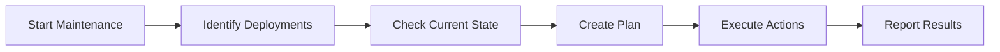

# Maintenance Sessions

This guide explains how to configure and manage maintenance sessions and updates in ImmyBot, ensuring your managed computers stay up-to-date and properly configured.

## Understanding Maintenance Sessions

Maintenance sessions are the mechanism through which ImmyBot applies deployments to computers. When a maintenance session runs, ImmyBot:

1. Identifies all deployments that apply to the computer
2. Determines the current state of the computer
3. Creates a plan to bring the computer into compliance
4. Executes that plan as a series of maintenance actions

## Maintenance Windows

Maintenance windows define when automated maintenance can run on computers. This helps ensure that maintenance activities don't disrupt users during working hours.

### Creating Maintenance Windows

1. Navigate to **Show more** > **Preferences** > **Maintenance Windows**
2. Click **Create Maintenance Window**
3. Enter a name for the window
4. Configure the schedule:
   - Days of the week
   - Start and end times
   - Time zone
5. (Optional) Add exclusions for holidays or special events
6. Click **Save**

### Assigning Maintenance Windows

1. Navigate to **Tenants**
2. Select a tenant
3. Click **Settings**
4. Under **Maintenance Windows**, select the appropriate window
5. Click **Save**

You can also assign different maintenance windows to specific computer groups:

1. Navigate to **Computer Groups**
2. Select a group
3. Click **Settings**
4. Under **Maintenance Windows**, select the appropriate window
5. Click **Save**

## Automated Maintenance

ImmyBot can automatically run maintenance sessions based on your configured maintenance windows.

### Configuring Automated Maintenance

1. Navigate to **Show more** > **Preferences** > **System Settings**
2. Under **Automated Maintenance**, toggle the setting to enabled
3. Configure global settings:
   - Maximum concurrent sessions
   - Retry behavior
   - Notification preferences
4. Click **Save**

### Maintenance Frequency

You can control how often maintenance runs:

1. Navigate to **Show more** > **Preferences** > **Maintenance Settings**
2. Configure the maintenance frequency:
   - Daily: Runs every day during the maintenance window
   - Weekly: Runs once per week during the maintenance window
   - Monthly: Runs once per month during the maintenance window
3. Click **Save**

## Manual Maintenance

You can also trigger maintenance sessions manually when needed.

### Running Maintenance on a Single Computer

1. Navigate to **Computers**
2. Select the computer
3. Click **Maintenance** in the action bar
4. Choose **Run Maintenance**
5. Configure options:
   - Select specific deployments (optional)
   - Choose notification preferences
   - Set priority
6. Click **Start**

### Running Maintenance on Multiple Computers

1. Navigate to **Computers**
2. Select multiple computers using the checkboxes
3. Click **Maintenance** in the action bar
4. Choose **Run Maintenance**
5. Configure options as above
6. Click **Start**

## Windows Updates

ImmyBot can manage Windows updates as part of maintenance sessions.

### Configuring Windows Update Settings

1. Navigate to **Show more** > **Preferences** > **Windows Updates**
2. Configure update behavior:
   - Update categories (security, feature, driver)
   - Deferral periods
   - Restart behavior
3. Click **Save**

### Creating Windows Update Deployments

1. Navigate to **Deployments**
2. Click **Create Deployment**
3. Enter a name (e.g., "Windows Updates")
4. Select **Task** as the deployment type
5. Choose or create a Windows Update task
6. Configure targets
7. Click **Save**

## Software Updates

ImmyBot makes it easy to manage software updates across your environment.

### Adding New Software Versions

1. Navigate to **Software Library**
2. Select the software to update
3. Click **Add Version**
4. Enter version information
5. Configure installation options
6. Click **Save**

### Updating Deployments

1. Navigate to **Deployments**
2. Select the deployment to update
3. Change the version to the new release
4. Click **Save**

### Automatic Version Updates

For software that should always be on the latest version:

1. Edit the deployment
2. Set **Version** to **Latest**
3. Configure update behavior
4. Save changes

## Maintenance Reporting

ImmyBot provides detailed reporting on maintenance activities.

### Viewing Maintenance Sessions

1. Navigate to **Sessions**
2. View all maintenance sessions across your environment
3. Filter by:
   - Status (Completed, Failed, In Progress)
   - Computer
   - Tenant
   - Date range

### Session Details

Click on any session to view detailed information:

- Actions performed
- Success/failure status
- Detailed logs
- Duration and timing
- Affected deployments

### Compliance Reporting

1. Navigate to **Reports** > **Compliance**
2. View compliance status for all deployments
3. Identify computers that are out of compliance
4. Take action as needed

## Maintenance Notifications

ImmyBot can send notifications about maintenance activities.

### Configuring Email Notifications

1. Navigate to **Show more** > **Notifications**
2. Configure email settings:
   - SMTP server
   - From address
   - Authentication
3. Click **Save**

### Setting Up Notification Rules

1. Navigate to **Show more** > **Notifications** > **Notification Rules**
2. Click **Create Rule**
3. Configure trigger events:
   - Session completion
   - Session failure
   - Compliance issues
4. Set recipients
5. Configure message template
6. Click **Save**

## Best Practices

Follow these best practices for effective maintenance management:

1. **Staggered Windows**: Create staggered maintenance windows to avoid overloading your infrastructure
2. **Test First**: Test updates on a small group before deploying widely
3. **Regular Review**: Periodically review maintenance logs and compliance reports
4. **Clear Communication**: Inform users about maintenance windows and expected changes
5. **Backup First**: Ensure critical systems have recent backups before major updates

## Troubleshooting

If you encounter issues with maintenance sessions:

### Common Problems and Solutions

1. **Sessions Not Starting**
   - Check agent status
   - Verify maintenance window configuration
   - Check for server resource constraints

2. **Failed Actions**
   - Review detailed logs
   - Check for security software interference
   - Verify network connectivity
   - Ensure sufficient disk space

3. **Incomplete Sessions**
   - Check for timeout settings
   - Look for user interruptions
   - Verify deployment configurations

## Next Steps

Now that you understand how to manage maintenance and updates in ImmyBot, you might want to explore:

- [Common Issues](./common-issues.md) - Troubleshoot common maintenance problems
- [Creating Deployments](./creating-deployments.md) - Create effective deployments for your environment
- [Working with Tasks](./working-with-tasks.md) - Use tasks to enhance your maintenance capabilities

---

**Next Steps:** [Common Issues →](./common-issues.md) | [Creating Deployments →](./creating-deployments.md)
