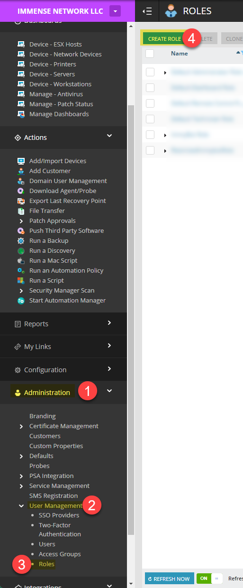

# N-Central Integration

Setting up this integration allows you to
1. Import customers from N-Central
2. Import computers from N-Central
3. Manage all computers in N-Central without deploying the ImmyBot Agent

## Create ImmyBot Role in N-Central

ImmyBot currently requires the following role permissions to operate correctly:

### Devices
- Devices View
  - All Devices -> Read Only
- Direct Support
  - Command Prompt -> Manage
  - File System -> Manage
- Remote Control
  - Custom -> Manage
  - Take Control -> Manage
- Network Devices
  - Add/Import Devices -> Manage
  - Edit Device Settings -> Manage

Create an "ImmyBot" role in your N-Central instance using above roles.

## Create ImmyBot user in N-Central

Create a new "ImmyBot" user in the instance with the "ImmyBot" role applied.

## Login to the new ImmyBot user to get MFA code and accept EULA

Once you have created the new ImmyBot user account, you must attempt to login
so that you may retrieve the MFA key, and complete any initial setup.
After entering the accounts email and password, there will be a MFA QR code displayed.
You MUST press the "CAN'T SCAN IT?" button to get the Base32-encoded MFA key.
After saving the key, use [a site such as this](https://totp.danhersam.com/?period=30&digits=6) to get the current token from the key, or temporarily scan the QR code on a device to complete sign-in.

::: tip
Make sure you accept the EULA when you login, otherwise the computers will not import!
:::

## Add integration for N-Central

After completing setup in N-Central, it's time to add the integration to ImmyBot.
Navigate to the "Integrations" page in ImmyBot, and create a new "N-Central" integration.
Input all the N-Central user account data to the fields on the right.

Press the "Verify Credentials" button, then, if completed successfully, press the button again to save the integration.

## Import your customers

Alternatively, you can create/map only certain customers.

When you map a customer from an RMM, the computers will undergo Identification

## Troubleshooting

### My customers are showing up but no computers
Login to N-Central as the ImmyBot User and accept the EULA
