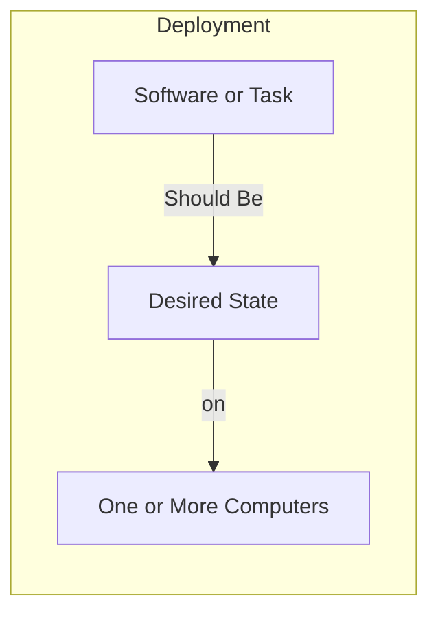
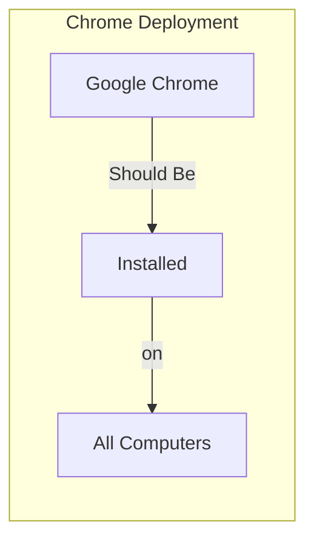

# Quick Start Guide

This guide will help you get up and running with ImmyBot in under 30 minutes. Follow these steps to set up your account, connect your first computer, and create your first deployment.

## Understanding the ImmyBot Approach

**The goal of ImmyBot is to set up a computer knowing only the customer and the end user.**

ImmyBot uses a declarative approach focused on desired state configuration. Instead of thinking about the steps to make something happen, you define how things "should be" and ImmyBot handles the rest. This paradigm shift allows you to focus on the end result rather than the process.

## Prerequisites

Before you begin, make sure you have:
- An active ImmyBot account (sign up at [immy.bot](https://immy.bot) if you don't have one)
- Administrator access to a test computer (physical or virtual)
- A USB drive (for physical computers)

## Step 1: Log in to ImmyBot

1. Navigate to your ImmyBot instance URL (typically `https://yourdomain.immy.bot`)
2. Enter your email and password
3. Click **Sign In**

You'll be greeted with the ImmyBot dashboard, which provides an overview of your environment.

## Step 2: Create an ImmyBot USB Drive

To connect your first computer to ImmyBot:

1. Insert a USB drive into your computer
2. From the ImmyBot dashboard, click on **Download ImmyAgent** in the left navigation
3. Select **Create USB Drive**
4. Choose your USB drive from the dropdown menu
5. Click **Create**

> **Note:** You only need to create this USB drive once. The same drive can be used for all clients and computers.

## Step 3: Connect Your First Computer

### For Physical Computers

1. Power on the computer and boot to Windows
2. When you reach the Windows setup screen (region selection), insert your ImmyBot USB drive
3. The computer will automatically detect the ImmyBot provisioning package
4. Follow any on-screen prompts to apply the package

### For Virtual Machines

1. From the ImmyBot dashboard, click on **Download ImmyAgent**
2. Select **Create ISO**
3. Mount the ISO to your virtual machine
4. At the Windows region selection screen, press the Windows key 5 times
5. Alternatively, double-click the PPKG file from the mounted disk

## Step 4: Identify and Assign the Computer

Once connected, your computer will appear in the **New Computers** section:

1. Go to **New Computers** in the ImmyBot dashboard
2. Locate your newly connected computer in the list
3. Click on the computer to begin the onboarding process
4. Assign a **Customer** (required) and **Primary User** (recommended)
5. Click **Start Onboarding**

ImmyBot will automatically apply all recommended deployments to the computer.

## Step 5: Create Your First Deployment

Now let's create a simple deployment to install a software package:

1. Navigate to **Deployments** in the left sidebar
2. Click **Create Deployment**
3. Enter a name for your deployment (e.g., "Install Chrome")
4. Select **Software** as the deployment type
5. Search for and select "Google Chrome" from the software list
6. Under **Targets**, click **Add Target**
7. Select a target type (e.g., "All Computers")
8. Click **Save**

Your deployment is now created and will be applied to all computers in the selected target.

### Understanding Deployments

Deployments are the core building blocks of ImmyBot. They define what should be installed or configured on which computers:

For example, your Chrome deployment specifies that Chrome should be installed on all computers:

#### Conditional Deployments

You can also create deployments that only apply under certain conditions. For example:
- Install Microsoft Visio only for users who have a license
- Deploy SentinelOne only for customers who pay for it

These conditions are defined using filter scripts that can check external systems or conditions.

## Step 6: Run a Maintenance Session

To apply your new deployment immediately:

1. Navigate to **Computers** in the left sidebar
2. Find and select your test computer
3. Click **Maintenance** in the top action bar
4. Select **Run Maintenance**
5. Click **Start**

You can monitor the progress of the maintenance session in real-time.

### Verification and Testing

ImmyBot tests everything it does before and after it does it, ensuring that changes are applied correctly and consistently:

- **Before Installation**: ImmyBot checks if the software is already installed and what version is present
- **During Installation**: The system monitors the installation process for errors
- **After Installation**: ImmyBot verifies that the software was installed correctly and is the expected version

For example, when installing Adobe Reader, ImmyBot will:
1. Find the latest available version using a dynamic version script
2. Determine the installed version (if any) by checking Add/Remove Programs
3. Queue an Install or Upgrade task based on the current state
4. Set Adobe Reader to be the default PDF handler by running a configuration task

## Next Steps

Congratulations! You've successfully set up ImmyBot, connected your first computer, and created your first deployment. Here are some next steps to explore:

- [Computer Onboarding](./computer-onboarding.md) - Learn more about the onboarding process
- [Deployments](./deployments.md) - Understand the fundamental concepts of ImmyBot
- [Creating & Managing Deployments](./creating-managing-deployments.md) - Explore advanced deployment options
- [Agent Installation](./agent-installation.md) - Learn about different agent installation methods

---

**Next Steps:** [Deployments →](./deployments.md) | [Computer Onboarding →](./computer-onboarding.md)
