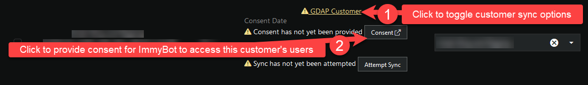

# AzureAD/365 Graph Permissions

Enabling this allows ImmyBot to

1. Sync all users from your partner tenant
2. Sync all users from your customer's tenants
3. Install the 365 applications a user is licensed for (Apps for business/Apps for entrprise/Project/Visio)
4. Deploy software to Teams, On-Premises Security Groups (Ex. Everyone in the Engineering Team gets AutoCAD 2022)

## Default

In this mode, you don't need to create an app registration. You consent as an administrator, allowing ImmyBot access users in your tenant.

[GDAP Customer Syncing](#gdap-customer-syncing) can be enabled in this mode.

## Custom

In this mode, you create an app registration and provide its credentials to ImmyBot. This mode is required if you want to be able to [sync non-GDAP customers](#csp-preconsent).

[GDAP Customer Syncing](#gdap-customer-syncing) can be enabled in this mode.

### Create an App Registration

Navigate to: <https://aad.portal.azure.com/>

**Important!** Your app registration must have a Web redirect uri of `https://<your-domain>.immy.bot/consent-callback`, replacing `<your-domain>` appropriately

### Grant Permissions

#### Target devices in Azure Groups

If you would also like to target devices from your Azure groups, you will need to include the `Microsoft Graph - Devices.Read.All` permission.

See the screenshots below for the minimum permissions.

### Create Client Secret

### CSP Preconsent

This step is optional. This is only necessary if you want to sync non-GDAP customers.

#### Add to Admin Agents Group (Legacy DAP)

### Copy the `Application (client) ID` and `Client Secret Value` into the form in ImmyBot

## GDAP Customer Syncing

After enabling GDAP Customer Syncing from the desired Azure permission form on the Azure settings page, you can sync GDAP customers:

