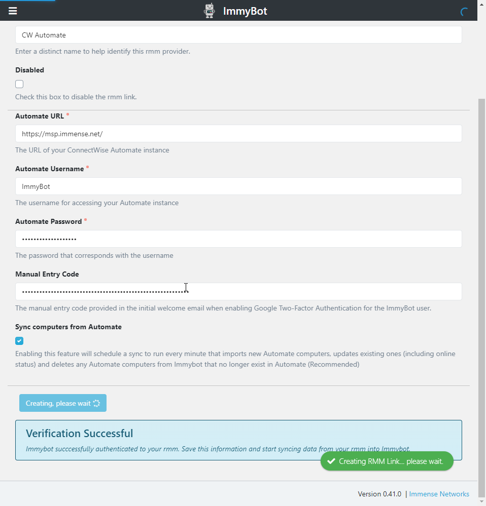

# ConnectWise Automate

Setting up this integration allows you to
1. Import customers from Automate
2. Import computers from Automate
3. Manage all computers in Automate without deploying the ImmyBot Agent
4. Map customers from Manage to ImmyBot tenant based on existing Automate<->Manage relationship

## Create ImmyBot Role
ImmyBot requires the following permissions in Automate

- Core
  - Clients.Read
  - Clients.Show All
  - Computers.Show All
  - Groups.Show All
  - Locations.Show All
  - Patch Manager.Read (Required if you want Immy to apply approved Windows Updates)
  

## Create ImmyBot User

## Enable Google MFA for ImmyBot User

## Add RMM Link for CW Automate

## Import your customers

Alternatively, you can create/map only certain customers.

When you map a customer from an RMM, the computers will undergo Identification

