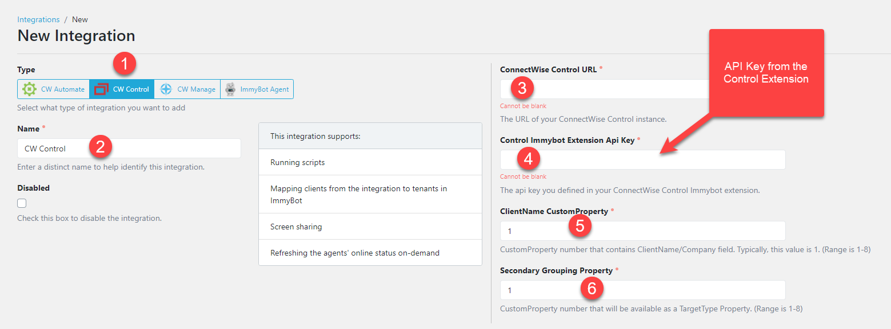
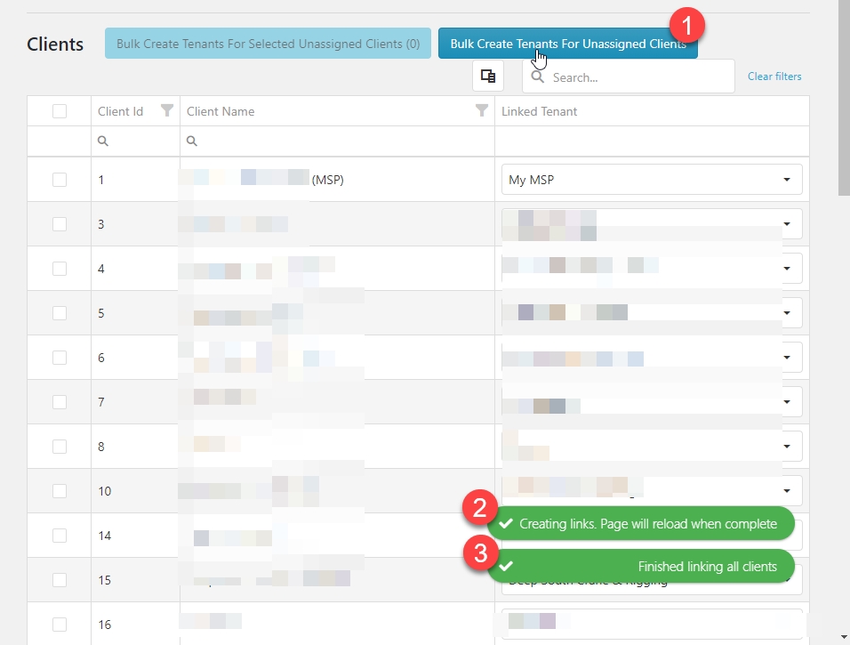

# ConnectWise Control Integration

Setting up this integration allows you to
1. Import customers from Control
2. Import computers from Control
3. Manage all computers in Control without deploying the ImmyBot Agent
4. Remote into computers from the ImmyBot interface using Control (Note: We default to requiring customer consent, you can disable this under Settings->Preferences)
5. Fix the Automate agent using the Control agent (by creating a cross-tenant deployment for the Automate Agent and creating a schedule for your customers)

## Install ImmyBot Extension for Control

## Create RMMLink for Control

## Import your customers

Alternatively, you can create/map only certain customers.

When you map a customer from an RMM, the computers will undergo Identification

